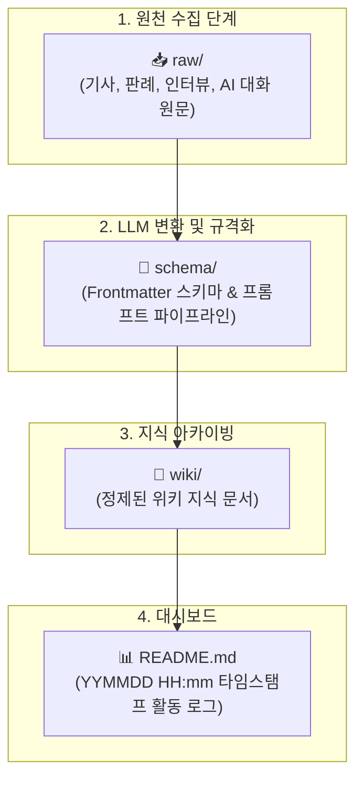

# 👥 아만보팀 [아는만큼보인다]

> **"AI가 발전함에 따라 게임 개발에서도 AI에 의존하는 경우가 많아졌다.**  
> **프로그래밍을 시작으로 아트, 기획의 영역까지 확장되는 상황에서 우리는 개발 환경 속에서 AI를 어디까지 인정할 것인가"**

AI 활용에 대한 다각도 토론, **개인별 RAW-SCHEMA-WIKI 3단 지식 파이프라인**, 바이브 코딩(Vibe Coding)을 통한 웹 서비스 제작 및 발표 프로젝트입니다.

---

## 🧑‍🤝‍🧑 팀원 구성 & 개인별 연구 WIKI

* **팀명**: 아만보팀 [아는만큼보인다]
* **팀원**: **김민주, 김준호, 함석신**
* **팀 주제**: **게임 제작을 위한 AI 활용은 어디까지 인정될 수 있을까 (토론)**

| 팀원명 | 개인 연구 WIKI 홈 | 주요 연구 영역 |
| :---: | :---: | :--- |
| **김민주** | 🔗 [김민주 연구 WIKI](./김민주/README.md) | 게임 개발 생산성 혁신, 시니어 1인 제작, 대화형 AI 캐릭터 |
| **김준호** | 🔗 [김준호 연구 WIKI](./김준호/README.md) | 창작 생태계 일자리 위협, 주니어 사다리 단절, 지브리풍 도용 저작권 리스크 |
| **함석신** | 🔗 [함석신 연구 WIKI](./함석신/README.md) | 개발 파이프라인별 인정 바운더리 기준, AI 유사도 검증 거버넌스 |
| **팀 공통** | 🏛️ [회의록 아카이브](./회의/README.md) | 일자별 회의록, 아젠다 정리, 바이브 코딩 및 발표 기획 |

---

## 🔄 3단 지식 파이프라인 아키텍처

개인 자료와 팀 공통 자료가 섞이지 않고 깃허브 충돌을 방지하기 위해, 각 팀원 폴더는 독립된 **RAW - SCHEMA - WIKI** 구조로 운영됩니다.



---

## 📁 깃허브(GitHub) 협업 디렉토리 구조

```
AMANBO/
├── 📂 김민주/                    # [김민주] 개인 연구 지식 베이스
│   ├── 📂 raw/                 # 수집한 기사 원문, 개발사 인터뷰, AI 대화
│   ├── 📂 schema/              # 스키마(schema.md) & 변환 프롬프트(prompt_pipeline.md)
│   ├── 📂 wiki/                # 정제된 위키 지식 문서
│   └── README.md               # 활동 로그 (YYMMDD HH:mm) & 색인
│
├── 📂 김준호/                    # [김준호] 개인 연구 지식 베이스
│   ├── 📂 raw/                 # 판례, 성명서, 일자리 피해 보도, AI 대화
│   ├── 📂 schema/              # 스키마(schema.md) & 변환 프롬프트(prompt_pipeline.md)
│   ├── 📂 wiki/                # 정제된 위키 지식 문서
│   └── README.md               # 활동 로그 (YYMMDD HH:mm) & 색인
│
├── 📂 함석신/                    # [함석신] 개인 연구 지식 베이스
│   ├── 📂 raw/                 # 플랫폼 정책, 법제 가이드라인, 기술 문서, AI 대화
│   ├── 📂 schema/              # 스키마(schema.md) & 변환 프롬프트(prompt_pipeline.md)
│   ├── 📂 wiki/                # 정제된 위키 지식 문서
│   └── README.md               # 활동 로그 (YYMMDD HH:mm) & 색인
│
├── 📂 회의/                     # [팀 공통] 종합 회의 아카이브
│   ├── 📂 raw/                 # [26.09.16]-회의록녹음요약.md (회의 녹음 전문)
│   ├── 📂 schema/              # 회의록 스키마 & 요약 프롬프트
│   ├── 📂 wiki/                # [26.09.16]-AI_창작과_인간의_역할_종합_회의록.md
│   └── README.md               # 회의 히스토리 로그 (YYMMDD HH:mm)
│
└── README.md                   # 프로젝트 메인 대시보드
```

---

## 🏷️ 파일 명명 & 로그 작성 규칙 (Rules)

### 1. 개별 자료 업로드 규칙
* **RAW 데이터**: `[작성자-자료제목_원문].md`
  * 예: `김민주/raw/[김민주-게임AI_프로그래밍도구_도입사례_기사].md`
* **WIKI 지식**: `[작성자-자료제목].md`
  * 예: `김민주/wiki/[김민주-게임AI_프로그래밍도구_도입효과].md`
* **회의록**: `[yy.mm.dd]-주제.md`
  * 예: `회의/wiki/[26.09.16]-AI_창작과_인간의_역할_종합_회의록.md`

### 2. ⏱️ 리드미 로그 타임스탬프 규칙 (`YYMMDD HH:mm`)
모든 `README.md`의 활동 로그는 자료를 올리거나 수정할 때마다 상단에 **`YYMMDD HH:mm`** 형식으로 고정 기록합니다.

```markdown
| 타임스탬프 (`YYMMDD HH:mm`) | 작업자 | 작업 내용 및 링크 | 비고 |
| :---: | :---: | :--- | :--- |
| `260916 19:40` | 김민주 | [김민주-자료제목].md WIKI 발행 | 신규 등록 |
```

---

## 🐙 깃허브(GitHub) 협업 가이드라인

1. **개인 폴더 격리를 통한 충돌 방지**:
   * 각 팀원은 자신의 이름 폴더(`김민주/`, `김준호/`, `함석신/`) 안에서 자유롭게 커밋하므로 Git 충돌(Merge Conflict)이 발생하지 않습니다.
2. **공통 파일(`회의/`, `README.md`) 편집 시**:
   * 작업 시작 전 반드시 `git pull`을 실행하여 최신 커밋을 반영합니다.
   * 작업 완료 후 `git add .` → `git commit -m "docs: 작업내용"` → `git push`를 진행합니다.
3. **상대경로 링크 준수**:
   * 깃허브 웹 및 로컬 클론 환경 어디서나 문서가 올바르게 열리도록 모든 링크는 상대경로(`../폴더명/문서.md`)로 작성합니다.

---

## 🚀 빠른 바로가기

* 👤 **김민주**: [대시보드](./김민주/README.md) | [변환프롬프트](./김민주/schema/prompt_pipeline.md) | [RAW보관소](./김민주/raw/README.md) | [WIKI보관소](./김민주/wiki/README.md)
* 👤 **김준호**: [대시보드](./김준호/README.md) | [변환프롬프트](./김준호/schema/prompt_pipeline.md) | [RAW보관소](./김준호/raw/README.md) | [WIKI보관소](./김준호/wiki/README.md)
* 👤 **함석신**: [대시보드](./함석신/README.md) | [변환프롬프트](./함석신/schema/prompt_pipeline.md) | [RAW보관소](./함석신/raw/README.md) | [WIKI보관소](./함석신/wiki/README.md)
* 🏛️ **회의록**: [대시보드](./회의/README.md) | [최신 회의록 (카트라이더 2일 스프린트 기획)](./회의/wiki/[26.09.17]-카트라이더_인간vsAI_2일스프린트_및_언리얼미니레이싱_기획.md)
