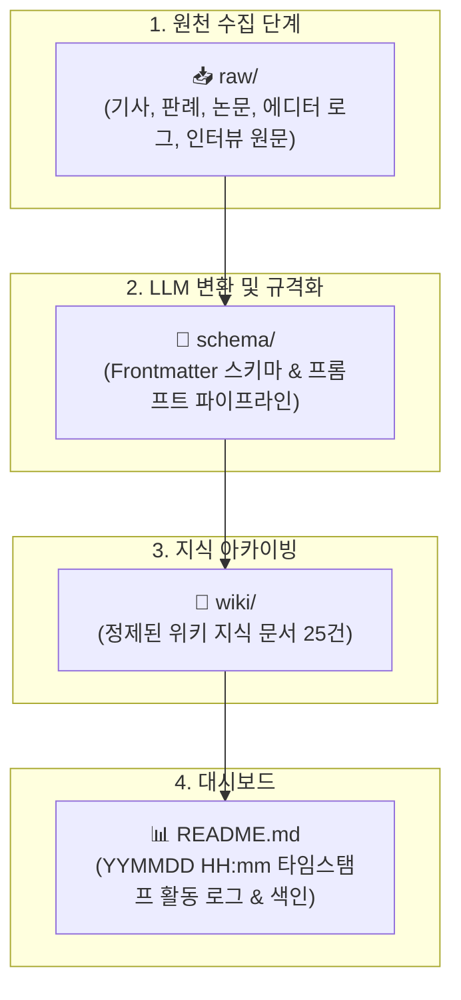

# 👥 아만보팀 [아는만큼보인다]

> **"AI가 발전함에 따라 게임 개발에서도 AI에 의존하는 경우가 많아졌다.**  
> **프로그래밍을 시작으로 아트, 기획의 영역까지 확장되는 상황에서 우리는 개발 환경 속에서 AI를 어디까지 인정할 것인가"**

AI 활용에 대한 다각도 토론, **개인별 RAW-SCHEMA-WIKI 3단 지식 파이프라인**, 바이브 코딩(Vibe Coding)을 통한 웹 레이싱 게임 제작, 언리얼 5.8 MCP 자동화 실증 및 3일간의 종합 연구 프로젝트입니다.

---

## 🏆 3일 스프린트 최종 연구 성과 요약 (26.09.16 ~ 26.09.18)

| 구분 | 연구/제작 산출물 | 핵심 성과 및 실증 데이터 | 바로가기 |
| :---: | :--- | :--- | :---: |
| **🧠 지식 파이프라인** | **전체 25건 WIKI 완비** | • 김민주 7건 (언리얼 MCP 실증 5건 + 저작권 법제 2건)<br>• 김준호 10건 (학술 논문 2건 + 게임사 사례 8건)<br>• 함석신 4건 (거버넌스 2건 + 대시보드 기획/비교 2건)<br>• 회의 아카이브 4건 (1·2차 회의, 스프린트, 최종 결산) | [WIKI 색인](#-팀원-구성--개인별-연구-wiki) |
| **🏎️ 실증 프로덕트 1** | **웹 3D 카트라이더 게임** | • Three.js + Web Audio 기반 무설치 브라우저 레이싱<br>• 12단계 바이브 코딩(드리프트, 4종 SD 캐릭터, AI 라이벌)<br>• **초고속 프로토타이핑(Time to Market) 가치 입증** | [TIMELINE.md](./ai_game/TIMELINE.md) |
| **🎮 실증 프로덕트 2** | **언리얼 5.8 MCP 맵 빌드** | • 언리얼 엔진 5.8 + Python JSON-RPC 연동<br>• 14분 만의 1차 빌드, 41분 만에 80m 무결점 트랙 완공<br>• **SplineMesh 전환 핫픽스를 통한 인간 2차 가공 필수성 실증** | [실시간로그](./김민주/wiki/[김민주-언리얼5.8_MCP_연동_및_미니레이싱_제작_실시간로그].md) |
| **💻 기술 제안 3** | **AI 쟁점 라이브 대시보드** | • FastAPI + Google Gemini API(Search Grounding)<br>• 키워드 입력 시 찬성/반대/가이드라인 3단 실시간 분석<br>• 발표 현장 1분 30초 라이브 인터랙티브 시연 각본 | [대시보드 기획](./함석신/wiki/[함석신]-AI_창작_찬반_및_윤리_쟁점_분석_라이브_대시보드_기획안.md) |
| **⚖️ 팀 공식 제언** | **3단계 스크리닝 거버넌스** | • **학습**(클린 데이터셋) ➔ **생성**(Copilot 한정) ➔ **이용**(인간 검수 및 사전 공시)<br>• 최종 책임 귀속 원칙(인간 디렉터 중심 마지노선) | [최종 종합 회의록](./회의/wiki/[26.09.18]-3일_스프린트_최종결산_및_인간vsAI_실증비교_종합_회의록.md) |

---

## 🧑‍🤝‍🧑 팀원 구성 & 개인별 연구 WIKI

* **팀명**: 아만보팀 [아는만큼보인다]
* **팀원**: **김민주, 김준호, 함석신**
* **팀 주제**: **게임 제작을 위한 AI 활용은 어디까지 인정될 수 있을까 (토론)**

| 팀원명 | 개인 연구 WIKI 홈 | WIKI 건수 | 주요 연구 영역 및 실증 파트 |
| :---: | :---: | :---: | :--- |
| **김민주** | 🔗 [김민주 연구 WIKI](./김민주/README.md) | **7건** | 언리얼 엔진 5.8 MCP 자동화 맵 제작, 1시간 스프린트 한계 분석, 저작권 법제 판례 |
| **김준호** | 🔗 [김준호 연구 WIKI](./김준호/README.md) | **10건** | 웹 3D 카트라이더 12단계 바이브 코딩, 창작 생태계 일자리 위협, 붉은사막·33원정대 리스크 분석 |
| **함석신** | 🔗 [함석신 연구 WIKI](./함석신/README.md) | **4건** | 개발 파이프라인별 인정 바운더리 기준, AI 윤리 진단 라이브 대시보드 기획, 웹 vs 언리얼 실무 비교 |
| **팀 공통** | 🏛️ [회의록 아카이브](./회의/README.md) | **4건** | 일자별 회의록, 아젠다 정리, 인간 vs AI 스프린트 대결 기획, 3일 최종 결산 종합 회의록 |

---

## ⏱️ 프로젝트 전체 활동 로그 (Activity Log)

| 타임스탬프 (`YYMMDD HH:mm`) | 작업자 | 작업 내용 및 링크 | 비고 |
| :---: | :---: | :--- | :--- |
| `260918 19:35` | **전원** | 📦 **3일간의 프로젝트 종료 및 전체 25건 WIKI 지식 베이스 전수 인제스트 완료** | **프로젝트 결산** |
| `260918 19:35` | **함석신** | [26.09.18 3일 스프린트 최종 결산 종합 회의록](./회의/wiki/[26.09.18]-3일_스프린트_최종결산_및_인간vsAI_실증비교_종합_회의록.md) 발행 | 최종 회의록 |
| `260918 19:35` | **김민주** | 언리얼 5.8 MCP 제작과정 및 오류수정, 프롬프트, 소감 등 [정제 위키 4건 추가 발행](./김민주/README.md) (총 7건 완비) | 위키 전수 인제스트 |
| `260918 19:35` | **함석신** | AI 활용 가이드, 웹 vs 언리얼 비교, 대시보드 기획, 생태계 연구 [정제 위키 4건 전량 발행](./함석신/README.md) (총 4건 완비) | 위키 전수 인제스트 |
| `260918 09:58` | **김민주** | 언리얼 5.8 MCP 카트라이더 미니레이싱 맵 완공 및 [실시간 PIE 주행 검증](김민주/wiki/[김민주-언리얼5.8_MCP_연동_및_미니레이싱_제작_실시간로그].md) 완료 | 22분 조기 완공 |
| `260917 15:25` | **김준호** | 웹 3D 카트라이더 12단계 고도화(Three.js 아케이드 물리, SD 캐릭터 4종, AI 라이벌 주행) 완료 | 웹 게임 완성 |
| `260917 11:25` | **전원** | [카트라이더 2일 스프린트 (인간 vs AI 대결)](./회의/wiki/[26.09.17]-카트라이더_인간vsAI_2일스프린트_및_언리얼미니레이싱_기획.md) 킥오프 | 대결 기획 |
| `260917 09:40` | **김준호** | `raw/` 데이터 전체 Ingest 완료: 학술 논문 2건, 언론 보도 8건 총 10건 [WIKI 발행](./김준호/wiki/README.md) | WIKI 대량 발행 |
| `260916 19:40` | **전원** | 개인 폴더링 개편(`김민주/`, `김준호/`, `함석신/`) 및 3단 파이프라인 동기화 | 구조 개편 |

---

## 🔄 3단 지식 파이프라인 아키텍처



---

## 📁 깃허브(GitHub) 협업 디렉토리 구조

```
AMANBO/
├── 📂 ai_game/                   # [실증 프로덕트 1] 웹 3D 카트라이더 바이브 코딩
│   ├── 📂 game_project/          # HTML5, CSS3, Three.js, Web Audio 게임 소스
│   ├── TIMELINE.md               # 12단계 개발 프롬프트 및 변경사항 전수 기록
│   └── TIMELINE_SUMMARY.md       # 핵심 개발 단계 요약
│
├── 📂 김민주/                    # [김민주] 언리얼 5.8 MCP & 생산성 연구 (WIKI 7건)
│   ├── 📂 raw/                 # 에디터 로그, 트랙 프롬프트, 0917/0918 소감 원문
│   ├── 📂 schema/              # 스키마(schema.md) & 변환 프롬프트(prompt_pipeline.md)
│   ├── 📂 wiki/                # 언리얼 MCP 실시간로그, 오류수정, 프롬프트, 소감, 저작권 WIKI
│   └── README.md               # 활동 로그 (YYMMDD HH:mm) & 색인
│
├── 📂 김준호/                    # [김준호] 창작 생태계 위협 & 리스크 분석 (WIKI 10건)
│   ├── 📂 raw/                 # 학술 논문 PDF, 게임사(붉은사막, 이환, 넥슨 등) 보도 원문
│   ├── 📂 schema/              # 스키마(schema.md) & 변환 프롬프트(prompt_pipeline.md)
│   ├── 📂 wiki/                # 미드저니 통제권 논문, 개발자 직무위협 논문, 8대 사례 WIKI
│   └── README.md               # 활동 로그 (YYMMDD HH:mm) & 색인
│
├── 📂 함석신/                    # [함석신] AI 거버넌스 & 라이브 대시보드 기획 (WIKI 4건)
│   ├── 📂 raw/                 # 파이프라인 가이드, 웹 vs 언리얼 비교, 대시보드 기획서, 실태조사
│   ├── 📂 schema/              # 스키마(schema.md) & 변환 프롬프트(prompt_pipeline.md)
│   ├── 📂 wiki/                # AI 활용 가이드, 웹 vs 언리얼 비교, 라이브 대시보드, 5대 데이터 WIKI
│   └── README.md               # 활동 로그 (YYMMDD HH:mm) & 색인
│
├── 📂 회의/                     # [팀 공통] 종합 회의 아카이브 (WIKI 4건)
│   ├── 📂 raw/                 # 09.16, 09.17(2건), 09.18 회의 녹취록 요약 원문
│   ├── 📂 schema/              # 회의록 스키마 & 요약 프롬프트
│   ├── 📂 wiki/                # 1차 회의, 2차 회의, 스프린트 킥오프, 3일 최종 결산 종합 회의록
│   └── README.md               # 회의 히스토리 로그 (YYMMDD HH:mm)
│
└── README.md                   # 프로젝트 메인 대시보드
```

---

## 🚀 빠른 바로가기

* 👤 **김민주**: [대시보드](./김민주/README.md) | [WIKI보관소 (7건)](./김민주/wiki/README.md) | [최신 위키 (언리얼5.8 MCP 오류수정)](./김민주/wiki/[김민주-언리얼5.8_MCP_미니레이싱_제작_과정_및_오류수정_기록].md)
* 👤 **김준호**: [대시보드](./김준호/README.md) | [WIKI보관소 (10건)](./김준호/wiki/README.md) | [웹 카트라이더 타임라인](./ai_game/TIMELINE.md)
* 👤 **함석신**: [대시보드](./함석신/README.md) | [WIKI보관소 (4건)](./함석신/wiki/README.md) | [최신 위키 (웹 vs 언리얼 비교)](./함석신/wiki/[함석신]-발표_방향성_웹_vs_언리얼_MCP_비교.md)
* 🏛️ **회의록**: [대시보드](./회의/README.md) | [3일 최종 결산 종합 회의록 (26.09.18)](./회의/wiki/[26.09.18]-3일_스프린트_최종결산_및_인간vsAI_실증비교_종합_회의록.md)
