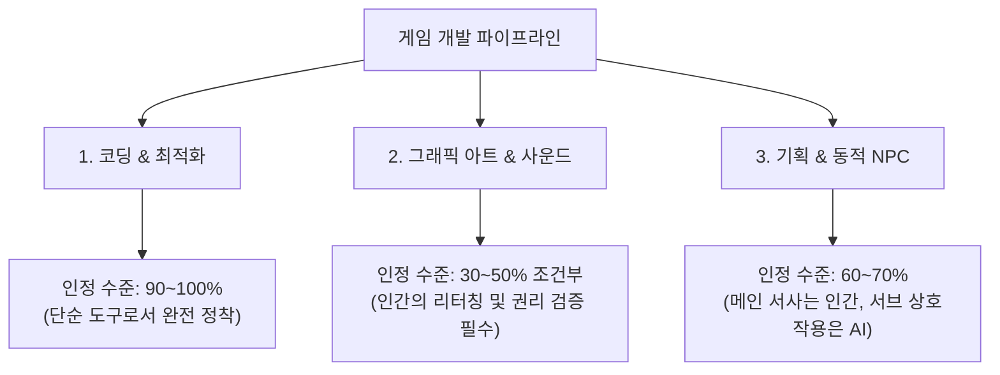
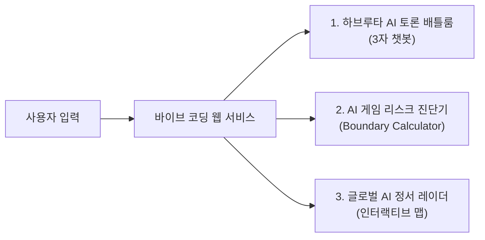

# 🎮 게임 제작을 위한 AI 활용, 어디까지 인정될 수 있을까?
> **토론 프로젝트 가이드 & 바이브 코딩(Vibe Coding) 서비스 기획서**  
> *"프로그래밍을 시작으로 아트, 기획의 영역까지 확장되는 상황에서 우리는 개발 환경 속에서 AI를 어디까지 인정할 것인가?"*

---

## 📌 목차
1. [프로젝트 개요](#1-프로젝트-개요)
2. [글로벌 팩트체크 & 국가·문화별 동향 비교](#2-글로벌-팩트체크--국가문화별-동향-비교)
3. [핵심 쟁점과 인정 바운더리 (경계선 설정)](#3-핵심-쟁점과-인정-바운더리-경계선-설정)
4. [우려와 염려를 '가능성'으로 전환하기](#4-우려와-염려를-가능성으로-전환하기)
5. [3자 토론 포지션 & 하브루타(상호 반박) 시나리오](#5-3자-토론-포지션--하브루타상호-반박-시나리오)
6. [팀 회의 중간 정리 & 다음 스텝](#6-팀-회의-중간-정리--다음-스텝)
7. [💡 바이브 코딩(Vibe Coding) 연계 서비스 기획안](#7--바이브-코딩vibe-coding-연계-서비스-기획안)

---

## 1. 프로젝트 개요

* **토론 대주제**: 게임 제작을 위한 AI 활용은 어디까지 인정될 수 있을까? (위협인가 vs 기회인가)
* **배경**:
  * 단순 코드 자동완성(Copilot 등)을 넘어 아트 리소스, 텍스트/시나리오 기획, 보이스/사운드, QA 및 실시간 NPC까지 생성형 AI가 게임 개발 파이프라인 전반을 관통함.
  * 창작자 일자리 위협, 데이터 저작권 침해, '영혼 없는 양산형(AI Slop)' 논란 등 윤리적·산업적 충돌 심화.
* **프로젝트 목표**:
  1. 감정적 대립을 넘어 국가별 법제/문화적 코드 차이와 사실(Fact)에 기반한 객관적 지표 확립.
  2. 찬성(민주) / 중립(석신) / 반대(준호)의 논리를 하브루타(Havruta) 방식으로 상호 검증.
  3. 토론 결과를 바탕으로 **바이브 코딩(Vibe Coding)**을 통해 작동 가능한 웹 서비스 프로토타입 제작.

---

## 2. 글로벌 팩트체크 & 국가·문화별 동향 비교

AI에 대한 인식과 법적 수용도는 각 국가의 **노동 문화, 팬덤 정서, 플랫폼 정책**에 따라 상이함.

| 비교 항목 | 🇺🇸 미국 / 서구권 | 🇨🇳 중국 | 🇰🇷 한국 & 🇯🇵 일본 |
| :--- | :--- | :--- | :--- |
| **업계 동향** | • 할리우드 파업(WGA, SAG-AFTRA) 연장선에서 게임 성우·배우 파업 발발 • 크레딧 인정 및 일자리 보호 요구 강력 | • 텐센트, 넷이즈 등 빅테크 주도로 AI 전면 도입 • 원화 제작 기간 70% 단축, AI NPC 상용화 선도 | • 대기업: R&D 및 글로벌 경쟁력 강화 집중 • 중소/인디: 생존을 위한 제작 단가 절감 도구로 활용 |
| **유저 인식** | • **"AI Slop"**에 대한 강한 거부감과 불매 운동 • *단, 압도적인 퀄리티와 재미가 증명되면 반감 감소* | • "AI로 만든 게임"임을 밝혀도 거부감이 상대적으로 낮음 • 가성비와 플레이 경험 자체를 중시 | • 서브컬처 팬덤 중심의 '화풍 도용/일러스트 훼손'에 극도로 민감 • '장인정신(Soul)'을 중시하는 문화적 특성 |
| **플랫폼 및 법제** | • **Steam(밸브)**: AI 생성물 사전 라벨링(공개) 의무화 • 미국 저작권청: 인간의 창작적 기여 없는 순수 AI물 저작권 불인정 | • 생성형 AI 서비스 관리 잠정 조례 등 국가 규제는 있으나 산업 육성은 전폭 지원 | • 한국 저작권위원회: 생성형 AI 저작권 등록 가이드 마련 중 (보수적 접근) |
| **출시국 변경 전략** | • 서구권: AI 사용을 숨기기보다 **"철저한 인간 검수(Human-in-the-Loop)"** 강조 또는 AI 비중 최소화 빌드로 출시 • 아시아권: 빠른 콘텐츠 업데이트와 볼륨 확대를 전면에 내세운 빌드로 출시 다변화 |

---

## 3. 핵심 쟁점과 인정 바운더리 (경계선 설정)

### ① 기술/프로그래밍 (허용도: 높음)
* **현실**: Copilot, Claude 등을 이용한 버그 수정, 셰이더 작성, 단위 테스트는 이미 업계 표준 생산성 도구화.
* **바운더리**: 전면 인정. 단, 보안 취약점 점검 및 최종 코드 리뷰는 인간 엔지니어의 책임.

### ② 그래픽 아트 / 성우 / 사운드 (허용도: 엄격한 조건부)
* **현실**: 가장 격렬한 저항과 반발이 발생하는 영역. 무단 스크래핑(도용) 문제와 직결.
* **바운더리**: 
  - 100% 프롬프트 딸깍 생성물 ❌ (출시 거부 및 저작권 불인정)
  - 인간 아티스트의 기획 하에 콘셉트 러프 스케치 및 텍스처 보조로 사용 후 **인간이 오버페인팅/리터칭한 2차 창작물 ⭕**.

### ③ 게임 기획 / 시나리오 / 인터랙티브 NPC (허용도: 신규 가능성 영역)
* **현실**: 정적인 퀘스트 텍스트를 실시간으로 살아 숨쉬는 대화형 NPC로 전환하려는 시도 확산.
* **바운더리**: 
  - 핵심 세계관과 메인 퀘스트 줄거리는 인간 기획자가 전담.
  - 오픈월드 엑스트라 NPC 대사 및 환경 상호작용은 AI 생성 허용.

---

## 4. 우려와 염려를 '가능성'으로 전환하기

| 순번 | 기존의 우려와 염려 (Fears) | 전환된 가능성과 기회 (Possibilities) |
| :---: | :--- | :--- |
| **01** | *"인간 개발자의 일자리가 사라질 것이다."* | **1인 개발자의 한계 돌파**: 자본 없는 인디 개발자도 AAA급 스케일과 아트워크를 시도할 수 있는 기회. |
| **02** | *"AI Slop(저질 양산품)으로 스토어가 오염된다."* | **기획력의 본질 복귀**: 기술적 장벽이 낮아짐에 따라 그래픽 자랑이 아닌 '독창적인 게임 메카닉과 규칙'이 차별화 요소로 부각. |
| **03** | *"저작권 침해로 소송 리스크가 크다."* | **클린 데이터셋 & 사내 자체 모델 구축**: 투명한 라이선스를 갖춘 독자적 AI 워크플로우를 보유한 스튜디오가 경쟁 우위 선점. |
| **04** | *"유저들이 AI 게임에 거부감을 느낀다."* | **완성도 우선주의**: 결국 게이머는 '재미와 완성도'에 반응함. AI를 썼다는 사실보다 '완성도가 조악할 때' 분노하는 것이므로 퀄리티 컨트롤에 집중. |

---

## 5. 3자 토론 포지션 & 하브루타(상호 반박) 시나리오

### 🟢 [찬성] 민주 — "AI는 창작의 민주화이자 새로운 장르의 개척자"
* **핵심 주장**:
  * 중소/인디 개발사에게 대기업과 싸울 수 있는 무기를 제공함.
  * 실시간으로 플레이어와 반응하는 차세대 게임 경험(동적 서사, 지능형 NPC)은 AI 없이는 불가능함.
* **하브루타 예상 공격 & 반박 멘트**:
  * ⚔️ *준호(반대)의 공격*: "기존 아티스트들의 피땀 어린 결과물을 도둑질해서 학습한 툴인데 윤리적 죄책감이 없습니까?"
  * 🛡️ *민주의 카운터*: "인간 아티스트도 수많은 거장의 그림을 보고 배우며 스타일을 확립합니다. AI를 단순히 '도둑질'로 규정하면 디지털 카메라가 나왔을 때 '빛을 훔치는 기계'라 비난하던 오류를 반복하는 것입니다."

---

### 🔴 [반대] 준호 — "창작 생태계 붕괴와 저질 양산화의 재앙"
* **핵심 주장**:
  * 주니어 개발자/원화가의 진입 사다리를 끊어 미래 세대 인재풀을 파괴함.
  * 공짜 데이터 도용으로 세워진 바벨탑이며, 유저들의 신뢰를 잃고 게임 시장 전체가 불매와 피로감에 빠질 것임.
* **하브루타 예상 공격 & 반박 멘트**:
  * ⚔️ *민주(찬성)의 공격*: "과거 언리얼/유니티 엔진이나 에셋 스토어가 나왔을 때도 같은 비판이 있었습니다. 도구를 거부하는 것이 생존입니까?"
  * 🛡️ *준호의 카운터*: "에셋 스토어는 창작자가 자발적으로 라이선스를 판매하는 공정한 생태계입니다. 반면 현재의 생성형 AI는 원작자의 동의도, 보상도 없는 무단 착취에 기반하고 있으므로 본질이 다릅니다."

---

### 🟡 [중립/조정] 석신 — "휴먼 인 더 루프(Human-in-the-Loop)와 투명한 룰 세팅"
* **핵심 주장**:
  * 전면 금지도, 무제한 자유도 답이 아님. **'인간은 감독(Director), AI는 조수(Assistant)'**라는 명확한 역할 분담 필요.
  * 스팀의 표기제(라벨링)처럼 투명한 정보 공개와 인간의 최종 책임 원칙이 해법.
* **하브루타 예상 공격 & 반박 멘트**:
  * ⚔️ *민주 & 준호의 공격*: "어디까지가 '조수'이고 어디까지가 '주체'인지 기준이 모호한데 어떻게 실효성 있게 통제합니까?"
  * 🛡️ *석신의 카운터*: "영화 엔딩 크레딧처럼 각 공정별 AI 기여율을 공개하고, 법적 저작권과 버그 책임은 전적으로 인간 디렉터가 지게 만들면 자연스럽게 자정 작용이 일어납니다."

---

## 6. 팀 회의 중간 정리 & 다음 스텝

### 🤝 어제 공통 합의된 사항
1. 프로그래밍 디버깅, 코드 어시스트, QA 자동화에 AI를 쓰는 것은 업계 필수 도구로 인정함.
2. 인간의 후가공이나 기획적 고민 없이 100% 생성된 무성의한 게임은 시장에서 도태되어야 함.
3. 국가별/문화권별 정서 차이가 크므로 글로벌 출시 시 권역별 맞춤 전략이 필수적임.

### ⚡ 여전히 팽팽한 이견
1. **아트/사운드 영역의 허용선**: 콘셉트 아트 단계까지만 허용할 것인가 vs 최종 리소스의 인간 리터칭까지 인정할 것인가?
2. **소송 리스크와 상용화 속도**: 규제와 판례가 완전히 정립될 때까지 보수적으로 접근할 것인가 vs 선제적으로 활용하여 경쟁력을 챙길 것인가?

### 🎯 내일 집중 토의할 아젠다
* **"게임 개발 5단계(기획-원화/3D-사운드-프로그래밍-QA)별 5점 척도 허용 기준표 완성하기"**

---

## 7. 💡 바이브 코딩(Vibe Coding) 연계 서비스 기획안

토론 내용을 웹 서비스로 승화시킬 수 있는 바이브 코딩 프로젝트 아이디어 3선입니다.

### 아이디어 1: 하브루타 AI 토론 배틀룸 (Debate Havruta Bot)
* **기능**: 사용자가 자신의 게임 개발 관련 생각(예: *"인디 게임인데 캐릭터 일러스트를 미드저니로 뽑아 쓰려고 해"*)을 입력하면:
  * **민주(찬성봇)**: 격려와 비용 절감 전략 제시.
  * **준호(반대봇)**: 날카로운 비판과 유저 불매 위험 지적.
  * **석신(중립봇)**: 안전하게 리터칭하고 스팀에 공개하는 가이드 제시.
* **바이브 코딩 구현 포인트**:
  * 프론트엔드 채팅 UI (Tailwind or Glassmorphism 스타일)
  * LLM API 시스템 프롬프트(Persona 분기)를 활용한 3자 대화 시뮬레이션

### 아이디어 2: 게임 AI 도입 바운더리 자가진단기 (Boundary Calculator)
* **기능**: 개발자가 [아트 / 코드 / 스토리 / 출시국가]를 체크박스로 선택하면 즉시 분석 결과 리포트 출력.
  * 스팀 출시 통과 확률 점수 (0~100점)
  * 유저 거부감 지수 (미국 vs 한국 vs 중국 비교 바 그래프)
  * 저작권 리스크 경고 및 안전 가이드라인 팁 제공.
* **바이브 코딩 구현 포인트**:
  * 직관적인 설문형 스텝 컴포넌트
  * 점수 산출 알고리즘 및 인터랙티브 게이지/차트 UI

### 아이디어 3: 글로벌 게임 AI 규제 & 여론 인터랙티브 레이더
* **기능**: 세계 지도에서 미국, 중국, 일본, 한국을 클릭하면 각국의 최근 AI 파업 사례, 플랫폼 규제 현황, 유저 거부감 척도를 카드 형태로 시각화.
* **바이브 코딩 구현 포인트**:
  * 인터랙티브 지도/국기 컴포넌트 + 상세 모달 창
