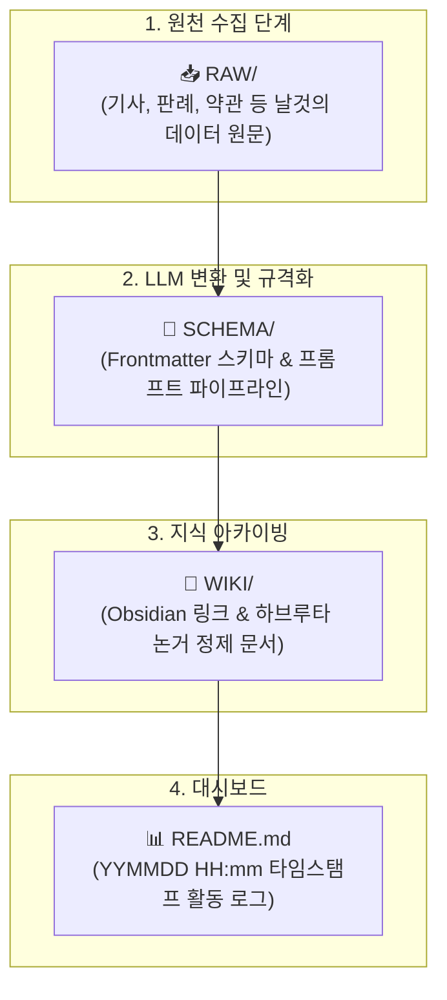

# 👥 아만보팀 (AMANBO) — 아는 만큼 보인다

> **"개발과 창작의 경계에서 AI를 어디까지 인정하고 공존할 것인가?"**  
> AI 활용에 대한 다각도 토론(하브루타), **RAW-SCHEMA-WIKI 3단 지식 파이프라인**, 바이브 코딩(Vibe Coding)을 통한 웹 서비스 제작 프로젝트

---

## 🧑‍🤝‍🧑 팀원 소개 & 개인별 LLM WIKI

| 이름 | 출생년도 | 주요 포지션 | 담당 역할 | 개인 LLM WIKI 홈 |
| :---: | :---: | :---: | :--- | :---: |
| **함석신** | 1993년생 | 🟡 **중립 / 조정** | • 팀 리딩 및 룰 세팅<br>• 휴먼 인 더 루프 가이드라인 수립 | 🔗 [중립 WIKI](file:///c:/Users/think/Documents/sesac_project/AMANBO/중립/README.md) |
| **김민주** | 1994년생 | 🟢 **찬성 / 혁신** | • AI 기술 도입 논거 & 생산성 혁신 사례<br>• 신기술 서비스 기획 | 🔗 [찬성 WIKI](file:///c:/Users/think/Documents/sesac_project/AMANBO/찬성/README.md) |
| **김준호** | 1999년생 | 🔴 **반대 / 비판** | • 저작권 침해, 일자리 위협, AI Slop 분석<br>• 창작 생태계 보호 관점 제시 | 🔗 [반대 WIKI](file:///c:/Users/think/Documents/sesac_project/AMANBO/반대/README.md) |

---

## 🔄 아만보팀 LLM WIKI 3단 파이프라인 아키텍처

각 팀원의 폴더는 날것의 수집 자료(`raw/`)를 규격화된 지식(`wiki/`)으로 자동 승화시키기 위해 **RAW - SCHEMA - WIKI** 3단 구조를 채택합니다.



---

## 📁 전체 디렉토리 구조

```
AMANBO/
├── 📂 찬성/                     # [김민주] 찬성 포지션 지식 베이스
│   ├── 📂 raw/                 # 원문 기사, 생산성 통계 원본
│   ├── 📂 schema/              # 찬성 스키마(schema.md) & LLM 변환 프롬프트
│   ├── 📂 wiki/                # 정제된 찬성 위키 지식 문서
│   └── README.md               # 찬성 WIKI 대시보드 & 활동 로그 (YYMMDD HH:mm)
│
├── 📂 반대/                     # [김준호] 반대 포지션 지식 베이스
│   ├── 📂 raw/                 # 소송 판례, 노조 성명서, 불매 보도 원본
│   ├── 📂 schema/              # 반대 스키마(schema.md) & LLM 변환 프롬프트
│   ├── 📂 wiki/                # 정제된 리스크/비판 위키 지식 문서
│   └── README.md               # 반대 WIKI 대시보드 & 활동 로그 (YYMMDD HH:mm)
│
├── 📂 중립/                     # [함석신] 중립/거버넌스 지식 베이스
│   ├── 📂 raw/                 # 플랫폼 약관, 정부 규제안, 연구서 원본
│   ├── 📂 schema/              # 중립 스키마(schema.md) & LLM 변환 프롬프트
│   ├── 📂 wiki/                # 정제된 거버넌스/척도표 위키 지식 문서
│   └── README.md               # 중립 WIKI 대시보드 & 활동 로그 (YYMMDD HH:mm)
│
├── 📂 회의/                     # [팀 공통] 종합 회의 아카이브
│   ├── 📂 raw/                 # 회의 녹취록, 메모 초안
│   ├── 📂 schema/              # 회의록 스키마 & LLM 요약 프롬프트
│   ├── 📂 wiki/                # 정제된 일자별 공식 종합 회의록
│   └── README.md               # 회의 WIKI 대시보드 & 회의 로그 (YYMMDD HH:mm)
│
└── README.md                   # 프로젝트 전체 통합 대시보드
```

---

## 🏷️ 파일 명명 & 로그 작성 규칙 (Rules)

### 1. 개별 자료 업로드 규칙
* **RAW 데이터**: `[작성자-자료제목_원문].md` (예: `찬성/raw/[김민주-2024_GDC_발표원문].md`)
* **WIKI 지식**: `[작성자-자료제목].md` (예: `찬성/wiki/[김민주-인디게임_AI도입_생산성_혁신].md`)
* **회의록**: `[yy.mm.dd]-주제.md` (예: `회의/wiki/[26.09.16]-게임_AI_활용_바운더리와_인지_외주화_종합_회의록.md`)

### 2. ⏱️ 리드미 로그 타임스탬프 규칙 (`YYMMDD HH:mm`)
모든 `README.md`의 활동 로그는 작업을 수행할 때마다 상단에 **`YYMMDD HH:mm`** 형식으로 기입합니다.

```markdown
| 타임스탬프 (`YYMMDD HH:mm`) | 작업자 | 작업 내용 및 링크 | 비고 |
| :---: | :---: | :--- | :--- |
| `260916 18:00` | 김민주 | [[찬성/wiki/[김민주-인디게임_AI도입_생산성_혁신]]] 발행 | WIKI 등록 |
```

---

## 🚀 빠른 바로가기

* 🟢 **찬성**: [대시보드](file:///c:/Users/think/Documents/sesac_project/AMANBO/찬성/README.md) | [스키마](file:///c:/Users/think/Documents/sesac_project/AMANBO/찬성/schema/schema.md) | [변환프롬프트](file:///c:/Users/think/Documents/sesac_project/AMANBO/찬성/schema/prompt_pipeline.md) | [WIKI목록](file:///c:/Users/think/Documents/sesac_project/AMANBO/찬성/wiki/README.md)
* 🔴 **반대**: [대시보드](file:///c:/Users/think/Documents/sesac_project/AMANBO/반대/README.md) | [스키마](file:///c:/Users/think/Documents/sesac_project/AMANBO/반대/schema/schema.md) | [변환프롬프트](file:///c:/Users/think/Documents/sesac_project/AMANBO/반대/schema/prompt_pipeline.md) | [WIKI목록](file:///c:/Users/think/Documents/sesac_project/AMANBO/반대/wiki/README.md)
* 🟡 **중립**: [대시보드](file:///c:/Users/think/Documents/sesac_project/AMANBO/중립/README.md) | [스키마](file:///c:/Users/think/Documents/sesac_project/AMANBO/중립/schema/schema.md) | [변환프롬프트](file:///c:/Users/think/Documents/sesac_project/AMANBO/중립/schema/prompt_pipeline.md) | [WIKI목록](file:///c:/Users/think/Documents/sesac_project/AMANBO/중립/wiki/README.md)
* 🏛️ **회의**: [대시보드](file:///c:/Users/think/Documents/sesac_project/AMANBO/회의/README.md) | [최신 회의록](file:///c:/Users/think/Documents/sesac_project/AMANBO/회의/wiki/[26.09.16]-게임_AI_활용_바운더리와_인지_외주화_종합_회의록.md)
