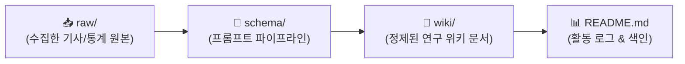

# 🎮 김민주의 AI 게임 제작 연구 WIKI

> **연구자**: 김민주  
> **팀 주제**: **게임 제작을 위한 AI 활용은 어디까지 인정될 수 있을까 (토론)**  
> *"AI가 발전함에 따라 게임 개발에서도 AI에 의존하는 경우가 많아졌다. 프로그래밍을 시작으로 아트, 기획의 영역까지 확장되는 상황에서 우리는 개발 환경 속에서 AI를 어디까지 인정할 것인가"*  
> **위키 구조**: `raw/` (원천자료) → `schema/` (변환규격) → `wiki/` (정제위키)  
> **최근 업데이트**: `260917 10:38`

---

## ⏱️ 활동 및 업데이트 로그 (Activity Log)

> [!IMPORTANT]
> **로그 작성 규칙**: 새 자료를 추가하거나 문서를 수정할 때마다 상단에 **`YYMMDD HH:mm`** 형식으로 타임스탬프를 남깁니다. (깃허브 커밋 시에도 이 형식을 준수합니다.)

| 타임스탬프 (`YYMMDD HH:mm`) | 작업자 | 작업 내용 및 링크 | 비고 |
| :---: | :---: | :--- | :--- |
| `260917 10:38` | **김민주** | 🧠 수집 RAW 데이터 2건 인제스트 완료 및 [정제 위키 2건](wiki/README.md) 발행 | 위키 인제스트 |
| `260917 10:00` | **김민주** | AI 저작권 논쟁(KBS Life) 및 법적 쟁점/판례(강인혁 변호사) [RAW 데이터 2건](raw/README.md) 수집 및 추가 | 원천자료 수집 |
| `260916 19:40` | **김민주** | 개인 폴더링 개편(`김민주/`) 및 팀 주제 기반 리드미 동기화 | 구조 개편 |
| `260916 18:00` | **김민주** | 3단 구조(`raw/`, `wiki/`, `schema/`) 구축 및 스키마 명세화 | 시스템 설정 |

---

## 🔄 LLM WIKI 파이프라인

### 📂 폴더별 역할
* **`📂 raw/`**: 게임 개발 AI 관련 기사, 개발사 인터뷰, 커뮤니티 반응, AI와의 대화 등 가공 전 원시 데이터
* **`📂 schema/`**: 원본 데이터를 정제할 때 준수하는 스키마 명세서 및 LLM 변환 프롬프트
* **`📂 wiki/`**: 팀 주제에 맞추어 논점을 정제하고 상호 참조 링크가 걸린 지식 문서

---

## 📐 스키마 & 프롬프트 파이프라인
* 📄 **스키마 명세서**: [schema.md](./schema/schema.md)
* 🤖 **LLM 변환 프롬프트**: [prompt_pipeline.md](./schema/prompt_pipeline.md)
* 📝 **위키 작성 템플릿**: [template.md](./schema/template.md)

---

## 📚 위키 지식 목록 (Wiki Index)

* 📄 **[[김민주-예술계_AI_저작권_논쟁_KBS_Life]](./wiki/[김민주-예술계_AI_저작권_논쟁_KBS_Life].md)**
  * KBS Life 예술계 AI 저작권 논쟁 분석 및 게임 개발 관점 고찰
  * 기술 숙련도(복싱)에서 질문과 사유(이종격투기)로의 창작 패러다임 전환
  * 배타적 소유권 극복을 위한 '저작 편집권' 및 '투명성 공시 인증제' 제안
  * WGA·SAG-AFTRA 총파업, 게티이미지 소송, 〈새벽의 자리아〉 판결 연계
* 📄 **[[김민주-AI_저작권_법적쟁점_및_판례_강인혁변호사]](./wiki/[김민주-AI_저작권_법적쟁점_및_판례_강인혁변호사].md)**
  * 강인혁 변호사의 AI 저작권 법적 쟁점 및 법원/저작권청 판단 기준 정제
  * 인간 저작자성(Human Authorship) 원칙에 따른 AI 독자 생성물의 저작물성 불인정
  * 텍스트 프롬프트 단순 입력의 한계 (명령 행위 vs 창작적 표현)
  * 상용 게임 개발 시 배경/보조 도구 활용과 2차 가공을 통한 전체 저작권 보호 가이드

---

## 🔗 팀 내 상호 참조 (Cross References)
* 🏛️ [회의록 아카이브](../회의/README.md)
* 👤 [김준호 연구 WIKI](../김준호/README.md)
* 👤 [함석신 연구 WIKI](../함석신/README.md)
* 📖 [프로젝트 메인 대시보드](../README.md)
