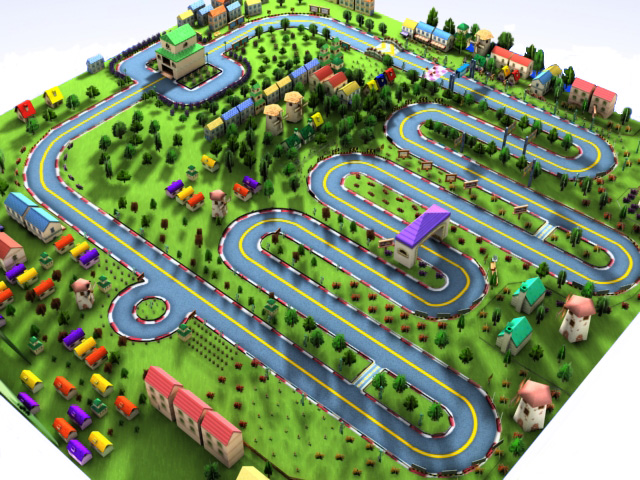

# 🏎️ [원문 RAW] 언리얼 5.8 MCP 미니 레이싱 트랙 제작 단계별 프롬프트 및 레퍼런스 조감도

> **기록자**: 김민주 (언리얼 5.8 + VFX / AI 페어 개발)  
> **수신/기록 일시**: 2026-09-18 09:36  
> **프로젝트**: 아만보팀 2일 카트라이더 스프린트 (인간 vs AI 대결)  
> **활용 에셋팩**: `Fantastic Village Pack` (`/Game/Fantastic_Village_Pack/`)  
> **연계 문서**: 
> * [[김민주-언리얼5.8_MCP_연동_및_미니레이싱_제작_실시간로그_원문]](./[김민주-언리얼5.8_MCP_연동_및_미니레이싱_제작_실시간로그_원문].md)
> * [[26.09.17]-카트라이더_인간vsAI_기획_및_언리얼파트_아트가이드](../../회의/raw/[26.09.17]-카트라이더_인간vsAI_기획_및_언리얼파트_아트가이드.md)

---

## 📸 1. 트랙 레퍼런스 조감도 (Reference Image)



### 🗺️ 조감도 기반 트랙 레이아웃 및 동선 분석
1. **바닥 베이스 (Ground Base)**:
   * 100m × 100m 정방형의 푸른 잔디(Grass) 및 흙(Dirt) 대지.
2. **폐쇄형 레이싱 트랙 (Closed Loop Spline Track)**:
   * **출발 및 결승 구간 (Start/Finish)**: 보라색 지붕의 아치 게이트(Arch Gate) 및 결승선 통과 감지용 트리거 볼륨, PlayerStart 배치.
   * **지그재그 헤어핀 코너 (S-Curves / Hairpin Turns)**: 우측 구간에 배치된 3~4회의 연속 유턴 코스. 감속과 섬세한 드리프트 컨트롤 요구.
   * **고속 외곽 구간 (High-speed Outer Circuit)**: 상단 및 좌측을 크게 감싸는 완만한 코너와 롱 스트레이트 직선 주로.
   * **회전 로터리 루프 (Roundabout Loop)**: 좌측 하단의 원형 회전교차로 구간을 돌아 다시 출발선 직선 주로로 합류.
3. **환경 및 랜드마크 배치 (Environment & Landmarks)**:
   * **트랙 안전 영역 확보**: 주행로 중심선으로부터 최소 7m 이상 이격하여 차량 주행 방해 방지.
   * **외곽 건물군 (Perimeter Village)**: 맵 바깥 라인을 따라 아기자기한 판타지 빌리지 주택들이 조밀하게 정렬.
   * **중앙 및 코너 랜드마크**: S자 코너 안쪽 및 트랙 중앙 빈터에 풍차(Windmill), 석조 시계탑(Tower) 등 시각적 랜드마크 배치.
   * **식생 및 소품 (Vegetation & Props)**: 트랙 주변 잔디밭에 침엽수/활엽수, 덤불, 나무통/상자 소품들을 무작위 회전·스케일로 자연스럽게 분산 배치.

---

## 📋 2. 단계별 지시 프롬프트 원문 (0단계 ~ 5단계)

### [0단계] 차량 모드 전환 및 에셋 스캔 (MCP 연결 확인용)
```plaintext
현재 언리얼 에디터의 프로젝트 상태를 확인하고 기본 설정을 해줘.
1. 현재 레벨 WorldSettings의 GameModeOverride를 '/Game/VehicleTemplate/Blueprints/SportsCar/BP_SportsCarGameMode' (또는 프로젝트 내 차량 게임모드 블루프린트)로 변경해 줘.
2. '/Game/Fantastic_Village_Pack/meshes' 및 '/Game/Fantastic_Village_Pack/materials' 경로에 존재하는 에셋 목록을 가져와서, 도로(Road/Track), 바닥(Floor/Ground/Grass), 건물(House/Building), 나무(Tree)에 적합한 대표 메시/머티리얼의 전체 에셋 경로(Asset Path) 목록을 요약해서 출력해 줘.
```

### [1단계] 바닥 베이스 플레이트 생성
```plaintext
언리얼 파이썬 API를 사용해 미니 레이싱 맵의 바닥 베이스를 생성해 줘.
1. 좌표 (0, 0, 0) 위치에 100m x 100m 크기(Scale: X=100, Y=100, Z=1)의 기본 Plane 액터를 스폰해 줘.
2. 바닥 머티리얼은 '/Game/Fantastic_Village_Pack/materials' 폴더 내의 잔디(Grass) 또는 흙(Ground) 머티리얼 중 하나를 찾아 적용해 줘.
3. 차량이 바닥을 뚫고 추락하지 않도록 충돌체 설정을 확인하고, Collision Profile을 'BlockAll'로 지정해 줘.
4. 액터 이름(Label)은 'Ground_Plane'으로 지정해 줘.
```

### [2단계] 폐쇄형 스플라인 트랙 및 충돌체 생성
```plaintext
'/Game/Fantastic_Village_Pack/meshes' 경로 내의 도로 또는 다리/바닥 모듈 메시(예: Road, Street, Track 키워드가 포함된 정적 메시)를 사용해서 카트라이더 스타일 레이싱 트랙을 만들어 줘.

[트랙 동선 요구사항]
가로 80m x 세로 80m 영역 안에 배치되는 폐곡선(IsClosedLoop = True) 스플라인 트랙:
1. 시작 직선 주로: (0, 0, 15)에서 출발하는 직선 코스.
2. 우측 구간: 연속 3~4회의 완만한 유턴이 이어지는 지그재그(S자) 헤어핀 코너.
3. 상단 및 좌측 구간: 고속 주행이 가능한 큼직한 외곽 코너 및 직선 주로.
4. 좌측 하단 작은 로터리 루프를 돌아 다시 출발점으로 연결.

[물리 및 컴포넌트 필수 요구]
1. SplineComponent를 가진 액터를 생성하고 위 좌표들을 포인트로 등록해 줘.
2. 각 스플라인 구간마다 SplineMeshComponent를 생성해 지정한 도로 메시를 이어붙여 줘.
3. 도로 메시의 비틀림을 막기 위해 UpVector를 (0, 0, 1)로 고정하고 Roll 축 회전을 0으로 유지해 줘.
4. 차량 타이어가 정상 지지되도록 Collision Profile을 'BlockAll'로 설정하고 SetGenerateOverlapEvents(True)를 켜 줘.
```

### [3단계] 스타트 지점(PlayerStart) 및 아치 게이트
```plaintext
방금 생성한 트랙의 출발 지점에 차량 스폰 위치와 결승선 아치를 세팅해 줘.
1. 트랙 스플라인 0번 포인트 위치를 기준으로 도로 표면 살짝 위(Z + 50)에 'PlayerStart' 액터를 스폰해 줘.
2. PlayerStart의 회전(Yaw)은 스플라인의 첫 번째 구간 진행 방향(Tangent)과 정확히 일치시켜 줘.
3. '/Game/Fantastic_Village_Pack/meshes' 내의 게이트, 아치, 혹은 기둥 구조물 메시를 찾아 시작 지점 도로 위에 걸치도록 스폰해 줘.
4. 결승선 통과 감지를 위해 도로 폭에 맞춘 BoxTriggerComponent를 게이트 중앙에 생성해 줘.
```

### [4단계] 마을 건물 및 랜드마크 배치
```plaintext
'/Game/Fantastic_Village_Pack/meshes' 경로에 있는 건물 메시(House, Building, Tower, Mill 등)들을 트랙 주변에 배치해 줘.

1. 트랙 도로 중심선으로부터 최소 7m(700 유닛) 이상 떨어진 안전 영역에만 건물을 스폰해 줘 (도로 침범 금지).
2. 외곽 직선 주로 바깥 라인을 따라 집 메시들을 정렬 배치하고, 지그재그 코너 안쪽 공터에는 풍차나 타워 같은 포인트 랜드마크를 2~3개 배치해 줘.
3. 차량 충돌 시 차가 튕겨 나갈 수 있도록 모든 건물 액터의 Collision Profile을 'BlockAll'로 지정해 줘.
4. 아웃라이너 정리를 위해 생성된 건물들을 'Environment_Buildings' 폴더로 묶어줘.
```

### [5단계] 나무(식생) 및 소품 배치
```plaintext
'/Game/Fantastic_Village_Pack/meshes' 경로의 나무(Tree), 덤불(Bush), 상자/통(Box, Barrel) 메시를 사용해 빈 공간을 채워 줘.

1. 트랙 스플라인 중심선 반경 5m 이내 도로 영역은 피해서, 잔디 공터에 총 40~50개의 식생 프랍을 무작위 분포로 스폰해 줘.
2. 자연스러운 연출을 위해 각 액터의 Z 회전(0~360도)과 스케일(0.8 ~ 1.2배)에 랜덤 값을 적용해 줘.
3. 모든 식생/소품 액터는 아웃라이너의 'Environment_Props' 폴더로 정리해 줘.
```

---

## 🛠️ 3. MCP 및 파이썬 실행 기술 매핑 노트

| 단계 | 주요 언리얼 Python API 및 대상 클래스 | 검증/주의 사항 |
| :--- | :--- | :--- |
| **0단계** | `unreal.EditorAssetSubsystem`, `unreal.AssetRegistryHelpers`, `WorldSettings.set_editor_property('game_mode_override_class')` | `Fantastic_Village_Pack` 내 정확한 경로 확인 및 로드 검증 |
| **1단계** | `unreal.EditorLevelLibrary.spawn_actor_from_class(unreal.StaticMeshActor)`, `StaticMeshComponent.set_editor_property('static_mesh')` | 100m(Scale 100), 머티리얼 적용, Collision `BlockAll` |
| **2단계** | `unreal.SplineComponent`, `unreal.SplineMeshComponent`, `unreal.SplinePointType.CURVE` | IsClosedLoop=True, 탄젠트/UpVector (0,0,1) 정렬, 타이어 충돌체 |
| **3단계** | `unreal.PlayerStart`, `unreal.Rotator`, `unreal.BoxComponent` | 스플라인 0번 포인트 접선 방향 일치, 트리거 이벤트 세팅 |
| **4단계** | `unreal.EditorLevelLibrary.spawn_actor_from_object`, `actor.set_folder_path('Environment_Buildings')` | 도로 중심선 7m(700 유닛) 안전 이격 거리 연산, Collision |
| **5단계** | `random.uniform`, `actor.set_actor_scale3d`, `actor.set_folder_path('Environment_Props')` | 반경 5m 회피 조건부 랜덤 스폰, 회전/스케일 변형 |
