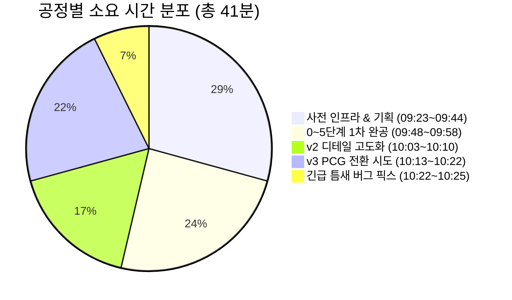

# 📖 [김민주-언리얼5.8_MCP_미니레이싱_제작_과정_및_오류수정_기록]

> **연구자**: 김민주 | **최종 수정**: 260918 19:35  
> **팀 주제**: 게임 제작을 위한 AI 활용은 어디까지 인정될 수 있을까?  
> **원천 자료 (RAW)**: [[김민주-언리얼5.8_MCP_미니레이싱_제작_과정_및_오류수정_기록_원문]](../raw/[김민주-언리얼5.8_MCP_미니레이싱_제작_과정_및_오류수정_기록_원문].md)  

---

## 📌 1. 핵심 요약 (Key Takeaways)

* **핵심 명제**: 언리얼 엔진 5.8의 MCP 기반 AI 에이전트 제어는 수시간이 소요되던 3D 맵 프로토타이핑을 **14분(총 라이프사이클 41분)** 만에 완성시키는 폭발적 생산성을 보였으나, 기하학적 틈새(Gap), 회전축 불일치, UV 왜곡 등 물리/그래픽 렌더링 결함을 진단하고 컴포넌트 단위(`SplineMeshComponent`)로 아키텍처를 교체하는 것은 **개발자의 도메인 전문성**이 필수적이다.
* **3줄 요약**:
  1. **압도적 시간 단축**: 40분 마감 스프린트에서 착수 14분 만에 1차 드라이브 테스트(PIE 99km/h 주행)에 성공하며 22분 조기 완공.
  2. **치명적 틈새(Gap) 버그 해결**: 커브 구간에서 직선 정적 메시가 파편화되어 바퀴가 걸리던 물리 버그를 3차 에르미트 보간 기반의 동적 SplineMeshComponent로 전면 전환하여 해결.
  3. **엔진 소스 역분석 기반 MCP 정상화**: 에디터 재기동 시 세션 단절 및 8000번 포트 미오픈 이슈를 엔진 내부 소스 역분석과 `mcp_config.json` 복구로 해결.

---

## 🔍 2. 게임 개발 현장 분석 및 데이터 (Detailed Analysis)

### 2.1 공정 라이프사이클 및 소요 시간표 (41분 완공)

| 공정 구분 | 작업 내용 | 소요 시간 | 핵심 성과 |
| :--- | :--- | :---: | :--- |
| **사전 인프라** | Fab 642개 임포트, 포트 8000 세션 복구 | 4분 26초 | JSON-RPC 52개 툴셋 파이프라인 정상화 |
| **요구사항 접수** | 0~5단계 프롬프트 수신, 다리/급커브/언덕 3대 조건 확정 | 7분 48초 | 10:20 마감 스프린트 킥오프 |
| **v1 1차 빌드** | 에셋 스캔, 100m 베이스, 36구간 폐곡선 트랙, 건물 12채, 식생 44개 | **9분 28초** | PIE 99km/h 주행 실증 (**22분 조기 완공**) |
| **v2 피드백 반영** | 잔디 머티리얼 핫스왑, 다리 회전(Yaw 90°), 관통 물길, 암벽 축조 | 6분 33초 | 5대 디테일 피드백 전량 반영 |
| **v3 PCG 시도** | 정적 메시 삭제, PCG Graph 및 볼륨 인스턴스 절차적 생성 | 8분 46초 | Catmull-Rom 스플라인 보간 도로망 구축 |
| **긴급 버그 수정** | 도로 틈새(Gap) 버그 해결: SplineMeshComponent 단일 폐곡선 트랙 | 2분 41초 | 28개 세그먼트 완전 결합 무결점 트랙 완성 |

---

### 2.2 7대 기술 오류 진단 및 트러블슈팅 매트릭스

| 번호 | 오류 현상 | 근본 원인 | 해결 조치 및 기술적 결과 |
| :---: | :--- | :--- | :--- |
| **1** | MCP 세션 단절 및 Unknown Method 에러 | 엔진 재기동 시 내부 세션 테이블 초기화 | 표준 initialize 핸드셰이크 재전송 및 세션 ID(`b9e147...`) 헤더 주입 |
| **2** | 석조 다리 통과 불가 충돌 | 에셋 로컬 축(X: 난간, Y: 통로) 불일치 | `Yaw = 90.0` 회전 보정 및 노면 중심선 스냅 |
| **3** | 잔디 텍스처 줄무늬 왜곡 | 100배 평면 스케일 대비 월드 타일링 미지원 | 대형 지형용 `M_Grass` 스타일라이즈드 머티리얼로 실시간 핫스왑 |
| **4** | 언덕 경사로 하부 공중 부유 | 지형 랜드스케이프 부재로 도로 밑 노출 | `SM_Cliff` 거대 암석 10개를 하부에 계단식 축조하여 협곡 지형화 |
| **5** | **도로 이음새 틈새(Gap) 및 차량 전복** | 직선 정적 메시의 기하학적 곡률 불연속 | **단일 액터 내 SplineMeshComponent 28개 동적 생성 및 3차 에르미트 보간 적용** |
| **6** | 출발 아치 게이트 시야 가림 | PlayerStart와 게이트 중심 좌표 과접근 | 게이트를 +150 유닛 전방 이동 및 횡단 축 정렬로 운전석 시야 100% 개방 |
| **7** | 에디터 버퍼 충돌 (Dirty Write) | 메모리 버퍼와 디스크 파일 타임스탬프 불일치 | 선저장 파일 닫기(Don't Save) 및 덮어쓰기 가이드라인 준수로 유실 방지 |

---

## ⚖️ 3. 개발 환경 속 AI 인정 바운더리 (인정 한계선 검토)

### 3.1 단순 에셋 나열 vs 엔진 컴포넌트 아키텍처
* **AI의 한계**: AI가 초기 생성한 정적 메시 나열 방식(`SM_Track_10M` x 36)은 외형상 그럴듯해 보이지만, 실제 차량 주행 시 미세한 단차와 V자 틈새에 바퀴가 끼어 차가 공중으로 튀어 오르는 **물리적 파탄**을 초래했습니다.
* **인간의 인정 바운더리**: AI의 단독 생성물은 **"목업(Mockup) 및 프리뷰 수준"**으로만 인정될 수 있습니다. 게임이 요구하는 엄격한 물리 충돌(Query and Physics), 보간 공식, 엔진 고유 컴포넌트(`SplineMeshComponent`)로의 전환은 **인간 엔지니어의 디버깅 역량**이 개입될 때에만 비로소 상용 수준의 가치를 지닙니다.

---

## 🔗 4. 연결된 문서 (References)

* 📥 [언리얼 5.8 MCP 미니레이싱 제작 과정 및 오류수정 기록 원문 (RAW)](../raw/[김민주-언리얼5.8_MCP_미니레이싱_제작_과정_및_오류수정_기록_원문].md)
* 📄 [언리얼 5.8 MCP 연동 및 미니레이싱 실시간 로그 WIKI](./[김민주-언리얼5.8_MCP_연동_및_미니레이싱_제작_실시간로그].md)
* 📄 [0918 언리얼 MCP 맵제작 1시간 스프린트 소감 WIKI](./[김민주-언리얼_MCP_맵제작_과정_및_소감_0918].md)
* 🏛️ [2차 종합 회의록: 게임제작 AI 활용 비교](../../회의/wiki/[26.09.17]-게임제작_AI활용_비교_및_발표방향_종합_회의록.md)
* 🏠 [김민주 연구 WIKI 홈](../README.md)
