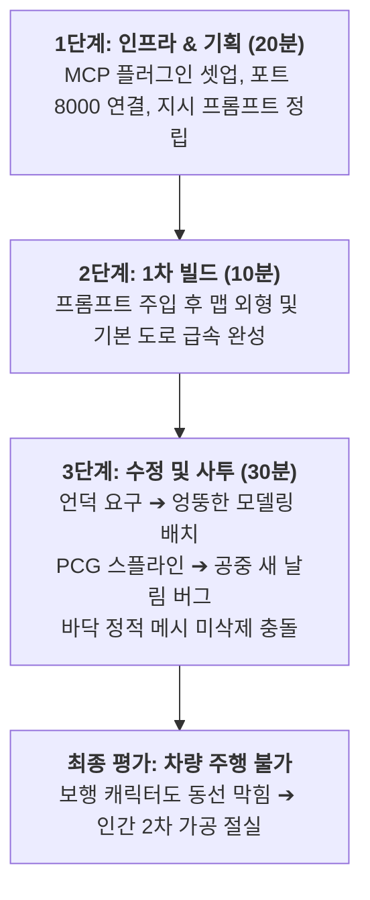

# 📖 [김민주-언리얼_MCP_맵제작_과정_및_소감_0918]

> **연구자**: 김민주 | **최종 수정**: 260918 19:35  
> **팀 주제**: 게임 제작을 위한 AI 활용은 어디까지 인정될 수 있을까?  
> **원천 자료 (RAW)**: [[김민주-언리얼_MCP_맵제작_과정_및_소감_0918_원문]](../raw/[김민주-언리얼_MCP_맵제작_과정_및_소감_0918_원문].md)  

---

## 📌 1. 핵심 요약 (Key Takeaways)

* **핵심 명제**: **"온전히 AI로만 게임 맵을 제작하기에는 기술적 한계가 명확하며, 플레이 가능한 상용 수준에 도달하려면 반드시 인간의 정밀한 2차 가공이 수반되어야 한다."**
* **3줄 요약**:
  1. **1시간 스프린트 도전**: 이동 중 사전 구상한 시나리오를 바탕으로 셋업 20분, 1차 빌드 10분, 수정 사투 30분의 총 60분 타임라인 소화.
  2. **AI의 맥락 오인과 트러블**: 언덕 융기 요구에 다른 모델링을 얹어 차량 주행을 가로막고, 물길 PCG 대신 "공중에 새가 날아다니는 엉뚱한 PCG"를 생성하는 등 프롬프트의 의미론적(Semantic) 한계 노출.
  3. **초반 부스팅의 명확한 가치**: 비록 완벽하지는 않았으나, 아무것도 없는 상태에서 10분 만에 전체 에셋 배치의 뼈대를 세워준 것은 인간의 지루한 반복 노가다를 덜어주는 최고의 윤활유임을 확인.

---

## 🔍 2. 게임 개발 현장 분석 및 데이터 (Detailed Analysis)

### 2.1 1시간 스프린트 단계별 타임라인 및 결과

### 2.2 AI가 드러낸 3대 치명적 한계점 분석

| 구분 | 인간의 의도 (User Intent) | AI의 실제 수행 (AI Action) | 문제점 및 결과 |
| :--- | :--- | :--- | :--- |
| **언덕 생성** | 랜드스케이프 지형(Terrain)을 융기시켜 오르막 노면 형성 | 엉뚱한 바위/구조물 메시를 도로 위에 억지로 얹음 | 사람은 걸어가도 카트는 절대 주행 불가한 장애물화 |
| **바닥 교체** | 기존 정적 메시 평면을 삭제하고 PCG 볼륨으로 교체 | 기존 정적 메시를 지우지 못하고 위에 덧씌움 | 지형 겹침 및 드로우콜 낭비 |
| **PCG 물길** | 스플라인을 따라 흐르는 강물 및 도로 절차적 생성 | 공중에 새 무리가 날아다니는 비행 PCG 라인 생성 | 맥락(Context)을 이해하지 못한 엉뚱한 생성 |

---

## ⚖️ 3. 개발 환경 속 AI 인정 바운더리 (인정 한계선 검토)

### 3.1 AI의 역할: "기반을 깔아주는 비서"
* 김민주 연구자의 실증 결론: AI는 단독으로 게임 완성품을 만들어내는 '창작 주체'가 될 수 없습니다.
* 하지만 **"백지 상태에서 10분 만에 레이아웃 뼈대를 잡아주어, 에셋을 일일이 검색하고 드래그 앤 드롭하는 수시간의 노가다를 없애준 것"**은 부인할 수 없는 거대한 생산성 혁신입니다.

### 3.2 미래 협업 모델: "AI 초안 + 충분한 인간 폴리싱"
* 1시간이라는 인위적 제한 시간 속에서는 AI의 돌발 오류를 수습하기 벅찼으나, **"충분한 시간이 주어진다면 AI가 깔아준 기반 위에 인간이 손길을 더해 완성도 높은 맵을 구축하는 하이브리드 워크플로우"**가 가장 현실적이고 이상적인 개발 바운더리임을 시사합니다.

---

## 🔗 4. 연결된 문서 (References)

* 📥 [0918 언리얼 MCP 맵제작 과정 및 소감 원문 (RAW)](../raw/[김민주-언리얼_MCP_맵제작_과정_및_소감_0918_원문].md)
* 📄 [언리얼 5.8 MCP 미니레이싱 제작 과정 및 오류수정 기록 WIKI](./[김민주-언리얼5.8_MCP_미니레이싱_제작_과정_및_오류수정_기록].md)
* 📄 [0917 언리얼 에셋 및 맵제작 과정 소감 WIKI](./[김민주-언리얼_에셋_및_맵제작_과정_소감_0917].md)
* 🏠 [김민주 연구 WIKI 홈](../README.md)
