# 📖 [김민주-언리얼_에셋_및_맵제작_과정_소감_0917]

> **연구자**: 김민주 | **최종 수정**: 260918 19:35  
> **팀 주제**: 게임 제작을 위한 AI 활용은 어디까지 인정될 수 있을까?  
> **원천 자료 (RAW)**: [[김민주-언리얼_에셋_및_맵제작_과정_소감_0917_원문]](../raw/[김민주-언리얼_에셋_및_맵제작_과정_소감_0917_원문].md)  

---

## 📌 1. 핵심 요약 (Key Takeaways)

* **핵심 명제**: 3D 레벨 디자인에서 상용 에셋이나 외부 베이스 맵을 차용하더라도, 실제 주행 가능한 카트라이더 트랙으로 탈바꿈시키는 핵심 동력은 **도로 폭 확장, 지형 평탄화, 다인 교차 검증, 조명 튜닝 등 인간 개발자의 고도화된 '2차 편집적 가공(Human Secondary Processing)'**이다.
* **3줄 요약**:
  1. **신속한 작업 피봇**: 촉박한 스프린트 일정 내 밑바닥 제작의 한계를 파악하고, Fab 공유 에셋 기반 베이스 맵을 임포트하여 수정·재가공하는 방식으로 전환.
  2. **1시간 vs 4.5시간의 법칙**: 주행 가능한 뼈대(1시간)보다 병목 해소, 지형 스무딩, 라이팅, 폭죽 VFX 등 완성도 폴리싱(4.5시간)에 절대적 시간이 소요됨.
  3. **웹 대비 높은 창작 몰입도**: 2D 코드 위주의 웹 바이브 코딩 대비 3D 뷰포트 공간에서의 실시간 공간 조작과 즉각적 비주얼 피드백이 창작적 재미를 극대화함.

---

## 🔍 2. 게임 개발 현장 분석 및 데이터 (Detailed Analysis)

### 2.1 0917 맵 제작 타임라인 분석 (총 5시간 30분)

```mermaid
gantt
    title 0917 언리얼 맵 제작 5.5시간 스프린트 공정
    dateFormat  HH:mm
    axisFormat %H:%M
    초기 기획 및 세부 조율      :done, des1, 12:00, 12:45
    트랙 구성 및 1차 주행 셋업  :done, des2, 12:45, 13:45
    지형 평탄화 및 트랙 확장    :done, des3, 13:45, 15:45
    다인 교차 테스트 & 조명 수정 :done, des4, 15:45, 17:00
    폭죽 VFX 피날레 & 최종 QA   :done, des5, 17:00, 17:30
```

| 공정 구분 | 주요 작업 내역 | 소요 시간 | 비고 |
| :--- | :--- | :---: | :--- |
| **초기 기획** | 트랙 테마, 도로 폭, 장애물, 물리 조건 디테일 정립 | 약 45분 | 설계 집중 |
| **1차 트랙 구성** | 베이스 맵 임포트 및 1차 주행 가능 트랙 셋업 | **약 1시간** | 프로토타입 완료 |
| **트랙 확장/평탄화** | 좁은 길 폭 확장, 지형 평탄화(Flatten/Smooth), 턱 제거 | 약 2시간 | 주행성 확보 |
| **다인 테스트/조명** | 팀원 교차 테스트, 병목 구간 튜닝, 시인성 조명 배치 | 약 1시간 15분 | 완성도 고도화 |
| **피날레 연출** | 결승선 축하 폭죽(Fireworks) VFX 파티클 배치, 최종 QA | 약 30분 | 마감 |
| **총계** | **기획 착수부터 최종 완공까지** | **총 5시간 30분** | 0917 완공 |

---

## ⚖️ 3. 개발 환경 속 AI 인정 바운더리 (인정 한계선 검토)

### 3.1 에셋 수급과 저작자성의 경계
* **외부 리소스 차용의 한계**: Fab 마켓플레이스의 고품질 에셋을 가져오더라도, 게임 특유의 카트 차폭과 코너링 물리에는 맞지 않아 차가 끼이거나 튀는 현상이 필연적으로 발생합니다.
* **편집 저작물로서의 독창성 인정**: 기존 에셋의 텍스처와 지형을 재구성하고, 플레이어의 동선에 맞게 공간을 재배치한 행위는 단순 복제를 넘어선 **'인간의 창작적 기여'**로 인정받아야 합니다.

### 3.2 AI 개발 도구 도입 시 고려점
* 향후 AI가 레벨 디자인 전반을 자동 생성하더라도, **"전체 작업 시간의 80%는 사람이 직접 플레이해보며 병목을 깎아내는 QA 및 폴리싱에 들어간다"**는 본 실증 데이터는 게임 업계의 AI 도입 현실을 설명하는 중요한 척도가 됩니다.

---

## 🔗 4. 연결된 문서 (References)

* 📥 [0917 언리얼 에셋 및 맵제작 과정 소감 원문 (RAW)](../raw/[김민주-언리얼_에셋_및_맵제작_과정_소감_0917_원문].md)
* 📄 [0918 언리얼 MCP 맵제작 과정 및 소감 WIKI](./[김민주-언리얼_MCP_맵제작_과정_및_소감_0918].md)
* 📄 [언리얼 5.8 MCP 연동 및 미니레이싱 실시간 로그 WIKI](./[김민주-언리얼5.8_MCP_연동_및_미니레이싱_제작_실시간로그].md)
* 🏠 [김민주 연구 WIKI 홈](../README.md)
