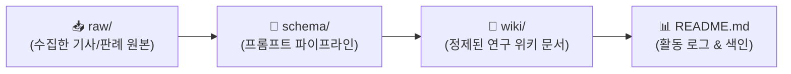

# 🎮 김준호의 AI 게임 제작 연구 WIKI

> **연구자**: 김준호  
> **팀 주제**: **게임 제작을 위한 AI 활용은 어디까지 인정될 수 있을까 (토론)**  
> *"AI가 발전함에 따라 게임 개발에서도 AI에 의존하는 경우가 많아졌다. 프로그래밍을 시작으로 아트, 기획의 영역까지 확장되는 상황에서 우리는 개발 환경 속에서 AI를 어디까지 인정할 것인가"*  
> **위키 구조**: `raw/` (원천자료) → `schema/` (변환규격) → `wiki/` (정제위키)  
> **최근 업데이트**: `260916 19:40`

---

## ⏱️ 활동 및 업데이트 로그 (Activity Log)

> [!IMPORTANT]
> **로그 작성 규칙**: 새 자료를 추가하거나 문서를 수정할 때마다 상단에 **`YYMMDD HH:mm`** 형식으로 타임스탬프를 남깁니다. (깃허브 커밋 시에도 이 형식을 준수합니다.)

| 타임스탬프 (`YYMMDD HH:mm`) | 작업자 | 작업 내용 및 링크 | 비고 |
| :---: | :---: | :--- | :--- |
| `260916 19:40` | **김준호** | 개인 폴더링 개편(`김준호/`) 및 팀 주제 기반 리드미 동기화 | 구조 개편 |
| `260916 18:00` | **김준호** | 3단 구조(`raw/`, `wiki/`, `schema/`) 구축 및 스키마 명세화 | 시스템 설정 |

---

## 🔄 LLM WIKI 파이프라인

### 📂 폴더별 역할
* **`📂 raw/`**: 게임 개발 AI 관련 판례, 노조/협회 성명서, 일자리 피해 보도, AI와의 대화 등 가공 전 원시 데이터
* **`📂 schema/`**: 원본 데이터를 정제할 때 준수하는 스키마 명세서 및 LLM 변환 프롬프트
* **`📂 wiki/`**: 팀 주제에 맞추어 리스크와 인정 바운더리를 정제한 지식 문서

---

## 📐 스키마 & 프롬프트 파이프라인
* 📄 **스키마 명세서**: [schema.md](./schema/schema.md)
* 🤖 **LLM 변환 프롬프트**: [prompt_pipeline.md](./schema/prompt_pipeline.md)
* 📝 **위키 작성 템플릿**: [template.md](./schema/template.md)

---

## 📚 위키 지식 목록 (Wiki Index)

*(현재 등록된 위키 문서가 없습니다. `raw/`에 원본 자료를 올리고 LLM을 통해 정제 문서를 등록해주세요)*

---

## 🔗 팀 내 상호 참조 (Cross References)
* 🏛️ [회의록 아카이브](../회의/README.md)
* 👤 [김민주 연구 WIKI](../김민주/README.md)
* 👤 [함석신 연구 WIKI](../함석신/README.md)
* 📖 [프로젝트 메인 대시보드](../README.md)
