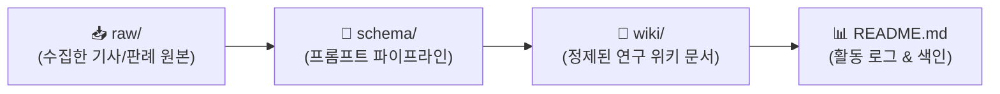

# 🎮 김준호의 AI 게임 제작 연구 WIKI

> **연구자**: 김준호  
> **팀 주제**: **게임 제작을 위한 AI 활용은 어디까지 인정될 수 있을까 (토론)**  
> *"AI가 발전함에 따라 게임 개발에서도 AI에 의존하는 경우가 많아졌다. 프로그래밍을 시작으로 아트, 기획의 영역까지 확장되는 상황에서 우리는 개발 환경 속에서 AI를 어디까지 인정할 것인가"*  
> **위키 구조**: `raw/` (원천자료) → `schema/` (변환규격) → `wiki/` (정제위키)  
> **최근 업데이트**: `260917 09:40`

---

## ⏱️ 활동 및 업데이트 로그 (Activity Log)

> [!IMPORTANT]
> **로그 작성 규칙**: 새 자료를 추가하거나 문서를 수정할 때마다 상단에 **`YYMMDD HH:mm`** 형식으로 타임스탬프를 남깁니다. (깃허브 커밋 시에도 이 형식을 준수합니다.)

| 타임스탬프 (`YYMMDD HH:mm`) | 작업자 | 작업 내용 및 링크 | 비고 |
| :---: | :---: | :--- | :--- |
| `260917 09:40` | **김준호** | `raw/` 데이터 전체 Ingest 완료: 학술 논문 2건, 언론 보도 8건 총 10건 [WIKI 발행](./wiki/README.md) | WIKI 대량 발행 |
| `260916 19:40` | **김준호** | 개인 폴더링 개편(`김준호/`) 및 팀 주제 기반 리드미 동기화 | 구조 개편 |
| `260916 18:00` | **김준호** | 3단 구조(`raw/`, `wiki/`, `schema/`) 구축 및 스키마 명세화 | 시스템 설정 |

---

## 🔄 LLM WIKI 파이프라인

### 📂 폴더별 역할
* **`📂 raw/`**: 게임 개발 AI 관련 판례, 노조/협회 성명서, 일자리 피해 보도, 학술 연구, AI와의 대화 등 가공 전 원시 데이터
* **`📂 schema/`**: 원본 데이터를 정제할 때 준수하는 스키마 명세서 및 LLM 변환 프롬프트
* **`📂 wiki/`**: 팀 주제에 맞추어 리스크와 인정 바운더리를 정제한 지식 문서

---

## 📐 스키마 & 프롬프트 파이프라인
* 📄 **스키마 명세서**: [schema.md](./schema/schema.md)
* 🤖 **LLM 변환 프롬프트**: [prompt_pipeline.md](./schema/prompt_pipeline.md)
* 📝 **위키 작성 템플릿**: [template.md](./schema/template.md)

---

## 📚 위키 지식 목록 (Wiki Index)

> 🔗 전체 상세 목차 및 개요는 **[김준호 WIKI 보관소 (wiki/README.md)](./wiki/README.md)**에서 확인하실 수 있습니다.

### 📑 학술 연구 논문 WIKI (2건)
* 📘 [[김준호-생성형AI_이미지도구_단계별학습전략과_창작통제권](./wiki/[김준호-생성형AI_이미지도구_단계별학습전략과_창작통제권].md)] : 미드저니 vs ComfyUI 인지부하 비교 및 창작 통제권 확보 3단계 모델 (한국컴퓨터게임학회, 2025)
* 📘 [[김준호-AI코딩도입에_따른_관리자_개발자_인식격차와_직무위협](./wiki/[김준호-AI코딩도입에_따른_관리자_개발자_인식격차와_직무위협].md)] : 924명 실증 조사 기반 개발자 vs IT관리자 상호지향성 분석 및 노동권/책임소재 (한국컴퓨터정보학회, 2026)

### 📰 게임 산업 언론 보도 및 사례 분석 WIKI (8건)
* 📰 [[김준호-게임_플랫폼_AI슬롭_범람과_인디_생태계_교란](./wiki/[김준호-게임_플랫폼_AI슬롭_범람과_인디_생태계_교란].md)] : AI 슬롭 범람에 따른 플랫폼 생태계 교란 및 인디 게임 가시성 침해
* 📰 [[김준호-33원정대_수상취소와_AI창작_인정범위_논쟁](./wiki/[김준호-33원정대_수상취소와_AI창작_인정범위_논쟁].md)] : 《33원정대》 AI 사용으로 인한 인디 어워즈 수상 취소 사태와 창작 독창성 쟁점
* 📰 [[김준호-이환_AI에셋_논란과_초기기획_투명성_가이드라인](./wiki/[김준호-이환_AI에셋_논란과_초기기획_투명성_가이드라인].md)] : 《이환》의 AI 에셋 노출 논란과 서브컬처 팬덤의 투명성 준칙
* 📰 [[김준호-AI_양산형_게임_외면과_고전_게임의_역설적_부상](./wiki/[김준호-AI_양산형_게임_외면과_고전_게임의_역설적_부상].md)] : 깊이 없는 AI 양산 게임 외면과 고전 명작(레트로) 회귀 시장 분석
* 📰 [[김준호-붉은사막_AI에셋_미고지_혼입_사태와_사전검수_리스크](./wiki/[김준호-붉은사막_AI에셋_미고지_혼입_사태와_사전검수_리스크].md)] : 《붉은사막》 정식 빌드 내 '다리 3개 말' 혼입 사태와 사전 검수 파이프라인 구축
* 📰 [[김준호-넥슨_생성형AI_도입과_개발보조_도구로서의_인정기준](./wiki/[김준호-넥슨_생성형AI_도입과_개발보조_도구로서의_인정기준].md)] : 넥슨의 전사적 AI 도입과 '대체재가 아닌 보조 도구'로서의 모범 선례
* 📰 [[김준호-AI게임_제작의_한계와_인간_창작자의_디렉팅_필수성](./wiki/[김준호-AI게임_제작의_한계와_인간_창작자의_디렉팅_필수성].md)] : AI 게임 제작의 한계와 감정적 공감을 이끄는 인간 디렉터 큐레이션 역량
* 📰 [[김준호-붉은사막_300만장_돌파와_AI논란_조기진화_선례](./wiki/[김준호-붉은사막_300만장_돌파와_AI논란_조기진화_선례].md)] : 300만 장 돌파와 신속한 인정/교체 조치를 통한 AI 위기관리 벤치마크

---

## 🔗 팀 내 상호 참조 (Cross References)
* 🏛️ [회의록 아카이브](../회의/README.md)
* 👤 [김민주 연구 WIKI](../김민주/README.md)
* 👤 [함석신 연구 WIKI](../함석신/README.md)
* 📖 [프로젝트 메인 대시보드](../README.md)
