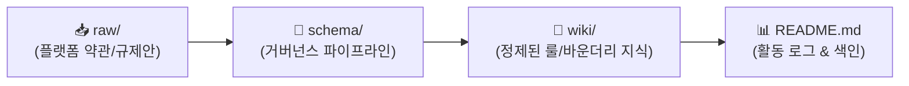

# 🟡 [중립 WIKI] 함석신의 거버넌스 & 휴먼 인 더 루프 위키

> **관리자**: 함석신 (1993년생 / 중립·조정 포지션)  
> **위키 구조**: `raw/` (원천자료) → `schema/` (변환규격) → `wiki/` (정제위키)  
> **최근 업데이트**: `260916 18:00`

---

## ⏱️ 활동 및 업데이트 로그 (Activity Log)

> [!IMPORTANT]
> **로그 작성 규칙**: 자료를 추가하거나 문서를 수정할 때마다 상단에 **`YYMMDD HH:mm`** 형식으로 타임스탬프를 남겨주세요.

| 타임스탬프 (`YYMMDD HH:mm`) | 작업자 | 작업 내용 및 링크 | 비고 |
| :---: | :---: | :--- | :--- |
| `260916 18:00` | **함석신** | 중립 폴더 3단 구조(`raw/`, `wiki/`, `schema/`) 개편 및 스키마 명세화 | 시스템 고도화 |
| `260916 18:00` | **함석신** | [[중립/wiki/[함석신-스팀_AI라벨링_및_휴먼인더루프_가이드라인]|📖 [함석신-스팀_AI라벨링_및_휴먼인더루프_가이드라인]]] 위키 발행 | WIKI 등록 |
| `260916 17:48` | **함석신** | 중립 폴더 LLM WIKI 초기 대시보드 구축 | 초기 설정 |

---

## 🔄 중립 LLM WIKI 아키텍처

### 1. 📂 폴더별 역할
* **`📂 raw/`**: 플랫폼 정책문, 정부 규제안, 저작권위원회 연구서 등 원시 데이터
* **`📂 schema/`**: 휴먼 인 더 루프 및 파이프라인 바운더리를 추출하는 스키마 명세서 및 LLM 변환 프롬프트
* **`📂 wiki/`**: 공존 룰과 하브루타 조정 논리가 정제된 위키 문서

---

## 📐 스키마 & 프롬프트 파이프라인
* 📄 **스키마 명세서**: [[중립/schema/schema|schema.md (Frontmatter 및 거버넌스 필드 정의)]]
* 🤖 **LLM 변환 프롬프트**: [[중립/schema/prompt_pipeline|prompt_pipeline.md (원문 → WIKI 자동 변환)]]
* 📝 **위키 작성 템플릿**: [[중립/schema/template|template.md]]

---

## 📚 중립 WIKI 지식 목록 (Wiki Index)

### 📌 정제된 위키 문서
* 🔗 [[중립/wiki/[함석신-스팀_AI라벨링_및_휴먼인더루프_가이드라인]|📖 [함석신-스팀_AI라벨링_및_휴먼인더루프_가이드라인]]]
  * 요약: 스팀의 2024 AI 라벨링 정책, 인간 감독/디렉터 책임제, 파이프라인별 허용 바운더리

---

## 🔗 상호 참조 (Cross References)
* [[회의/[26.09.16]-게임_AI_활용_바운더리와_인지_외주화_종합_회의록|26.09.16 종합 회의록]]
* [[찬성/README|찬성 WIKI (김민주)]]
* [[반대/README|반대 WIKI (김준호)]]
