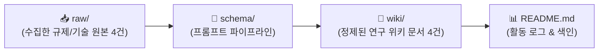

# 🎮 함석신의 AI 게임 제작 연구 WIKI

> **연구자**: 함석신  
> **팀 주제**: **게임 제작을 위한 AI 활용은 어디까지 인정될 수 있을까 (토론)**  
> *"AI가 발전함에 따라 게임 개발에서도 AI에 의존하는 경우가 많아졌다. 프로그래밍을 시작으로 아트, 기획의 영역까지 확장되는 상황에서 우리는 개발 환경 속에서 AI를 어디까지 인정할 것인가"*  
> **위키 구조**: `raw/` (원천자료 4건) → `schema/` (변환규격) → `wiki/` (정제위키 4건 전수 인제스트 완료)  
> **최근 업데이트**: `260918 19:35` (3일간의 프로젝트 WIKI 인제스트 100% 완료)

---

## ⏱️ 활동 및 업데이트 로그 (Activity Log)

> [!IMPORTANT]
> **로그 작성 규칙**: 새 자료를 추가하거나 문서를 수정할 때마다 상단에 **`YYMMDD HH:mm`** 형식으로 타임스탬프를 남깁니다. (깃허브 커밋 시에도 이 형식을 준수합니다.)

| 타임스탬프 (`YYMMDD HH:mm`) | 작업자 | 작업 내용 및 링크 | 비고 |
| :---: | :---: | :--- | :--- |
| `260918 19:35` | **함석신** | 📦 3일간의 프로젝트 종료에 따른 **RAW 데이터 전수 인제스트 완료 (정제 WIKI 4건 전량 신규 발행)** | **전체 인제스트 완료** |
| `260917 11:25` | **함석신** | 🎤 발표 방향성 [웹 vs 언리얼 MCP 비교 전략 가이드](raw/[함석신]-발표_방향성_웹_vs_언리얼_MCP_비교.md) 기획 및 등록 | 비교 전략 수립 |
| `260916 21:50` | **함석신** | [💻 AI 창작 쟁점 분석 라이브 대시보드 기획안](raw/ai_creation_issue_dashboard_proposal.md) 등록 | 프로젝트 기획 |
| `260916 21:46` | **함석신** | [🔗 AI 창작 및 게임 개발 쟁점 조사 보고서](raw/ai_game_creation_research.md) 5대 데이터 축 및 실전 발표 스피치 가이드 보강 | 내용 보강 |
| `260916 21:37` | **함석신** | [🔗 AI 창작 및 게임 개발 쟁점 조사 보고서](raw/ai_game_creation_research.md) 등록 | 조사 보고서 |
| `260916 21:25` | **함석신** | [게임 개발 및 창작 AI 활용 가이드](raw/[함석신]-게임_개발_및_창작_AI_활용_가이드.md) 정리 및 등록 | 문서 작성 |
| `260916 19:40` | **함석신** | 개인 폴더링 개편(`함석신/`) 및 팀 주제 기반 리드미 동기화 | 구조 개편 |
| `260916 18:00` | **함석신** | 3단 구조(`raw/`, `wiki/`, `schema/`) 구축 및 스키마 명세화 | 시스템 설정 |

---

## 🔄 LLM WIKI 파이프라인

### 📂 폴더별 역할
* **`📂 raw/`**: 플랫폼 정책, 법제 가이드라인, 대시보드 기획서, 웹 vs 언리얼 비교 메모 등 가공 전 원시 데이터 (4건)
* **`📂 schema/`**: 원본 데이터를 정제할 때 준수하는 스키마 명세서 및 LLM 변환 프롬프트
* **`📂 wiki/`**: 팀 주제에 맞추어 거버넌스와 인정 기준 척도를 정제한 공식 지식 문서 (4건)

---

## 📐 스키마 & 프롬프트 파이프라인
* 📄 **스키마 명세서**: [schema.md](./schema/schema.md)
* 🤖 **LLM 변환 프롬프트**: [prompt_pipeline.md](./schema/prompt_pipeline.md)
* 📝 **위키 작성 템플릿**: [template.md](./schema/template.md)

---

## 📚 위키 지식 목록 (Wiki Index - 총 4건)

> 🔗 전체 상세 목차 및 개요는 **[함석신 WIKI 보관소 (wiki/README.md)](./wiki/README.md)**에서 확인하실 수 있습니다.

### ⚖️ AI 거버넌스 & 바운더리 기준 WIKI (2건)
1. 📄 **[[함석신-게임_개발_및_창작_AI_활용_가이드]](./wiki/[함석신]-게임_개발_및_창작_AI_활용_가이드.md)**
   * 코딩(적극 수용), 아트(초안 한정/인간 리터칭 필수), 기획(서브 보조/메인 인간 주도) 3대 파이프라인별 AI 인정 바운더리
   * 스팀 정책 개정사, 직군별 수용도 지표 기반 4단계 발표 전략 및 실시간 진단 대시보드 연계 거버넌스
2. 📄 **[[함석신-게임_개발_및_창작_생태계_내_AI_도입의_한계와_허용_기준_연구]](./wiki/[함석신]-게임_개발_및_창작_생태계_내_AI_도입의_한계와_허용_기준_연구.md)**
   * 콘진원 국내 게임사 AI 도입률 41%, GDC 2025 개발자 55% 효율성 설문 등 5대 객관적 데이터 축 분석
   * 미 저작권청(USCO) 판례, SAG-AFTRA 비디오게임 파업(95% 찬성)과 **'학습-생성-이용 3단계 스크리닝 체계'** 수립

### 💻 기술 프로덕트 & 실증 비교 WIKI (2건)
3. 📄 **[[함석신-AI_창작_찬반_및_윤리_쟁점_분석_라이브_대시보드_기획안]](./wiki/[함석신]-AI_창작_찬반_및_윤리_쟁점_분석_라이브_대시보드_기획안.md)**
   * FastAPI + Google Gemini API(Search Grounding) + Vanilla JS 반응형 대시보드 아키텍처 명세서
   * 쟁점 키워드 입력 시 찬성(효율), 반대(저작권), 가이드라인(마지노선) 3단 카드를 3초 만에 렌더링하는 발표 현장 라이브 시연 각본
4. 📄 **[[함석신-발표_방향성_웹_vs_언리얼_MCP_비교]](./wiki/[함석신]-발표_방향성_웹_vs_언리얼_MCP_비교.md)**
   * 동일한 레이싱 게임 목적 아래 웹 바이브 코딩(초고속 프로토타이핑/TTM) vs 언리얼 5.8 MCP(고품질 물리 시뮬레이션/차세대 에이전틱 워크플로우) 실증 비교
   * 발표 슬라이드 단독 매트릭스 표 및 비즈니스 의사결정 전략 도출

---

## 🔗 팀 내 상호 참조 (Cross References)
* 🏛️ [회의록 아카이브](../회의/README.md)
* 👤 [김민주 연구 WIKI](../김민주/README.md)
* 👤 [김준호 연구 WIKI](../김준호/README.md)
* 📖 [프로젝트 메인 대시보드](../README.md)
