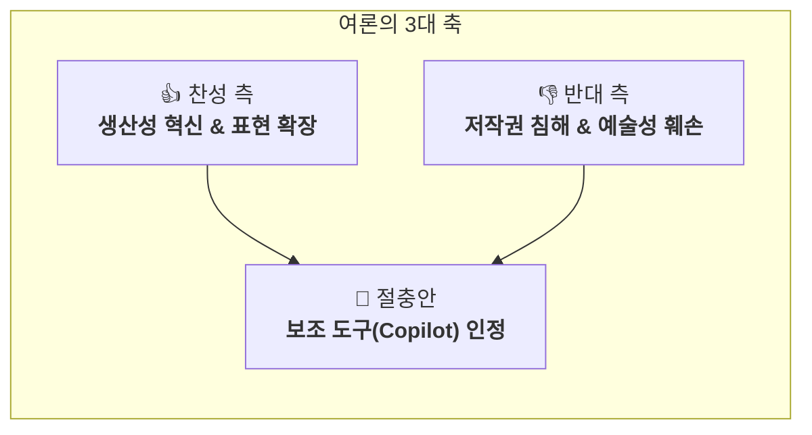
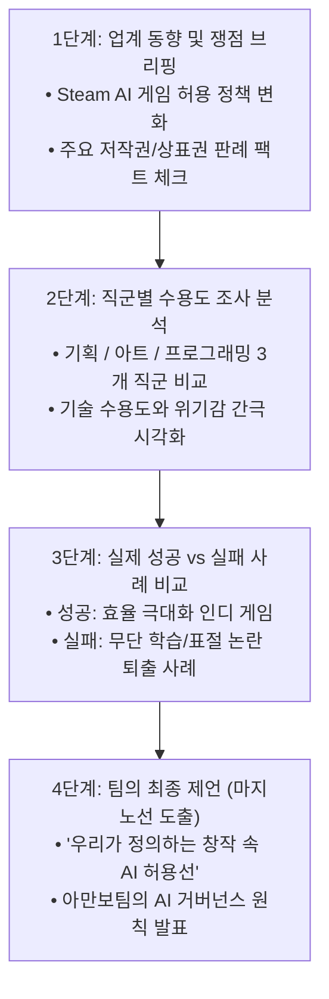
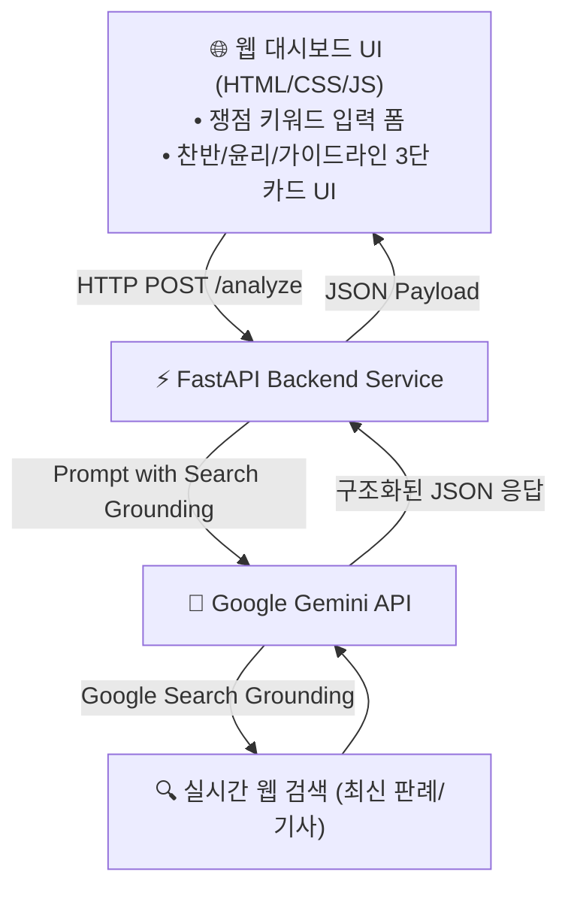

# 🎮 [함석신-게임 개발 및 창작 AI 활용 가이드]

> **연구자**: 함석신 | **작성 일시**: 2026-09-16 21:25  
> **팀 주제**: **게임 제작을 위한 AI 활용은 어디까지 인정될 수 있을까 (토론)**  
> *"AI가 발전함에 따라 게임 개발에서도 AI에 의존하는 경우가 많아졌다. 프로그래밍을 시작으로 아트, 기획의 영역까지 확장되는 상황에서 우리는 개발 환경 속에서 AI를 어디까지 인정할 것인가"*  
> **소속**: 아만보팀 [아는만큼보인다]

---

## 📌 1. 핵심 요약 (Executive Summary)

1. **활용 바운더리**: AI는 인간 창작자를 대체하는 '대체재'가 아닌, 생산성을 극대화하고 아이디어를 확장하는 **'보조 도구(Copilot)'**로 한정 인정.
2. **발표 전략**: 단순 찬반 나열을 넘어 **스팀(Steam) 정책, 판례, 직군별 수용도 지표 등 객관적 데이터**를 기반으로 실증적 결론 도출.
3. **기술 산출물**: **FastAPI + Gemini API(Google Search Grounding) + 실시간 카드 대시보드**를 연동한 **「AI 창작 찬반 및 윤리 쟁점 분석 라이브 대시보드」** 구현 및 발표 현장 라이브 시연.

---

## ⚖️ 1. 주제에 대한 의견: 찬반 대립 및 실무 활용 방향

현재 게임 및 창작 업계의 여론은 생산성 혁신과 저작권/예술성 보호라는 두 가치가 첨예하게 대립하고 있으며, 현실적인 절충 가이드라인이 요구되고 있습니다.



### 1.1 찬성 측 (생산성 혁신 및 표현 확장)
* **소규모·인디 개발팀의 무기**: 대기업 대비 인력과 자본이 절대적으로 부족한 인디 게임 개발자에게 AI는 강력한 레버리지 역할을 수행합니다.
* **비용 및 시간 절감**:
  * 단순 반복 코딩(보일러플레이트 코드 작성, 단위 테스트 생성)
  * 프로토타입 단계의 에셋 초안 제작
  * NPC 다이얼로그 템플릿 및 환경 텍스트 대량 생성
* **핵심 가치 집중**: 소모성 작업 시간을 줄여 게임의 핵심 기획, 스토리텔링, 독창적인 게임 메커니즘 구상에 역량을 집중할 수 있습니다.

### 1.2 반대 측 (저작권 침해 및 예술성 훼손)
* **무단 데이터 스크래핑 및 상업적 착취**: 기존 아티스트와 작가들이 오랜 시간 축적한 고유 화풍과 저작물을 동의 없이 학습(Data Scraping)하여 상업용 모델로 활용하는 것에 대한 반발이 거셉니다.
* **예술의 본질적 가치 훼손**: AI의 생성물은 통계적 확률에 기반한 결과물일 뿐, 인간 고유의 철학·감정·경험을 온전히 담아낼 수 없으며 결과적으로 게임 예술의 가치를 하락시킨다는 우려가 존재합니다.
* **주니어 사다리 단절**: 초급 개발자/아티스트가 실무를 통해 성장할 수 있는 진입 관문이 사라져 장기적인 창작 생태계가 붕괴될 위험이 있습니다.

### 1.3 절충안: 올바른 활용 가이드라인 (툴로서의 인정)

> [!IMPORTANT]
> **핵심 원칙**: **"AI는 대체재(Replacement)가 아니라 보조 도구(Copilot)이다."**

* **허용 영역 (적극 수용)**:
  * 브레인스토밍 및 아이디어 발상
  * 다국어 로컬라이징 번역 보조
  * QA 버그 시뮬레이션 및 플레이테스트 데이터 분석
  * 코드 리팩토링 및 디버깅
* **제한 영역 (인간의 책임 귀속)**:
  * 최종 게임 원화 및 핵심 비주얼 에셋
  * 메인 퀘스트 시나리오 및 핵심 세계관 설정
  * **저작권 및 법적 책임**: 최종 산출물에 대한 윤리적·법적 책임은 온전히 인간 디렉터와 창작자가 부담해야 함.

---

## 📊 2. 발표 내용 추천: 차별화된 데이터 기반 구상

단순히 "이런 의견들이 있다" 수준의 발표는 평범합니다. **"우리가 직접 데이터를 수집하고 분석해 보니 이러한 결론이 도출되었다"**는 실증적 분석을 전면에 배치해야 청중과 평가위원의 신뢰를 얻을 수 있습니다.

### 2.1 4단계 추천 발표 흐름 (Storyline)



### 2.2 세부 구성 항목

| 단계 | 주요 발표 콘텐츠 | 데이터 및 팩트 포인트 |
| :--- | :--- | :--- |
| **1. 쟁점 브리핑** | 스팀(Steam)의 AI 생성 게임 등록 정책 개정 히스토리 | • 2023년 초기 전면 거절 → 2024년 개발자 자율 공시(Disclosure) 및 실시간 AI 생성 필터링 도입으로 정책 선회 분석<br>• 미국 저작권청(USCO)의 AI 저작물 등록 거부 판례 |
| **2. 직군별 수용도** | 기획·아트·프로그래밍 간의 시각차 분석 | • **프로그래머**: Copilot 등 도구 도입률 매우 높음 (효율 중심)<br>• **기획자**: 브레인스토밍/퀘스트 생성 보조로 긍정적 수용<br>• **아티스트**: 화풍 도용, 포트폴리오 가치 하락으로 강한 우려 |
| **3. 사례 비교 분석** | AI 활용 성공 vs 실패 사례 비교 | • **성공 사례**: 소규모 인디팀이 AI를 환경 텍스처/프로토타입에 활용해 런칭 성공<br>• **실패/비판 사례**: 원작자 동의 없는 화풍 복제 논란으로 유저 평점 테러 및 스토어 제재를 받은 사례 |
| **4. 팀의 최종 제언** | 창작 속 AI의 마지노선(Red Line) 정의 | • 투명성(AI 사용 여부 공시 의무화)<br>• 원작자 보상 체계(Opt-out / 학습 데이터 출처 명시)<br>• 최종 책임 귀속 원칙(인간 검수 필수화) |

---

## 💻 3. 기술 연계 결과물 아이디어: 「AI 창작 찬반 및 윤리 쟁점 분석 라이브 대시보드」

수업에서 학습한 기술 스택(**FastAPI, Gemini API, 반응형 웹 대시보드, 클라우드**)을 결합하여, 프로젝트 주제를 실제로 검증·분석하는 소프트웨어 산출물을 제작합니다.

### 3.1 시스템 아키텍처 다이어그램



### 3.2 핵심 기능 및 구현 명세

1. **백엔드 (FastAPI)**:
   - 엔드포인트: `POST /api/analyze-issue`
   - 요청 바디: `{"keyword": "게임 아트 AI 생성", "target_genre": "인디 RPG"}`
   - 기능: 사용자 입력 키워드를 기반으로 최적화된 시스템 프롬프트를 조립하여 Gemini API 호출
2. **AI 엔진 (Gemini API with Google Search Grounding)**:
   - 최신 웹 검색 그라운딩을 활성화하여 2024~2026년 최신 게임 정책, 저작권 이슈, 판례를 실시간 탐색
   - 일관된 카드 UI 렌더링을 위해 **Structured JSON Output** 형태로 결과 반환:
     ```json
     {
       "issue": "AI 게임 아트 활용",
       "pros": ["에셋 제작 비용 70% 절감", "소규모 팀의 프로토타이핑 가속"],
       "cons": ["학습 데이터 저작권 리스크", "스팀 유저 평점 및 신뢰도 하락 우려"],
       "guidelines": [
         "배경 에셋 초안에만 한정 사용",
         "주요 캐릭터 원화는 100% 인간 수작업 유지",
         "스토어 페이지에 AI 활용 범위 명시"
       ],
       "precedents": ["Steam AI Content Disclosure Policy", "USCO Thaler 판결"]
     }
     ```
3. **프론트엔드 (Live Dashboard UI)**:
   - 검색창에 쟁점 키워드 입력 시 로딩 인디케이터 동작
   - 결과를 **[찬성 측 논거]**, **[반대 측 리스크]**, **[실무적 가이드라인 대안]**의 3분할 인터랙티브 카드 UI로 깔끔하게 렌더링
   - 다운로드 기능: 분석 리포트를 마크다운(`MD`) 또는 `JSON`으로 내보내기 지원

### 3.3 발표 시 시연(Live Demo) 연출 전략

* **도입부**: 발표 초반, 스크린에 실제 배포된 웹 대시보드(또는 로컬 서버)를 전체 화면으로 띄움.
* **현장 인터랙션**:
  1. 청중 또는 교수님에게 즉석에서 논쟁적인 키워드(예: *"생성형 AI로 NPC 풀 보이스 더빙"*)를 제안받음.
  2. 검색창에 해당 키워드를 입력하고 분석 실행.
  3. 실시간으로 Gemini가 웹 검색을 거쳐 최신 성우 노조 파업 이슈, 찬성 논거, 실무 가이드라인을 카드 형태로 도출하는 모습을 시연.
* **기대 효과**:
  * 기술적 완성도(FastAPI, Gemini API, UI 개발 능력) 입증
  * 주제 적합성(단순 발표가 아닌, 토론을 서포트하는 실제 프로덕트 구현)에 대한 극찬 유도

---

## 📅 4. 함석신의 역할 및 액션 플랜 (Action Plan)

아만보팀 내에서 본 연구자(함석신)의 핵심 담당 영역은 **"개발 파이프라인별 인정 바운더리 기준 및 AI 거버넌스 체계화"**입니다.

1. **1단계 (RAW 데이터 수집)**:
   - 스팀(Steam)의 최신 AI 게임 등록 공시 가이드 전문 수집 (`raw/` 저장)
   - 주요 게임사(유비소프트, 엔씨소프트 등)의 AI 도입 및 논란 사례 정리
2. **2단계 (FastAPI 대시보드 프로토타이핑)**:
   - FastAPI 백엔드 구축 및 Gemini API 프롬프트 엔지니어링 수행
   - 쟁점 분석 JSON 스키마 규격화
3. **3단계 (팀 협업 및 발표 연계)**:
   - 김민주(생산성 관점), 김준호(리스크 관점) 팀원의 자료를 대시보드 기본 데이터셋으로 흡수
   - 발표 당일 라이브 시연 리허설 진행

---

## 🔗 5. 연결된 문서 (Cross References)

* 🏠 [함석신 연구 WIKI 홈](./README.md)
* 📐 [위키 스키마 명세서](./schema/schema.md)
* 🤖 [LLM 변환 프롬프트 파이프라인](./schema/prompt_pipeline.md)
* 🏛️ [팀 종합 회의록](../../회의/wiki/[26.09.16]-AI_창작과_인간의_역할_종합_회의록.md)
* 📖 [아만보팀 프로젝트 메인 대시보드](../README.md)
