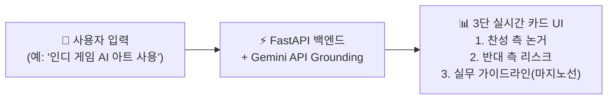

# 💻 [프로젝트 기획안] AI 창작 찬반 및 윤리 쟁점 분석 라이브 대시보드

> **문서 목적**: 내일 아만보팀 미팅에서 제안할 팀 프로젝트 최종 산출물 기획안  
> **기획자**: 함석신  
> **연계 문서**: [🔗 AI 창작 및 게임 개발 쟁점 조사 보고서](./ai_game_creation_research.md)  
> **작성 일시**: 2026-09-16 21:50  

---

## 📌 1. 기획 배경 및 제안 취지

### 1.1 "단순 의견 나열형 PPT"의 한계 극복
* 기존 팀 발표의 가장 큰 맹점은 조사한 내용을 단순히 슬라이드에 텍스트로 나열하는 **"말뿐인 발표"**에 그치기 쉽다는 점입니다.
* 이번 아만보팀 프로젝트는 **"우리가 직접 데이터를 수집·분석하여 마지노선을 도출하고, 우리가 배운 클라우드와 AI 기술로 이를 진단하는 도구까지 직접 만들었다"**는 실증적 프로덕트를 전면에 내세워 평가위원과 청중으로부터 폭발적인 반응을 이끌어내고자 합니다.

### 1.2 배운 핵심 기술의 100% 실무 접목
* 수업을 통해 학습한 **FastAPI(백엔드 비동기 서버)**, **Google Gemini API(Web Search Grounding 포함)**, **반응형 웹 대시보드(Frontend)**, **클라우드 배포 환경**을 하나의 파이프라인으로 유기적으로 엮어 실무 개발 역량을 입증합니다.

---

## 🎯 2. 결과물 개요 및 핵심 기능

### 2.1 프로젝트 명칭
> **「AI 창작 찬반 및 윤리 쟁점 분석 라이브 대시보드」**  
> *(AI Creation Debate & Ethics Live Analyzer Dashboard)*

### 2.2 핵심 작동 프로세스
사용자가 특정 게임 창작 및 개발 이슈(예: *"게임 배경 원화에 생성형 AI 사용"*, *"NPC 대화에 실시간 대화형 LLM 적용"*, *"생성형 AI로 캐릭터 음성 풀 더빙"*)를 입력창에 검색하면:



### 2.3 3대 핵심 분석 카드 구성

| 카드 구분 | 분석 내용 및 출력 데이터 | 기대 효과 |
| :--- | :--- | :--- |
| **🟢 [1] 찬성 측 논거 (Pros)** | • 인디/소규모 팀의 제작비 절감 수치<br>• 프로토타이핑 가속 및 기획 다양성 확장 근거 | 생산성 혁신 관점의 실질적 이점 조명 (김민주 연구 연계) |
| **🔴 [2] 반대 측 리스크 (Cons)** | • 원저작자 화풍 무단 도용 등 저작권 소송 위험<br>• 게이머 커뮤니티 거부감 및 스토어 제재 가능성 | 법적·윤리적 리스크 경각심 고취 (김준호 연구 연계) |
| **🟡 [3] 실무 가이드라인 (Boundary)** | • **3단계 스크리닝(학습-생성-이용)** 기반 마지노선 제시<br>• 인간 디렉터의 필수 검수 절차 및 스토어 공시 지침 | 아만보팀이 정의한 '인간 중심 공존 기준' 실시간 권고 |

---

## 🏗️ 3. 시스템 아키텍처 및 기술 스택

### 3.1 아키텍처 다이어그램

```mermaid
graph TD
    subgraph Frontend [사용자 인터페이스 (UI)]
        UI["🌐 반응형 웹 대시보드<br>• 검색창 & 쟁점 추천 태그<br>• 3단 그리드 카드 UI<br>• PDF/JSON 결과 내보내기"]
    end

    subgraph Backend [백엔드 API 서버 (FastAPI)]
        API["⚡ FastAPI Application<br>• POST /api/analyze<br>• Pydantic 유효성 검증<br>• 비동기(Async) 처리"]
    end

    subgraph AI_Engine [지능형 분석 엔진]
        Gemini["🤖 Google Gemini API<br>• 최적화 시스템 프롬프트<br>• Structured JSON Output"]
        Search["🔍 Google Search Grounding<br>• 최신 판례, 스팀 정책, 기사 실시간 크롤링"]
        Gemini <--> Search
    end

    UI -->|HTTP Request / JSON| API
    API -->|Prompt with Grounding| Gemini
    Gemini -->|검증된 분석 결과| API
    API -->|Clean JSON Payload| UI
```

### 3.2 기술 스택 선정 이유

1. **Backend - `FastAPI`**:
   - Python 기반으로 Gemini API SDK와의 호환성이 가장 뛰어남.
   - 비동기(`async/await`) 통신을 지원하여 실시간 AI 호출 시 끊김 없는 반응 속도 보장.
   - 자동 생성되는 Swagger UI(`/docs`)를 통해 시연 전후 백엔드 완성도를 시각적으로 증명 가능.
2. **AI & Grounding - `Google Gemini API with Search Grounding`**:
   - 2024~2026년 최신 저작권 소송(미드저니 판례, SAG-AFTRA 협약 등)과 스팀(Steam)의 변경된 AI 정책을 실시간 웹 검색으로 참조하여 신뢰도 높은 최신 데이터 제공.
   - JSON Schema 모드를 강제하여 프론트엔드가 즉시 파싱할 수 있는 안정적인 데이터 반환.
3. **Frontend - `Vanilla JS + Modern CSS (Glassmorphism)`**:
   - 무거운 프레임워크 없이 빠르고 가볍게 구동.
   - 다크 모드 기반의 세련된 대시보드 카드 UI로 발표 현장 빔프로젝터 가독성 극대화.
4. **Cloud / Deployment**:
   - 클라우드 컨테이너 서비스(GCP Cloud Run 또는 AWS) 배포 또는 로컬 포워딩(ngrok)을 통한 외부 라이브 접속 환경 지원.

---

## 📋 4. 데이터 인터페이스 설계 (API Spec)

### 4.1 요청 (Request)
```json
POST /api/analyze
Content-Type: application/json

{
  "issue_keyword": "생성형 AI로 NPC 풀 보이스 더빙",
  "project_scale": "인디 게임 (소규모)",
  "target_market": "글로벌 (Steam 출시 목표)"
}
```

### 4.2 응답 (Response)
```json
{
  "status": "success",
  "data": {
    "keyword": "생성형 AI로 NPC 풀 보이스 더빙",
    "pros": [
      "인디 개발비의 약 60~80%에 달하는 전문 성우 녹음 비용 절감",
      "다국어 로컬라이징 음성을 손쉽게 동시 제작 가능"
    ],
    "cons": [
      "SAG-AFTRA 비디오게임 협약 위반 리스크 (디지털 복제 시 사전 고지 및 교섭 의무화)",
      "게이머 커뮤니티의 '영혼 없는 무성의한 더빙' 비판 및 평점 하락"
    ],
    "team_guideline": [
      "1. 상용 라이선스가 보장된 클린 음성 데이터셋만 제한적 활용",
      "2. 메인 캐릭터는 인간 전문 성우 기용 필수, 단순 엑스트라 NPC에 한하여 보조적 사용",
      "3. 스팀 스토어 제품 페이지에 AI 음성 사용 범위를 투명하게 사전 공시"
    ],
    "citations": [
      {
        "title": "SAG-AFTRA 2025 Interactive Media Agreement",
        "url": "https://www.sagaftra.org"
      },
      {
        "title": "Steam AI-Generated Content Guidelines",
        "url": "https://www.makeuseof.com/new-steam-ai-games-rules/"
      }
    ]
  }
}
```

---

## 🎬 5. 발표 현장 라이브 시연(Live Demo) 연출 각본

발표자가 스크린에 라이브 대시보드를 띄우고 진행할 1분 30초 인터랙션 시나리오입니다:

```
[00:00~00:20] 도입 및 화면 전환
• 발표자: "저희 팀은 단순 토론에 그치지 않고, 지금까지 연구한 법적 쟁점과 가이드라인을 실시간으로 판별해 주는 'AI 창작 윤리 진단 대시보드'를 직접 개발했습니다. 화면을 보시죠."
• 스크린에 로컬/클라우드로 호스팅된 깔끔한 대시보드 웹 화면 전체 송출.

[00:20~00:45] 현장 즉석 키워드 수렴 및 입력
• 발표자: "교수님(또는 청중), 최근 가장 논쟁적이라고 생각하시는 게임 AI 키워드를 하나 던져주시겠습니까?"
• 청중 제안: "인디 게임에서 메인 일러스트를 미드저니로 뽑는 건 어때요?"
• 발표자가 검색창에 즉석 타이핑 후 [쟁점 진단 실행] 버튼 클릭.

[00:45~01:10] 실시간 Gemini Grounding 분석 및 카드 렌더링
• 로딩 스피너 작동 후 3초 만에 3개의 카드가 매끄러운 애니메이션과 함께 등장.
• 발표자: "보시는 것처럼 저희 백엔드 FastAPI와 Gemini가 실시간 웹 검색을 거쳐, 비용 절감 효과(찬성), 미드저니 집단 소송 및 스팀 제재 리스크(반대), 그리고 우리 팀이 수립한 '3단계 스크리닝 가이드라인'을 명확히 도출해 냅니다."

[01:10~01:30] 마무리 메시지
• 발표자: "이처럼 기술은 위험하지만, 우리가 올바른 거버넌스와 도구를 갖춘다면 창작의 훌륭한 파트너가 될 수 있습니다."
• (청중 및 평가위원의 감탄과 박수 유도)
```

---

## 🤝 6. 내일 팀 회의 논의 아젠다 (Team Discussion Points)

내일 정기 미팅에서 팀원들에게 제안하고 확정할 협업 분담안입니다:

### 6.1 팀원별 전문 영역과의 시너지 연계
1. **김민주 팀원 (생산성 & 혁신 담당)**:
   - 대시보드의 **[찬성 측 논거]** 파트에 들어갈 프롬프트 엔지니어링 검토.
   - 인디 개발사의 비용 절감 통계 및 생산성 부스팅 사례 데이터셋 제공.
2. **김준호 팀원 (리스크 & 생태계 보호 담당)**:
   - 대시보드의 **[반대 측 리스크]** 파트 알고리즘 정밀화.
   - 화풍 도용, SAG-AFTRA 파업, USCO 저작권 판례 등 치명적 리스크 키워드 매핑.
3. **함석신 (본인 - 거버넌스 및 시스템 총괄)**:
   - 대시보드의 **[실무 가이드라인]** 도출 로직(3단계 스크리닝 원칙) 설계.
   - FastAPI 백엔드 구축, Gemini API Grounding 연동 및 웹 대시보드 통합 구현 주도.

### 6.2 회의 시 결정할 사항
- [ ] 결과물 명칭 최종 컨펌 (`AI 창작 윤리 & 쟁점 진단 대시보드`)
- [ ] 백엔드(FastAPI) 및 프론트엔드 기본 템플릿 개발 일정 (D-Day 타임라인)
- [ ] 발표 슬라이드 내 라이브 시연 순서 배치 (발표 전개부 vs 결론부)

---

## 🔗 7. 연결된 문서 (References)
* 📊 [AI 창작 및 게임 개발 쟁점 조사 보고서](./ai_game_creation_research.md)
* 🎮 [게임 개발 및 창작 AI 활용 가이드](./[함석신]-게임_개발_및_창작_AI_활용_가이드.md)
* 🏠 [함석신 WIKI 메인 홈](./README.md)
* 🏛️ [팀 종합 회의록](../../회의/wiki/[26.09.16]-AI_창작과_인간의_역할_종합_회의록.md)
