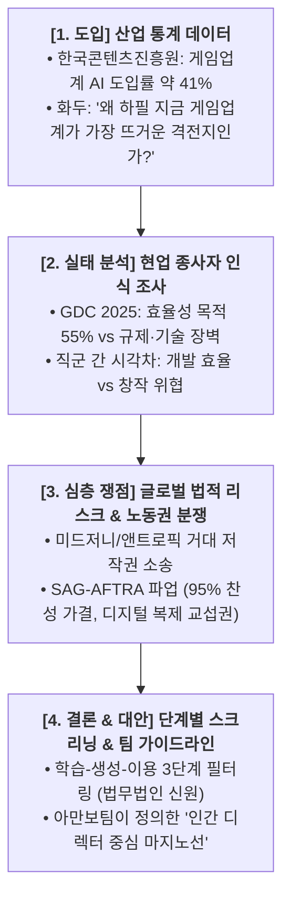

# 🎮 게임 개발 및 창작 생태계 내 AI 도입의 한계와 허용 기준 연구

> **연구 주제**: 게임 개발 환경 속 AI 의존도 증가에 따른 프로그래밍·아트·기획 영역의 AI 수용 범위와 윤리적·실무적 가이드라인 고찰  
> **작성자**: 함석신  
> **작성일**: 2026-09-16  

---

## 1. 📌 찬성 / 반대 / 절충안별 핵심 논거 및 실증 출처

### 🟢 1) 찬성 측 (생산성 혁신 & 인디 개발 표현 확장)
1. **국내 콘텐츠·게임 산업 생성형 AI 도입 가속화**
   - *내용*: 국내 콘텐츠산업의 생성형 AI 활용률이 20%를 돌파했으며, 게임·방송 분야가 도입률 선두를 차지하고 있음.
   - *출처*: [한국콘텐츠진흥원 2025 콘텐츠산업 생성형 AI 활용 실태 보고서 요약 (Platum)](https://platum.kr/archives/271989)
2. **글로벌 게임 개발자 3명 중 1명 생성형 AI 실무 도입**
   - *내용*: GDC(Game Developers Conference) 공식 연례 보고서에 따르면 글로벌 개발자의 30% 이상이 업무 효율화를 위해 AI 툴을 사용 중임.
   - *출처*: [GDC 2025 State of the Game Industry Report 공식 발표](https://reg.gdconf.com/state-of-game-industry-2025)
3. **인디 및 1인 개발자의 리소스 한계 극복**
   - *내용*: 부족한 자본과 인력을 보완하여 대형 스튜디오와의 개발 격차를 좁히고 빠른 프로토타이핑을 가능케 함.
   - *출처*: [Game Developer - GDC 개발자 설문 및 인디 개발 현황](https://www.gamedeveloper.com/business/gdc-2024-state-of-the-game-industry-devs-discuss-layoffs-generative-ai-and-more)
4. **반복 업무 자동화 및 기획 시도 다양화**
   - *내용*: 방대한 NPC 대사 템플릿 제작, 코드 디버깅 등 기계적 노동을 줄이고 핵심 메카닉 기획에 집중 가능.
   - *출처*: [KDB 미래전략연구소 - 게임 산업 내 생성형 AI 도입 동향 브리프](https://www.kdb.co.kr)
5. **다국어 로컬라이제이션 및 게임 접근성 향상**
   - *내용*: 다국어 번역 비용 절감을 통해 소규모 게임의 글로벌 동시 출시 및 시각/청각 보조 기능 개발 용이.

---

### 🔴 2) 반대 측 (저작권 침해, 일자리 위협, 예술적 가치 훼손)
1. **개발자 84%의 윤리적 우려 및 게이머들의 냉소적 반응**
   - *내용*: 게임 제작자 대다수가 데이터 무단 학습의 비윤리성을 경고하고 있으며, 게이머 커뮤니티 내에서도 무성의한 AI 에셋에 대한 거부감 확산.
   - *출처*: [Game Developer - Devs' Ethical Concerns on Generative AI](https://www.gamedeveloper.com/business/gdc-2024-state-of-the-game-industry-devs-discuss-layoffs-generative-ai-and-more)
2. **목소리·모션 캡처 노동권 침해 및 대규모 파업**
   - *내용*: 미국 배우조합(SAG-AFTRA)이 AI 무단 복제에 반발해 장기 비디오게임 파업을 단행, 사전 동의 및 정당한 보상 규정을 쟁취함.
   - *출처*: [SAG-AFTRA Interactive Media (Video Game) Agreement 공식 합의문](https://www.sagaftra.org/contracts-industry-resources/interactive/2025-interactive-media-video-game-agreement)
3. **미국 저작권청(USCO)의 순수 AI 생성물 저작권 불인정**
   - *내용*: 인간의 창의적 개입 없이 AI 프롬프트만으로 뽑아낸 이미지·텍스트는 독점적 저작권 보호 대상이 아니라고 공식 명시.
   - *출처*: [US Copyright Office - Copyright Registration Guidance: AI-Generated Materials](https://www.copyright.gov/ai/)
4. **생성형 AI 빅테크 대상 집단 저작권 소송 리스크**
   - *내용*: 미드저니, 앤트로픽 등 생성 AI 기업들이 원저작자 동의 없는 학습 데이터 무단 크롤링으로 천문학적 소송에 직면.
5. **사내 보안 자산 및 미공개 코드 유출 위험**
   - *내용*: 퍼블릭 LLM에 핵심 게임 로직이나 미공개 시나리오를 무단 입력 시 외부 학습 데이터로 흡수될 보안 취약점 대두.

---

### 🟡 3) 절충안 (보조 도구 Copilot으로서의 가이드라인 수립)
1. **Valve(Steam)의 현실적 AI 게임 퍼블리싱 규정 개정**
   - *내용*: 전면 금지 대신 '사전 생성 AI(Pre-generated)'와 '실시간 생성 AI(Live-generated)'로 나누어 사전 고지 및 유저 신고 가드레일을 의무화함.
   - *출처*: [Valve Steam AI 정책 업데이트 및 가이드라인 (MakeUseOf 보도)](https://www.makeuseof.com/new-steam-ai-games-rules/)
2. **콘텐츠 공정 이용 및 3단계 스크리닝 체계 (학습-생성-이용)**
   - *내용*: 엔터테인먼트 전문 법률가들이 제시하는 단계별 필터링 (라이선스 검증 ➔ 인간의 2차 편집 개입 ➔ 결과물 표기 의무).
3. **캘리포니아주 AI 복제 방지 법안 (AB 1836 / AB 2602)**
   - *내용*: 창작자 및 연기자의 서면 동의 없는 디지털 복제를 금지하는 법제화 확산.
   - *출처*: [California Legislative Information - Digital Replica Protection](https://leginfo.legislature.ca.gov)
4. **사내 및 외주 계약서 내 AI 활용 범위 명문화**
   - *내용*: 상용 납품 에셋에 대한 AI 의존도를 계약서상에 투명하게 공개하고 법적 책임 한계를 사전 규정.
5. **'대체(Substitute)'가 아닌 '증강(Augment)' 철학 확립**
   - *내용*: 기획·아트·코딩의 주도권은 인간이 쥐고, 지루한 반복 연산과 디버깅 보조에 한정하여 생산성을 높이는 공존 모델 지향.

---

## 2. 📊 팀 발표 전략 및 5대 핵심 데이터 기반 구성 프레임워크

단순히 "찬반 양쪽의 의견이 팽팽하다"는 식의 피상적인 의견 나열을 지양하고, **5가지 객관적 실증 데이터 축**을 바탕으로 청중과 심사위원을 설득하는 체계적인 4단계 스토리라인입니다.

### 🎯 5대 핵심 데이터 축 상세 및 실전 발표 시나리오

#### 📈 ① [도입부 - 산업 통계 데이터] 게임업계 생성 AI 도입의 폭발적 가속화
* **객관적 팩트 근거**:
  * **한국콘텐츠진흥원 산업 동향 분석 보고서**: 국내 콘텐츠 산업 전반 중 **게임업계의 생성형 AI 도입률이 약 41%**로 전 분야 중 최고 수준 기록.
* **발표 현장 스피치 가이드 (무슨 이야기를 할 것인가?)**:
  * **핵심 화두 던지기**: *"왜 하필 지금 게임 개발과 AI의 충돌이 콘텐츠 산업 전체에서 가장 뜨거운 화두인가?"*
  * **구체적 전달 메시지**: 
    > "영화나 웹툰과 달리 게임은 소프트웨어 코드, 2D/3D 아트, 음악, 방대한 퀘스트 시나리오가 복합적으로 얽힌 종합 예술 소프트웨어입니다. 따라서 생성형 AI의 침투 속도와 파급력이 다른 어떤 콘텐츠 분야보다 빠르고 거대합니다. 국내 게임사의 무려 41%가 이미 실무에 AI를 도입했다는 통계는, 게임업계에서 AI가 이미 '먼 미래의 실험'이 아니라 '생존과 직결된 현실의 도구'로 자리 잡았음을 증명합니다."
* **슬라이드 연출 팁**: 콘텐츠 분야별 AI 도입률 비교 막대그래프(게임 41% 강조)를 전면에 배치하여 발표 시작과 동시에 객관적 수치로 이목 집중.

---

#### 🔍 ② [실태 분석 - 현업 종사자의 인식 조사] 기대와 현실적 갈등의 공존
* **객관적 팩트 근거**:
  * **GDC(게임 개발자 컨퍼런스) 및 콘진원 종사자 설문조사**: 게임 개발 종사자의 **55% 이상이 '업무 효율성 및 생산성 향상'**을 위해 AI 도구를 채택하고 있으나, 동시에 **데이터 규제 불확실성, 알고리즘 이해 부족, 무단 학습에 대한 윤리적 우려**를 실무 진입의 최대 장벽으로 지목.
* **발표 현장 스피치 가이드 (무슨 이야기를 할 것인가?)**:
  * **핵심 화두 던지기**: *"현업 개발자들은 AI를 마냥 환영하고 있을까, 아니면 어쩔 수 없는 압박 속에 쓰고 있을까?"*
  * **구체적 전달 메시지**: 
    > "현업 개발자들의 현실은 단순한 찬양론과 거리가 멉니다. 55%가 넘는 종사자가 '효율성' 때문에 AI 툴을 켜지만, 동시에 '내가 쓴 프롬프트 결과물이 남의 저작권을 침해하진 않았을까?', '사내 핵심 코드가 외부로 유출되진 않을까?'라는 실무적 갈등과 기술적 장벽을 매일 마주하고 있습니다. 특히 코딩 작업을 자동화하는 프로그래머는 높은 만족도를 보이는 반면, 원화가와 시나리오 작가 직군은 자신들의 고유 스타일이 통째로 흡수된다는 위기감을 느끼며 직군 간 극심한 시각차가 발생하고 있습니다."
* **슬라이드 연출 팁**: 프로그래머(생산성 찬성 우세) vs 아티스트/작가(저작권·고용 위기 우세) 간의 시각차를 대립형 스펙트럼 인포그래픽으로 시각화.

---

#### ⚖️ ③ [법적 리스크 - 글로벌 소송 및 판례 동향] 무단 학습의 대가와 거대 소송전
* **객관적 팩트 근거**:
  * **미드저니(Midjourney)·스태빌리티 AI vs 창작자 집단 소송**: 디즈니, 유니버설 등 글로벌 IP 홀더들의 캐릭터 무단 학습 및 화풍 복제 고소.
  * **앤트로픽(Anthropic)의 음반사/작가 저작권 소송 합의 국면**: 천문학적 배상금 및 학습 데이터셋 투명성 요구.
* **발표 현장 스피치 가이드 (무슨 이야기를 할 것인가?)**:
  * **핵심 화두 던지기**: *"AI로 게임을 빠르게 찍어냈다고 끝일까? 기업을 파멸로 몰고 갈 수 있는 글로벌 법적 시한폭탄"*
  * **구체적 전달 메시지**: 
    > "반대 측의 주장은 단순한 감정적 반발이 아니라 실제 기업의 존폐를 가르는 '치명적인 법적 리스크'에 기반합니다. 전 세계 법정에서는 이미 미드저니, 앤트로픽과 같은 글로벌 AI 빅테크를 상대로 천문학적인 규모의 저작권 침해 소송이 진행 중입니다. 만약 게임 개발사가 출처가 불분명한 AI 모델로 에셋을 제작해 스팀이나 콘솔 스토어에 출시할 경우, 추후 집단 소송이나 판매 중지 가처분이라는 막대한 법적 책임을 고스란히 뒤집어쓰게 됩니다."
* **슬라이드 연출 팁**: 주요 글로벌 AI 저작권 소송 일지와 함께 '미국 저작권청(USCO)의 순수 AI 생성물 저작권 불인정' 판례 문서를 인용해 법적 리스크의 심각성 강조.

---

#### 🎙️ ④ [노동권 및 업계 가이드라인 - 성우/노조 협약] 창작 생태계의 방어선
* **객관적 팩트 근거**:
  * **미국 배우조합(SAG-AFTRA) 비디오게임 협약 (Interactive Media Agreement)**:
    * 조합원 **95% 이상의 압도적 찬성**으로 비디오게임 장기 파업 단행 및 역사적 협약 타결.
    * 핵심 성과: AI를 통한 음성/모션 디지털 복제(Digital Replica) 사용 시 **'사전 고지(Notice)' 및 '명시적 동의와 별도 교섭(Consent & Bargaining)' 의무화**.
* **발표 현장 스피치 가이드 (무슨 이야기를 할 것인가?)**:
  * **핵심 화두 던지기**: *"AI의 위협은 프로그래머와 디자이너만의 문제인가? 목소리와 감정을 연기하는 게임 생태계 전반의 노동권 충돌"*
  * **구체적 전달 메시지**: 
    > "AI 문제는 소프트웨어 개발팀 내부의 울타리를 넘어섰습니다. 캐릭터의 영혼을 불어넣는 성우, 모션 캡처 액터 등 게임 생태계 전반의 노동권과 정면 충돌하고 있습니다. SAG-AFTRA가 95%라는 압도적 찬성으로 쟁취해낸 이번 협약은, 기술이 아무리 발전하더라도 창작자의 목소리와 인격권은 '사전 고지와 교섭'이라는 법적 가드레일 안에서만 다루어져야 한다는 산업계의 강력한 기준점을 세웠습니다."
* **슬라이드 연출 팁**: SAG-AFTRA 파업 현장 슬로건과 협약문의 핵심 2대 원칙('Notice & Bargaining')을 굵은 타이포그래피로 연출.

---

#### 🛡️ ⑤ [대안 제시 - 단계별 스크리닝 및 법률 가이드] 실천 가능한 마지노선
* **객관적 팩트 근거**:
  * **엔터테인먼트 전문 로펌(법무법인 신원 등)의 AI 법률 가이드**: **학습 ➔ 생성 ➔ 이용**의 3단계 스크리닝 시스템 도입 주장.
  * **Valve(Steam)의 현실적 AI 가이드라인**: 사전 고지(Disclosure) 및 실시간 AI 콘텐츠 유저 신고 시스템.
* **발표 현장 스피치 가이드 (무슨 이야기를 할 것인가?)**:
  * **핵심 화두 던지기**: *"무조건적인 금지도, 무제한적인 허용도 답이 아니라면 우리 팀이 내린 최종 결론은 무엇인가?"*
  * **구체적 전달 메시지**: 
    > "저희 아만보팀은 무책임한 찬반 양비론에서 벗어나 실무적 해결책을 모색했습니다. 법률 전문가와 글로벌 플랫폼이 제시하는 최선의 타협점은 **'3단계 스크리닝 체계'**입니다.
    > 1. **학습 단계**: 무단 크롤링 모델을 배제하고 상업적 이용이 검증된 라이선스 데이터셋만 채택.
    > 2. **생성 단계**: 기획과 아트의 주도권은 인간이 쥐고, NPC 대사 초안이나 디버깅 등 '보조 도구(Copilot)'로만 한정.
    > 3. **이용 단계**: 최종 산출물에는 반드시 인간 창작자의 2차 가공과 품질 검증이 필수적으로 수반되어야 하며, 스토어에 AI 사용 범위를 투명하게 고지.
    > 인간의 손길과 책임이 빠진 순수 AI 산출물은 게임 시장에 진입할 수 없다는 것, 이것이 저희 팀이 정의한 창작 속 AI의 마지노선입니다."
* **슬라이드 연출 팁**: 3단계 스크리닝 파이프라인 다이어그램과 함께 팀의 최종 결론(인간 책임 원칙)을 요약 카드로 정리.

---

## 3. 🛠️ 기술 연계 프로젝트 제안
- **프로젝트명**: `AI 창작 윤리 & 쟁점 진단 대시보드`
- **적용 기술**: FastAPI + Google Gemini API (Web Search Grounding) + Vanilla JS Dashboard
- **핵심 역할**: 사용자가 창작 아이디어를 입력하면, 실시간 웹 검색을 통해 유사 저작권 판례와 직군별 찬반 리스크를 자동 분석하여 시각적 카드로 리포트 출력.
