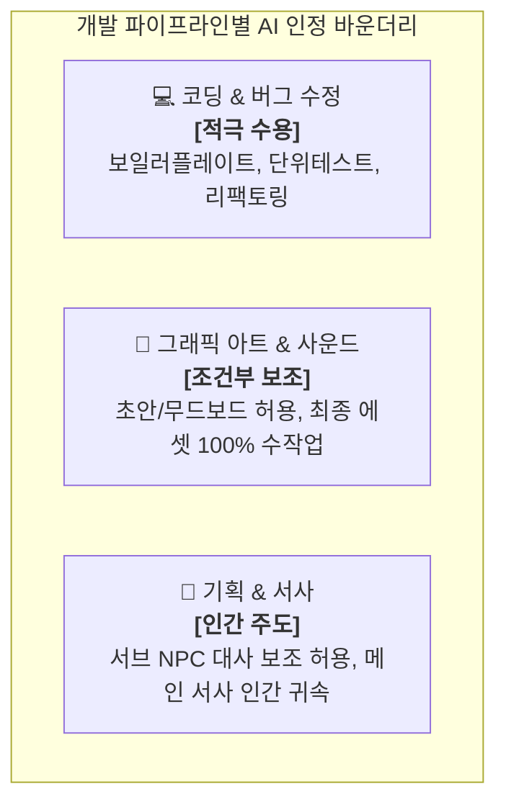

# 📖 [함석신-게임_개발_및_창작_AI_활용_가이드]

> **연구자**: 함석신 | **최종 수정**: 260918 19:35  
> **팀 주제**: 게임 제작을 위한 AI 활용은 어디까지 인정될 수 있을까?  
> **원천 자료 (RAW)**: [[함석신-게임_개발_및_창작_AI_활용_가이드]](../raw/[함석신]-게임_개발_및_창작_AI_활용_가이드.md)  

---

## 📌 1. 핵심 요약 (3-Line Summary)

1. **활용 바운더리**: AI는 인간 창작자를 대체하는 '대체재'가 아닌, 단순 반복 작업을 줄이고 창의적 확장을 돕는 **'보조 도구(Copilot)'**로 한정 인정한다.
2. **데이터 기반 발표 프레임워크**: 단순 의견 나열을 탈피하여 **스팀 정책 개정사, 판례, 3개 직군별(기획/아트/프로그래밍) 수용도 지표** 등 5대 데이터 축을 중심으로 실증적 결론을 도출한다.
3. **기술 산출물 연동**: FastAPI + Google Gemini API(Search Grounding) 기반의 **「AI 창작 찬반 및 윤리 쟁점 분석 라이브 대시보드」**를 통해 팀이 정의한 마지노선을 소프트웨어로 직접 시연한다.

---

## ⚖️ 2. 게임 개발 파이프라인별 허용 가이드라인 (Detailed Boundary)

### 2.1 코딩 & 엔지니어링: 적극적 보조 도구 인정
* **허용 범위**: 반복적인 보일러플레이트 코드 작성, 단위 테스트 케이스 생성, 레거시 코드 리팩토링, 디버깅 로그 분석.
* **엔지니어의 책임**: AI가 생성한 코드에 내포된 보안 취약점, 메모리 누수, 라이선스 오염(GPL 등)에 대한 최종 기술적 검증과 책임은 인간 엔지니어에게 귀속.

### 2.2 그래픽 아트 & 비주얼: 초안 생성 vs 인간 리터칭 조건
* **허용 범위**: 초기 콘셉트 기획 단계의 브레인스토밍 무드보드, 배경 에셋의 기초 텍스처 초안.
* **금지 및 제한**: 메인 캐릭터 원화, 핵심 일러스트를 AI 프롬프트만으로 뽑아 상용화하는 행위 금지. 최소 60% 이상의 인간 아티스트 2차 리터칭 및 독창적 변형이 수반되어야 함.

### 2.3 기획 & 동적 NPC: 메인 서사 vs 서브 인터랙션
* **허용 범위**: 월드 내 방대한 엑스트라 NPC의 일상 다이얼로그 템플릿 대량 생성, 퀘스트 아이디어 발상.
* **인간 주도 원칙**: 게임의 철학과 주제의식을 관통하는 메인 시나리오, 엔딩 분기, 핵심 퀘스트라인은 인간 기획자의 온전한 창작물이어야 함.

---

## 🛡️ 3. 기술적·제도적 안전장치 검토

### 3.1 3단계 스크리닝 체계 (학습 - 생성 - 이용)
1. **학습 단계 (Data Sourcing)**: 무단 스크래핑된 공용 모델 배제, 상업적 이용 권리가 확보된 클린 라이선스 데이터셋만 활용.
2. **생성 단계 (Generation Process)**: 기획·아트의 주도권을 인간이 쥐고 Copilot 형태로만 한정.
3. **이용 단계 (Deployment)**: 최종 산출물에 대한 인간 검수 의무화 및 스팀 스토어 페이지 내 AI 활용 범위 사전 공시(Disclosure).

### 3.2 고용주와 노동자 사이의 절충안
* **고용주/경영진**: 비용 절감에만 매몰되어 주니어 인력을 감축할 경우 미래 시니어 공급선(사다리)이 끊기는 자충수가 됨을 인지.
* **노동자/창작자**: AI 툴을 능숙히 다루는 'AI 오케스트레이터' 역량을 강화하되, 단체 협약(SAG-AFTRA 방식)을 통해 디지털 복제 시 사전 고지와 교섭권을 제도화.

---

## 🔗 4. 연결된 문서 (References)

* 📥 [게임 개발 및 창작 AI 활용 가이드 원문 (RAW)](../raw/[함석신]-게임_개발_및_창작_AI_활용_가이드.md)
* 📄 [게임 개발 및 창작 생태계 내 AI 도입의 한계와 허용 기준 연구 WIKI](./[함석신]-게임_개발_및_창작_생태계_내_AI_도입의_한계와_허용_기준_연구.md)
* 📄 [AI 창작 찬반 및 윤리 쟁점 분석 라이브 대시보드 기획안 WIKI](./[함석신]-AI_창작_찬반_및_윤리_쟁점_분석_라이브_대시보드_기획안.md)
* 📄 [발표 방향성: 웹 vs 언리얼 MCP 비교 WIKI](./[함석신]-발표_방향성_웹_vs_언리얼_MCP_비교.md)
* 🏠 [함석신 연구 WIKI 홈](../README.md)
