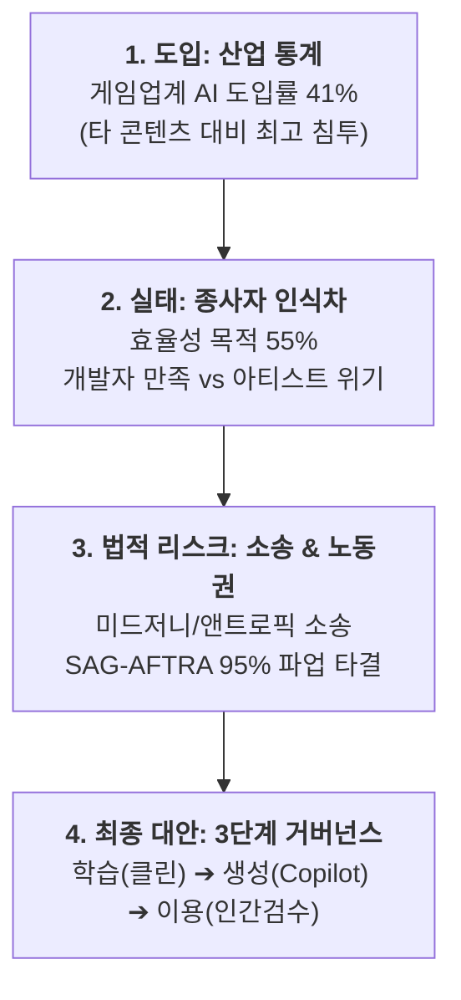

# 📖 [함석신-게임_개발_및_창작_생태계_내_AI_도입의_한계와_허용_기준_연구]

> **연구자**: 함석신 | **최종 수정**: 260918 19:35  
> **팀 주제**: 게임 제작을 위한 AI 활용은 어디까지 인정될 수 있을까?  
> **원천 자료 (RAW)**: [[ai_game_creation_research]](../raw/ai_game_creation_research.md)  

---

## 📌 1. 핵심 요약 (3-Line Summary)

1. **산업 현황 팩트**: 국내 게임사의 **생성형 AI 도입률은 약 41%**(콘진원), 글로벌 개발자의 **30% 이상이 실무 도입**(GDC) 중이나, 종사자 84%는 윤리적 침해와 무단 학습 리스크를 강하게 경고하고 있다.
2. **글로벌 노동권 및 법제 방어선**: 미 저작권청(USCO)의 순수 AI 저작권 불인정, 미드저니/앤트로픽 거대 소송전, **SAG-AFTRA 파업(95% 찬성 가결)을 통한 '사전 고지 및 교섭권 의무화'**가 강력한 산업 가드레일로 작동하고 있다.
3. **아만보팀의 최종 대안**: 무조건적 금지도, 무제한적 방임도 아닌 **'학습 ➔ 생성 ➔ 이용' 3단계 스크리닝 체계**를 통해 인간 창작자의 책임과 주도권을 명문화하는 거버넌스를 제안한다.

---

## ⚖️ 2. 게임 개발 파이프라인별 허용 가이드라인 (Detailed Boundary)

### 2.1 5대 핵심 데이터 축 및 실증 근거

| 데이터 축 | 핵심 팩트 수치 | 산업적 의미 및 발표 시사점 |
| :--- | :--- | :--- |
| **① 산업 통계** | 국내 게임사 생성 AI 도입률 **41%** (콘진원 2025) | 코드, 아트, 서사가 얽힌 종합 예술로서 가장 침투가 빠름 |
| **② 종사자 인식** | 개발자 **55%** 효율 목적 채택 vs **84%** 윤리적 우려 (GDC) | 프로그래머(생산성 찬성) vs 아티스트/작가(화풍 침해 우려) 간극 심화 |
| **③ 법적 판례** | 미 저작권청(USCO) AI 저작물 거부, 미드저니 집단소송 | 출처 불분명한 AI 에셋 사용 시 스토어 판매 중지 및 소송 위험 |
| **④ 노동권 협약** | **SAG-AFTRA 비디오게임 파업 95% 찬성** 타결 | 디지털 복제 시 '사전 고지 및 별도 교섭(Notice & Bargaining)' 의무화 |
| **⑤ 플랫폼 규정** | Valve(Steam) 사전 생성/실시간 생성 분리 공시제 | 스토어 출시 시 투명성 공시 및 유저 신고 가드레일 확립 |

---

## 🛡️ 3. 기술적·제도적 안전장치 검토

### 3.1 아만보팀이 수립한 3단계 스크리닝 체계
1. **1단계: 학습 데이터 스크리닝 (Training Data Sourcing)**
   * 불법 크롤링이나 원작자 거부(Opt-out) 데이터셋을 학습한 모델 배제. 상업적 라이선스가 완전히 검증된 클린 데이터셋만 도입.
2. **2단계: 생성 프로세스 스크리닝 (Generation Governance)**
   * AI를 독립적 창작자가 아닌 '증강 도구(Augment Tool)'로 위치 설정. 기획과 비주얼의 핵심 방향타는 인간 디렉터가 장악.
3. **3단계: 이용 및 배포 스크리닝 (Deployment & Disclosure)**
   * 최종 빌드에는 반드시 인간의 2차 가공과 품질 검증(QA) 로그가 동반되어야 하며, 소비자에게 AI 활용 내역을 정직하게 사전 공시.

---

## 🔗 4. 연결된 문서 (References)

* 📥 [게임 개발 및 창작 생태계 내 AI 도입 연구 원문 (RAW)](../raw/ai_game_creation_research.md)
* 📄 [게임 개발 및 창작 AI 활용 가이드 WIKI](./[함석신]-게임_개발_및_창작_AI_활용_가이드.md)
* 📄 [AI 창작 찬반 및 윤리 쟁점 분석 대시보드 기획안 WIKI](./[함석신]-AI_창작_찬반_및_윤리_쟁점_분석_라이브_대시보드_기획안.md)
* 📄 [김준호 연구 WIKI: 붉은사막·33원정대 리스크 분석](../../김준호/wiki/README.md)
* 🏠 [함석신 연구 WIKI 홈](../README.md)
