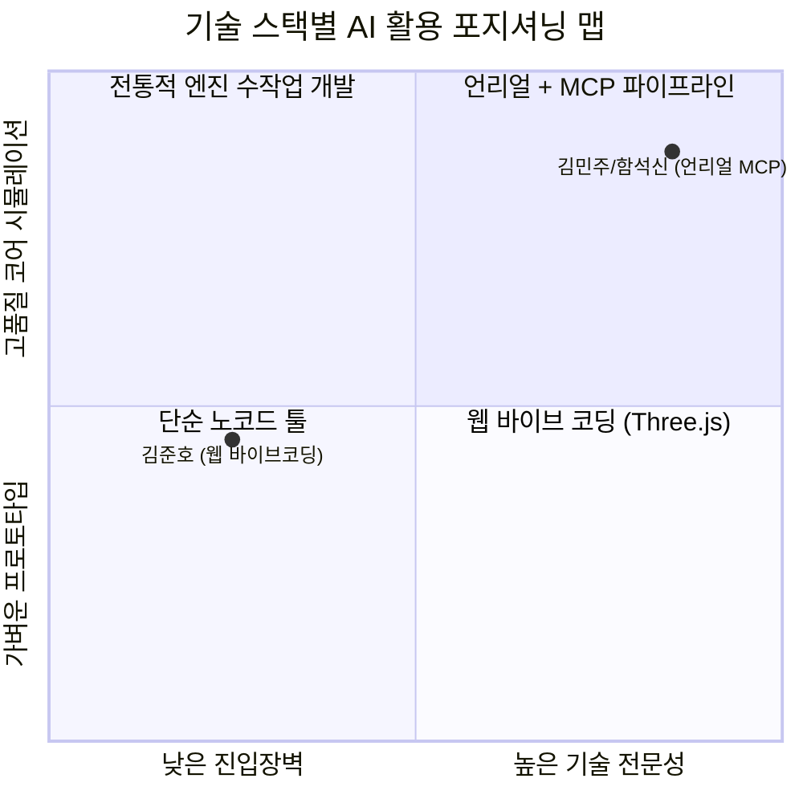

# 📖 [함석신-발표_방향성_웹_vs_언리얼_MCP_비교]

> **연구자**: 함석신 | **최종 수정**: 260918 19:35  
> **팀 주제**: 게임 제작을 위한 AI 활용은 어디까지 인정될 수 있을까?  
> **원천 자료 (RAW)**: [[함석신-발표_방향성_웹_vs_언리얼_MCP_비교]](../raw/[함석신]-발표_방향성_웹_vs_언리얼_MCP_비교.md)  

---

## 📌 1. 핵심 요약 (3-Line Summary)

1. **발표 핵심 메시지**: 단순한 제작 결과물 자랑이 아닌, **'동일한 목적 아래 서로 다른 두 기술 스택(웹 vs 언리얼)이 보여준 AI 활용 방식과 실무 파이프라인의 실증적 차이'**를 기획적·비즈니스 관점에서 입체적으로 비교한다.
2. **트레이드오프 분석**: **Time to Market(시장 출시 속도)**을 극대화하는 웹 바이브 코딩과, **Fidelity(공간 몰입도 및 물리 시뮬레이션)**를 구현하는 언리얼+MCP 차세대 에이전틱 워크플로우의 상호보완적 가치를 도출한다.
3. **슬라이드 전략**: 발표 슬라이드 2장에 [웹 파트 초고속 프로토타이핑 vs 언리얼 MCP 에이전트 제어] 비교 매트릭스를 단독 배치하고 기획자 한 줄 제언을 강조한다.

---

## ⚖️ 2. 게임 개발 파이프라인별 허용 가이드라인 (Detailed Boundary)

### 2.1 [발표 슬라이드용] 웹 vs 언리얼 개발 파이프라인 비교 매트릭스

| 비교 항목 | 🌐 웹 개발 파트 (Three.js / Web) | 🎮 언리얼 + MCP 파트 (Unreal Engine 5.8) |
| :--- | :--- | :--- |
| **담당 연구자** | 김준호 (바이브 코딩) | 김민주 / 함석신 (AI 페어 개발) |
| **핵심 목표** | 초고속 프로토타이핑 & 즉각적 기능 검증 | 게임성 구현 & 코어 물리/3D 공간 시뮬레이션 |
| **주요 기술 스택** | HTML5, CSS3, Vanilla JS, Three.js, Web Audio | Unreal Engine 5.8, C++, Python, JSON-RPC MCP |
| **AI 활용 형태** | **Co-pilot / Feature Integration** (프롬프트 대화를 통한 코드/물리 생성) | **Next-Gen Workflow (MCP Agentic)** (AI 에이전트가 언리얼 에디터/오브젝트 직접 조작) |
| **개발 소요 시간** | 수 시간 내 즉시 플레이 가능 (초고속 TTM) | 초기 환경/파이프라인 셋업 후 14분 쾌속 빌드 |
| **진입장벽 및 학습곡선**| 낮음 (웹 브라우저 즉시 구동, 무설치) | 높음 (엔진 구조, C++ 포트 리버스 엔지니어링) |
| **몰입감 & 물리 환경** | 가벼운 아케이드 주행 및 브라우저 3D | 실시간 정밀 물리, 3D 공간감, 고품질 렌더링 |
| **최적 비즈니스 단계** | MVP 가설 검증, 초기 아이데이션 단계 | 상용 게임/코어 콘텐츠 개발 단계 |

---

## 🛡️ 3. 기술적·제도적 안전장치 검토

### 3.1 기획자의 실무 결론 (Business Decision)
> *"가벼운 서비스나 빠른 비즈니스 가설 검증이 필요하다면 **웹 + AI 조합**이 압도적으로 효율적이지만, 깊이 있는 물리 시뮬레이션과 고품질 몰입감이 필요한 코어 콘텐츠라면 **엔진과 최신 프로토콜(MCP) 기반의 전문 파이프라인**이 필수적이다."*

### 3.2 발표 스피치 핵심 멘트 가이드
> "저희 아만보팀은 단순히 한 가지 결과물을 내는 것을 넘어, 웹 기술과 게임 엔진이라는 서로 다른 두 환경에서 AI가 어떻게 작동하고 개발 생산성을 바꾸는지를 비교 검증했습니다.  
> 웹 파트가 몇 시간 만에 아이디어를 브라우저에 띄우는 '속도'의 가능성을 보여주었다면, 언리얼 파트는 MCP를 통해 AI가 에디터와 오브젝트를 직접 핸들링하는 '차세대 워크플로우'의 비전을 실증했습니다."

---

## 🔗 4. 연결된 문서 (References)

* 📥 [발표 방향성 웹 vs 언리얼 MCP 비교 원문 (RAW)](../raw/[함석신]-발표_방향성_웹_vs_언리얼_MCP_비교.md)
* 📄 [게임 개발 및 창작 AI 활용 가이드 WIKI](./[함석신]-게임_개발_및_창작_AI_활용_가이드.md)
* 📄 [언리얼 5.8 MCP 연동 및 미니레이싱 실시간 로그 WIKI](../../김민주/wiki/[김민주-언리얼5.8_MCP_연동_및_미니레이싱_제작_실시간로그].md)
* 📄 [카트라이더 바이브 코딩 개발 타임라인](../../ai_game/TIMELINE.md)
* 🏠 [함석신 연구 WIKI 홈](../README.md)
