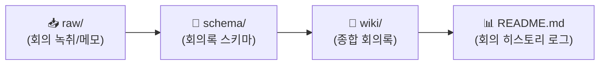

# 🏛️ [회의 WIKI] 아만보팀 프로젝트 & 회의 아카이브

> **팀명**: 아만보 (아는 만큼 보인다)  
> **위키 구조**: `raw/` (회의메모/녹취) → `schema/` (회의록규격) → `wiki/` (종합회의록)  
> **최근 업데이트**: `260916 18:00`

---

## ⏱️ 활동 및 회의 로그 (Meeting & Activity Log)

> [!IMPORTANT]
> **로그 작성 규칙**: 새 회의록을 추가하거나 기존 문서를 업데이트할 때마다 상단에 **`YYMMDD HH:mm`** 형식으로 기록합니다.

| 타임스탬프 (`YYMMDD HH:mm`) | 안건 / 작업 내용 | 참석자 | 관련 문서 링크 |
| :---: | :--- | :---: | :--- |
| `260916 18:00` | 회의 폴더 3단 구조(`raw/`, `wiki/`, `schema/`) 개편 | 전원 | [[회의/README|회의 대시보드]] |
| `260916 18:00` | [[회의/wiki/[26.09.16]-게임_AI_활용_바운더리와_인지_외주화_종합_회의록|📖 26.09.16 회의록]] WIKI 보관소 동기화 | 전원 | 1차 종합 회의록 |
| `260916 17:48` | 전 폴더 LLM WIKI 구축 및 로그 규격 (`YYMMDD HH:mm`) 통일 | 전원 | [[README|루트 README]] |
| `260916 17:39` | 1차 토론 2개 안건 종합 회의록 병합 작성 | 함석신, 김민주, 김준호 | [[회의/[26.09.16]-게임_AI_활용_바운더리와_인지_외주화_종합_회의록|26.09.16 회의록]] |

---

## 🔄 회의 LLM WIKI 아키텍처

### 1. 📂 폴더별 역할
* **`📂 raw/`**: 회의 녹취록, 브레인스토밍 메모, 개별 안건 초안
* **`📂 schema/`**: 종합 회의록 Frontmatter 규격 및 자동 요약 프롬프트
* **`📂 wiki/`**: 합의 사항과 Action Items가 정제된 공식 종합 회의록

---

## 📋 회의록 WIKI 아카이브 색인

* 🔗 **[[회의/wiki/[26.09.16]-게임_AI_활용_바운더리와_인지_외주화_종합_회의록|2026.09.16 (1차 회의 종합 회의록)]]**:
  * 안건 1: 게임 제작을 위한 AI 활용 인정 바운더리 & 3자 하브루타 토론
  * 안건 2: 인지적 외주화(기억 퇴화) 방지와 건강한 AI 공존법
  * 바이브 코딩 연계 기획안 (하브루타 챗봇, AI 바운더리 자가진단기, ThinkFirst 타이머)

---

## 🔗 상호 참조 (Cross References)
* [[찬성/README|찬성 WIKI (김민주)]]
* [[반대/README|반대 WIKI (김준호)]]
* [[중립/README|중립 WIKI (함석신)]]
