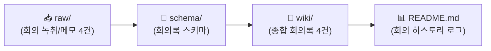

# 🏛️ [회의 WIKI] 아만보팀 프로젝트 & 회의 아카이브

> **팀명**: 아만보팀 [아는만큼보인다]  
> **팀원**: 함석신, 김민주, 김준호  
> **팀 주제**: **게임 제작을 위한 AI 활용은 어디까지 인정될 수 있을까 (토론)**  
> *"AI가 발전함에 따라 게임 개발에서도 AI에 의존하는 경우가 많아졌다. 프로그래밍을 시작으로 아트, 기획의 영역까지 확장되는 상황에서 우리는 개발 환경 속에서 AI를 어디까지 인정할 것인가"*  
> **위키 구조**: `raw/` (회의녹취/메모 4건) → `schema/` (회의록규격) → `wiki/` (종합회의록 4건 완비)  
> **최근 업데이트**: `260918 19:35` (3일간의 프로젝트 종합 결산 회의록 발행 완료)

---

## ⏱️ 활동 및 회의 로그 (Meeting & Activity Log)

> [!IMPORTANT]
> **로그 작성 규칙**: 새 회의록을 추가하거나 기존 문서를 업데이트할 때마다 상단에 **`YYMMDD HH:mm`** 형식으로 기록합니다.

| 타임스탬프 (`YYMMDD HH:mm`) | 안건 / 작업 내용 | 참석자 | 관련 문서 링크 |
| :---: | :--- | :---: | :--- |
| `260918 19:35` | 🏁 **[3일 스프린트 최종 결산]** 인간 vs AI 실증 비교(웹 12단계 vs 언리얼 41분), 3단계 스크리닝 거버넌스 및 최종 종합 회의록 발행 | 전원 | [26.09.18 최종 결산 종합 회의록](./wiki/[26.09.18]-3일_스프린트_최종결산_및_인간vsAI_실증비교_종합_회의록.md) |
| `260917 11:25` | 🏁 **[스프린트 킥오프]** 카트라이더 2일 단기전(인간 vs AI 대결) 및 언리얼 파트 아트 가이드(빌리지 버전) 등록 | 전원 | [26.09.17 카트라이더 기획](./wiki/[26.09.17]-카트라이더_인간vsAI_2일스프린트_및_언리얼미니레이싱_기획.md) |
| `260917 10:32` | 📥 2차 회의록 녹음 요약 원본(RAW) 등록 및 종합 회의록(WIKI) 발행 (게임 제작 AI 활용 비교 및 발표 방향) | 전원 | [26.09.17 회의록](./wiki/[26.09.17]-게임제작_AI활용_비교_및_발표방향_종합_회의록.md) |
| `260916 19:40` | 폴더링 구조 개편(`김민주/`, `김준호/`, `함석신/`) 및 팀 주제 정의 동기화 | 전원 | [26.09.16 회의록](./wiki/[26.09.16]-AI_창작과_인간의_역할_종합_회의록.md) |
| `260916 19:25` | 📥 회의록 녹음 요약 원본(RAW) 인제스트 및 종합 회의록(WIKI) 발행 | 전원 | [26.09.16 회의록](./wiki/[26.09.16]-AI_창작과_인간의_역할_종합_회의록.md) |
| `260916 19:10` | 회의 녹음 요약 원본 자료(RAW) 등록 | 전원 | [26.09.16 회의록녹음요약(RAW)](./raw/[26.09.16]-회의록녹음요약.md) |

---

## 🔄 회의 LLM WIKI 아키텍처

### 1. 📂 폴더별 역할
* **`📂 raw/`**: 회의 녹취록, 브레인스토밍 메모, 개별 안건 원본 요약 (4건)
* **`📂 schema/`**: 종합 회의록 Frontmatter 규격 및 인제스트 프롬프트
* **`📂 wiki/`**: 논점 분석, 합의 사항, Action Items가 정제된 공식 종합 회의록 (4건)

---

## 📋 회의록 WIKI 아카이브 색인 (총 4건)

* 🔗 **[2026.09.18 (3일 스프린트 최종 결산 및 인간 vs AI 실증 비교 종합 회의록)](./wiki/[26.09.18]-3일_스프린트_최종결산_및_인간vsAI_실증비교_종합_회의록.md)**:
  * 웹 바이브 코딩(초고속 프로토타이핑 2~3시간) vs 언리얼 5.8 MCP(14분 쾌속 빌드 / 41분 무결점 트랙) 실무 비교 매트릭스 도출
  * AI의 에셋 배치 초반 부스팅과 틈새 버그 해결을 위한 인간의 2차 가공(SplineMesh) 필수성 실증
  * FastAPI + Gemini Search Grounding 라이브 대시보드 시연 각본 및 4단계 발표 스토리라인 확정
  * **'학습 ➔ 생성 ➔ 이용 3단계 스크리닝 거버넌스'** 및 인간 최종 책임 귀속 원칙 팀 공식 제언 채택
* 🔗 **[2026.09.17 (카트라이더 2일 스프린트: 인간 vs AI 대결 & 언리얼 미니 레이싱 기획)](./wiki/[26.09.17]-카트라이더_인간vsAI_2일스프린트_및_언리얼미니레이싱_기획.md)**:
  * 3인 2팀(김준호 웹 바이브코딩 vs 함석신/김민주 언리얼5.8 MCP AI 페어) 2일 제작 대결 구조 확정
  * 함석신 연출/기획의 '미니 레이싱 (빌리지 버전) One Lap Challenge' 아트/게임 디자인 가이드 반영
  * MCP 연동 시작부터 엔진 제어 및 수정 전 과정 분 단위 전수 기록 합의
* 🔗 **[2026.09.17 (2차 회의: 게임 제작을 통한 AI 활용 비교 및 발표 방향)](./wiki/[26.09.17]-게임제작_AI활용_비교_및_발표방향_종합_회의록.md)**:
  * 회의 녹음 요약(RAW) 분석 및 인제스트 완료본
  * 게임 제작 중심 주제 구체화 및 7대 제작 파이프라인(기획, 시스템, 그래픽, 캐릭터, 사운드, 코딩, 테스트) 매핑
  * 인간 제작 vs AI 활용 제작: 대결 구도 및 6대 실증 비교 지표(시간, 수정횟수, 오류유형, 개입도 등) 설계
* 🔗 **[2026.09.16 (1차 회의: AI 창작과 인간의 역할)](./wiki/[26.09.16]-AI_창작과_인간의_역할_종합_회의록.md)**:
  * 회의 녹음 요약(RAW) 분석 및 인제스트 완료본
  * 고용주 vs 노동자 시각차 (주니어 대체와 일자리 문제)
  * 창작의 주체성 논쟁: 단순 도구인가 vs 취향 분석 기반 주체인가?
  * 지브리풍 화풍 도용 및 저작권 논란, 바이브 코딩 연계 아이디어 발굴

---

## 🔗 팀 내 상호 참조 (Cross References)
* 👤 [김민주 연구 WIKI](../김민주/README.md)
* 👤 [김준호 연구 WIKI](../김준호/README.md)
* 👤 [함석신 연구 WIKI](../함석신/README.md)
* 📖 [프로젝트 메인 대시보드](../README.md)
