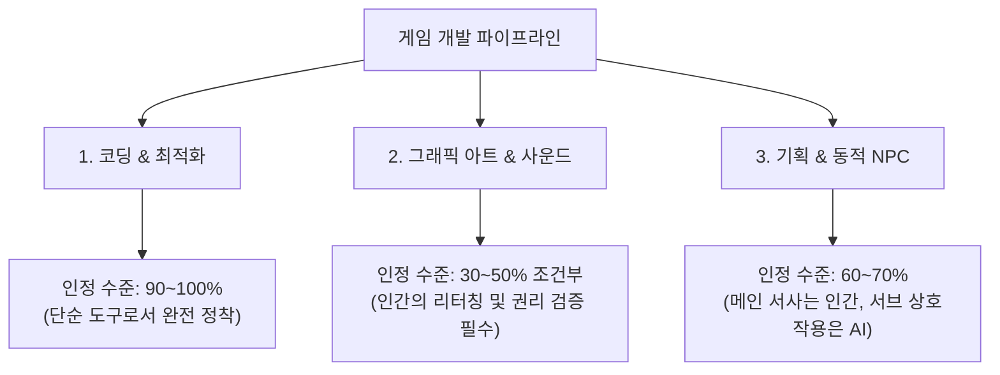
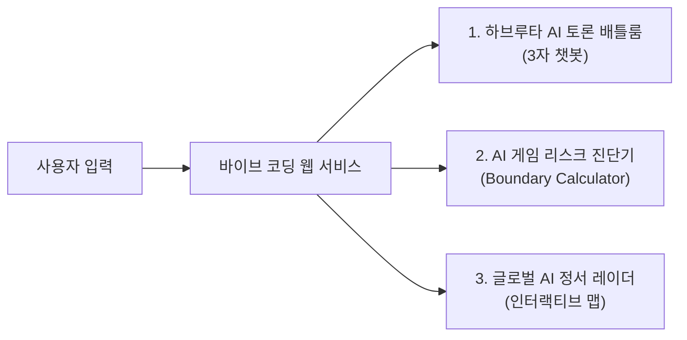

# 📋 [26.09.16] 게임 AI 활용 바운더리와 인지 외주화 종합 회의록

> **팀명**: 아만보 (아는 만큼 보인다)  
> **회의 일시**: 2026년 09월 16일  
> **참석자**: 함석신 (1993 / 중립·조정), 김민주 (1994 / 찬성), 김준호 (1999 / 반대)  
> **기록자**: 아만보팀 공동 작성  

---

## 🧭 [RULE] 아만보팀 아카이빙 & 회의록 운영 규칙

앞으로 모든 팀원은 아래 규칙을 준수하여 자료를 업로드 및 정리합니다.

### 1. 4대 폴더 구조 및 역할
* **📂 `찬성`**: AI 기술 도입 및 활용 확대를 지지하는 논거, 사례, 긍정적 데이터 업로드
* **📂 `반대`**: AI 도입에 따른 윤리적·저작권·일자리 위협 및 한계점에 관한 논거 및 비판 자료 업로드
* **📂 `중립`**: 규제, 가이드라인, 휴먼 인 더 루프(Human-in-the-Loop), 절충안 및 객관적 지표 자료 업로드
* **📂 `회의`**: 정기/수시 회의록, 아젠다별 종합 정리본, 전체 프로젝트 기획서 아카이브

### 2. 파일 명명 규칙 (Naming Convention)
* **개별 자료 업로드 시 (찬성/반대/중립 폴더)**:
  * 형식: `[작성자-제목].md` (또는 해당 확장자)
  * 예시:
    * `찬성/[김민주-게임AI_도입을_통한_인디개발사_혁신사례].md`
    * `반대/[김준호-원화가_저작권_침해_및_일자리_위협_보고서].md`
    * `중립/[함석신-글로벌_스팀_AI_라벨링_가이드라인_분석].md`
* **회의록 저장 시 (회의 폴더)**:
  * 형식: `[yy.mm.dd]-주제.md`
  * 예시:
    * `회의/[26.09.16]-게임_AI_활용_바운더리와_인지_외주화_종합_회의록.md`

### 3. 회의록 표준 템플릿 권장 구성
1. **회의 메타정보**: 일시, 참석자, 포지션 명시
2. **아젠다 목록**: 회의에서 다룬 세부 안건
3. **안건별 상세 논의 & 상호 검증**: 각 포지션(찬성/반대/중립) 의견 및 하브루타 대립
4. **결정 사항 및 합의점 (Consensus)**
5. **향후 실행 과제 (Action Items & Next Steps)**

---

## 🎯 오늘 회의 아젠다 (Agenda)
1. **[안건 1] 게임 제작을 위한 AI 활용, 어디까지 인정될 수 있을까?**
   * 글로벌 동향 및 파이프라인별 허용 바운더리 설정
   * 민주(찬성) vs 준호(반대) vs 석신(중립) 하브루타 토론
   * 바이브 코딩(Vibe Coding) 연계 서비스 기획안 도출
2. **[안건 2] AI를 쓸수록 우리는 바보가 되는가? (인지 외주화와 뇌 건강)**
   * 기억/사고의 인지적 외주화 장단점 분석
   * 건강한 AI 상호작용 5단계 루프 및 인지 자립도 챌린지
   * 바이브 코딩 연계 프로토타입 아이디어 도출

---

# 🎮 [안건 1] 게임 제작을 위한 AI 활용, 어디까지 인정될 수 있을까?
> **토론 프로젝트 가이드 & 바이브 코딩(Vibe Coding) 서비스 기획**  
> *"프로그래밍을 시작으로 아트, 기획의 영역까지 확장되는 상황에서 우리는 개발 환경 속에서 AI를 어디까지 인정할 것인가?"*

## 1. 프로젝트 배경 및 목표
* **토론 대주제**: 게임 제작을 위한 AI 활용은 어디까지 인정될 수 있을까? (위협인가 vs 기회인가)
* **배경**:
  * 단순 코드 자동완성(GitHub Copilot 등)을 넘어 원화/3D 아트, 텍스트/시나리오 기획, 성우 보이스/사운드, QA 및 실시간 상호작용 NPC까지 생성형 AI가 게임 개발 파이프라인 전반을 관통함.
  * 창작자 일자리 위협, 데이터 무단 크롤링 저작권 침해, '영혼 없는 양산형(AI Slop)' 범람 등 윤리적·산업적 충돌 심화.
* **프로젝트 목표**:
  1. 감정적 대립을 넘어 국가별 법제/문화적 코드 차이와 사실(Fact)에 기반한 객관적 지표 확립.
  2. 찬성(민주) / 중립(석신) / 반대(준호)의 논리를 하브루타(Havruta) 방식으로 상호 검증.
  3. 토론 결과를 바탕으로 **바이브 코딩(Vibe Coding)**을 통해 실제 작동하는 웹 서비스 프로토타입 제작.

---

## 2. 글로벌 팩트체크 & 국가·문화별 동향 비교

AI에 대한 사회적 인식과 법적 수용도는 각 국가의 **노동 문화, 팬덤 정서, 플랫폼 정책**에 따라 뚜렷한 차이를 보임.

| 비교 항목 | 🇺🇸 미국 / 서구권 | 🇨🇳 중국 | 🇰🇷 한국 & 🇯🇵 일본 |
| :--- | :--- | :--- | :--- |
| **업계 동향** | • 할리우드 파업(WGA, SAG-AFTRA) 연장선에서 게임 성우·배우 파업 발발<br>• 크레딧 인정 및 일자리 보호 요구 강력 | • 텐센트, 넷이즈 등 빅테크 주도로 AI 전면 도입<br>• 원화 제작 기간 70% 단축, AI NPC 상용화 선도 | • 대기업: R&D 및 글로벌 경쟁력 강화 집중<br>• 중소/인디: 생존을 위한 제작 단가 절감 도구로 활용 |
| **유저 인식** | • **"AI Slop"**에 대한 강한 거부감과 불매 운동<br>• *단, 압도적인 퀄리티와 재미가 증명되면 반감 감소* | • "AI로 만든 게임"임을 밝혀도 거부감이 상대적으로 낮음<br>• 가성비와 플레이 경험 자체를 중시 | • 서브컬처 팬덤 중심의 '화풍 도용/일러스트 훼손'에 극도로 민감<br>• '장인정신(Soul)'을 중시하는 문화적 특성 |
| **플랫폼 및 법제** | • **Steam(밸브)**: AI 생성물 사전 라벨링(공개) 의무화<br>• 미국 저작권청: 인간의 창작적 기여 없는 순수 AI물 저작권 불인정 | • 생성형 AI 서비스 관리 잠정 조례 등 국가 규제는 있으나 산업 육성은 전폭 지원 | • 한국 저작권위원회: 생성형 AI 저작권 등록 가이드 마련 중 (보수적 접근) |
| **출시국 전략** | • 서구권: AI 사용을 숨기기보다 **"철저한 인간 검수(Human-in-the-Loop)"** 강조 또는 AI 비중 최소화 빌드로 출시<br>• 아시아권: 빠른 콘텐츠 업데이트와 볼륨 확대를 전면에 내세운 빌드로 출시 다변화 |

---

## 3. 핵심 쟁점과 인정 바운더리 (경계선 설정)



### ① 기술/프로그래밍 (허용도: 높음, 90~100%)
* **현실**: Copilot, Claude, ChatGPT 등을 이용한 버그 수정, 셰이더 작성, 단위 테스트는 이미 업계 표준 생산성 도구화.
* **바운더리**: 전면 인정. 단, 보안 취약점 점검 및 최종 코드 리뷰는 인간 엔지니어의 책임.

### ② 그래픽 아트 / 성우 / 사운드 (허용도: 엄격한 조건부, 30~50%)
* **현실**: 가장 격렬한 저항과 반발이 발생하는 영역. 무단 스크래핑(도용) 및 창작자 일자리 위협과 직결.
* **바운더리**: 
  * ❌ **100% 프롬프트 딸깍 생성물**: 출시 거부 및 저작권 불인정, 유저 불매 위험.
  * ⭕ **인간 아티스트 주도의 2차 가공물**: 콘셉트 러프 스케치 및 텍스처 보조로 사용 후 **인간이 오버페인팅/리터칭한 창작물**에 한해 조건부 인정.

### ③ 게임 기획 / 시나리오 / 인터랙티브 NPC (허용도: 신규 가능성 영역, 60~70%)
* **현실**: 정적인 퀘스트 텍스트를 실시간으로 살아 숨쉬는 대화형 NPC로 전환하려는 시도 확산.
* **바운더리**: 
  * 핵심 세계관과 메인 퀘스트 줄거리는 인간 기획자가 전담.
  * 오픈월드 엑스트라 NPC 대사 및 환경 상호작용은 AI 생성 허용.

---

## 4. 우려와 염려를 '가능성'으로 전환하기

| 순번 | 기존의 우려와 염려 (Fears) | 전환된 가능성과 기회 (Possibilities) |
| :---: | :--- | :--- |
| **01** | *"인간 개발자의 일자리가 사라질 것이다."* | **1인 개발자의 한계 돌파**: 자본 없는 인디 개발자도 AAA급 스케일과 아트워크를 시도할 수 있는 기회 제공. |
| **02** | *"AI Slop(저질 양산품)으로 스토어가 오염된다."* | **기획력의 본질 복귀**: 기술적 장벽이 낮아짐에 따라 그래픽 자랑이 아닌 '독창적인 게임 메카닉과 규칙'이 차별화 요소로 부각. |
| **03** | *"저작권 침해로 소송 리스크가 크다."* | **클린 데이터셋 & 사내 자체 모델 구축**: 투명한 라이선스를 갖춘 독자적 AI 워크플로우를 보유한 스튜디오가 경쟁 우위 선점. |
| **04** | *"유저들이 AI 게임에 거부감을 느낀다."* | **완성도 우선주의**: 결국 게이머는 '재미와 완성도'에 반응함. AI를 썼다는 사실보다 '완성도가 조악할 때' 분노하는 것이므로 퀄리티 컨트롤에 집중. |

---

## 5. 3자 토론 포지션 & 하브루타(Havruta) 상호 반박

### 🟢 [찬성] 김민주 (1994) — "AI는 창작의 민주화이자 새로운 장르의 개척자"
* **핵심 주장**:
  * 중소/인디 개발사에게 대기업과 경쟁할 수 있는 무기를 제공함.
  * 실시간으로 플레이어와 반응하는 차세대 게임 경험(동적 서사, 지능형 NPC)은 AI 없이는 불가능함.
* **하브루타 공방**:
  * ⚔️ *준호(반대)의 공격*: "기존 아티스트들의 피땀 어린 결과물을 도둑질해서 학습한 툴인데 윤리적 죄책감이 없습니까?"
  * 🛡️ *민주의 카운터*: "인간 아티스트도 수많은 거장의 그림을 보고 배우며 스타일을 확립합니다. AI를 단순히 '도둑질'로 규정하면 디지털 카메라가 나왔을 때 '빛을 훔치는 기계'라 비난하던 오류를 반복하는 것입니다."

### 🔴 [반대] 김준호 (1999) — "창작 생태계 붕괴와 저질 양산화의 재앙"
* **핵심 주장**:
  * 주니어 개발자/원화가의 진입 사다리를 끊어 미래 세대 인재풀을 파괴함.
  * 공짜 데이터 도용으로 세워진 바벨탑이며, 유저들의 신뢰를 잃고 게임 시장 전체가 불매와 피로감에 빠질 것임.
* **하브루타 공방**:
  * ⚔️ *민주(찬성)의 공격*: "과거 언리얼/유니티 엔진이나 에셋 스토어가 나왔을 때도 같은 비판이 있었습니다. 도구를 거부하는 것이 생존입니까?"
  * 🛡️ *준호의 카운터*: "에셋 스토어는 창작자가 자발적으로 라이선스를 판매하는 공정한 생태계입니다. 반면 현재의 생성형 AI는 원작자의 동의도, 보상도 없는 무단 착취에 기반하고 있으므로 본질이 다릅니다."

### 🟡 [중립/조정] 함석신 (1993) — "휴먼 인 더 루프(Human-in-the-Loop)와 투명한 룰 세팅"
* **핵심 주장**:
  * 전면 금지도, 무제한 자유도 답이 아님. **'인간은 감독(Director), AI는 조수(Assistant)'**라는 명확한 역할 분담 필요.
  * 스팀의 표기제(라벨링)처럼 투명한 정보 공개와 인간의 최종 책임 원칙이 현실적 해법.
* **하브루타 공방**:
  * ⚔️ *민주 & 준호의 공격*: "어디까지가 '조수'이고 어디까지가 '주체'인지 기준이 모호한데 어떻게 실효성 있게 통제합니까?"
  * 🛡️ *석신의 카운터*: "영화 엔딩 크레딧처럼 각 공정별 AI 기여율을 공개하고, 법적 저작권과 버그 책임은 전적으로 인간 디렉터가 지게 만들면 자연스럽게 자정 작용이 일어납니다."

---

## 6. 팀 중간 정리 & 합의 사항
* **🤝 공통 합의된 사항**:
  1. 프로그래밍 디버깅, 코드 어시스트, QA 자동화에 AI를 쓰는 것은 업계 필수 도구로 인정.
  2. 인간의 후가공이나 기획적 고민 없이 100% 생성된 무성의한 게임은 시장에서 도태되어야 함.
  3. 국가별/문화권별 정서 차이가 크므로 글로벌 출시 시 권역별 맞춤 전략이 필수적임.
* **⚡ 여전히 팽팽한 이견**:
  1. **아트/사운드 영역의 허용선**: 콘셉트 아트 단계까지만 허용할 것인가 vs 최종 리소스의 인간 리터칭까지 인정할 것인가?
  2. **소송 리스크와 상용화 속도**: 규제와 판례가 완전히 정립될 때까지 보수적으로 접근할 것인가 vs 선제적으로 활용하여 경쟁력을 챙길 것인가?

---

## 7. 💡 바이브 코딩(Vibe Coding) 서비스 기획안 (아이디어 3선)



1. **하브루타 AI 토론 배틀룸 (Debate Havruta Bot)**
   * 기능: 사용자가 자신의 아이디어를 입력하면 민주(찬성봇), 준호(반대봇), 석신(중립봇)이 즉각 상호 토론 시뮬레이션 수행.
2. **게임 AI 도입 바운더리 자가진단기 (Boundary Calculator)**
   * 기능: 아트/코드/스토리/출시국가 선택 시 스팀 통과율(0~100점), 유저 거부감 지수, 저작권 리스크 리포트 제공.
3. **글로벌 게임 AI 규제 & 여론 인터랙티브 레이더**
   * 기능: 세계 지도에서 국가별(미국, 중국, 일본, 한국 등) 규제 현황, 파업 사례, 정서 척도 인터랙티브 시각화.

---

# 🧠 [안건 2] AI를 쓸수록 우리는 바보가 되는가?
> **부제: 기억을 외주화한 인간의 뇌와 건강한 AI 공존법**  
> *"인간이 기억과 판단을 AI에 넘겨줄 때, 뇌는 해방되는가 아니면 퇴화하는가?"*

## 1. 문제 제기 — 기억을 AI에게 맡기기 시작한 인간
* **현상**: 일정, 할 일 목록, 아이디어, 전문 지식 검색까지 모든 인지 활동을 생성형 AI와 스마트 기기에 저장하고 인출하는 것이 일상화됨.
* **핵심 질문**:
  * AI가 편리하게 기억을 대신해 줄수록, 인간이 스스로 기억을 인출(Retrieval)하고 고뇌하는 시간은 사라지고 있지 않은가?
  * 스마트폰 도입 이후 전화번호를 외우지 못하게 된 것처럼, 이제는 **"논리적으로 사고하고 문맥을 파악하는 능력"**까지 AI 없이는 불가능해지는 극단적 의존 상태에 직면한 것은 아닌가?

---

## 2. 핵심 요약 비교 (TL;DR)

```mermaid
graph TD
    subgraph ❌ 나쁜 루프 : 인지적 의존
        A1["문제/질문 발생"] --> B1["즉시 AI 질문 (생각 생략)"]
        B1 --> C1["AI 답변 무비판적 수용"]
        C1 --> D1["기억력·사고력 퇴화"]
    end

    subgraph ⭕ 건강한 루프 : 인지적 확장 5단계
        A2["1. 문제 발생"] --> B2["2. 자체 회상 & 스스로 생각"]
        B2 --> C2["3. AI 활용 (비교·확장)"]
        C2 --> D2["4. 팩트 검증 & 비판적 검토"]
        D2 --> E2["5. 인간의 직접 결정"]
    end
```

---

## 3. AI 사용의 명과 암

### 💡 장점: 뇌의 인지 부하를 줄여주는 도구
* **인지적 외주화 (Cognitive Offloading)**: 반복적인 데이터 수집, 일정 정리, 복잡한 수식 계산, 초안 번역 등 단순 소모성 뇌 활동을 AI에 이관.
* **고차원 뇌 영역의 활성화**: 단기 기억(작업 기억, Working Memory)의 한계를 극복하고, 절약된 에너지를 **전략적 의사결정, 창의적 통찰, 인간 간 공감과 협업**에 재투자.

### ⚠️ 단점: 생각하는 과정까지 외주화될 때의 위험
* **인지적 퇴화 (Cognitive Atrophy)**: 뇌의 신경 가소성(Neuroplasticity) 원리에 따라, 스스로 기억을 끄집어내고(Recall) 고민하지 않으면 장기 기억 형성 능력과 깊은 집중력이 점진적으로 약화됨.
* **수동적 사고와 검증 결여 (Passive Acceptance)**: AI의 할루시네이션을 무비판적으로 수용하며, 문제를 스스로 쪼개고 가설을 세우는 **'문제 해결의 근력'** 상실.

---

## 4. 뇌를 지키는 방법 — AI 전 선(先) 사고 원칙

> **골든 룰**: *"AI를 열기 전, 3분간 먼저 뇌를 쥐어짜라."*

1. **선(先) 사고 후(後) AI 검증**: 문제 직면 시 즉시 프롬프트를 치지 않고, 나의 지식과 논리로 가설/초안을 작성한 뒤 AI와 교차 비교.
2. **뇌가 직접 처리하는 활동(Brain Workout) 사수**:
   * **의도적 회상 (Active Recall)**: 바로 검색하지 않고 1~2분간 기억 더듬기.
   * **손글씨 & 아날로그 메모**: 물리적 필기를 통한 신경망 자극.
   * **독서, 하브루타(토론), 문제 풀이**: 맥락을 깊이 파고드는 인지 훈련 지속.
3. **기억의 이원화**:
   * AI 외주 대상: 단순 일정, 일회성 데이터, 코드 문법 등
   * 인간 뇌 보존 대상: 핵심 통찰, 가치관, 원리 원칙

---

## 5. 건강한 AI 사용법 — 「5단계 인지적 상호작용 루프」

```
[1단계: 기억] 내 머릿속에 있는 기존 지식과 경험을 먼저 떠올린다.
    ↓
[2단계: 생각] 문제의 핵심이 무엇인지 스스로 구조화하고 잠정 결론을 낸다.
    ↓
[3단계: AI 활용] 내 생각의 사각지대, 추가 자료, 대안 시나리오를 AI에 질문한다.
    ↓
[4단계: 검증] AI 답변의 진위 여부, 논리적 모순, 편향을 비판적으로 검토한다.
    ↓
[5단계: 직접 결정] 최종 판단과 책임은 오직 '인간인 나' 자신이 내린다.
```

---

## 6. 미니 프로젝트 실천 챌린지 & 바이브 코딩 연계
* **「AI 없는 나: 인지 자립도 실험」 (3일~1주일 챌린지)**:
  * 작업 첫 30분은 AI 접속 금지(백지 브레인스토밍)
  * 질문 시 반드시 본인 초안 첨부 후 "내 생각과 비교해줘" 질의
* **바이브 코딩 연계 아이디어: 「ThinkFirst (생각 먼저!)」 앱**:
  * 질문 입력 시 즉시 답하지 않고 **"3분 카운트다운 타이머"** 작동
  * *"내가 먼저 생각한 답"*을 적어야만 AI 답변과 함께 [내 생각 vs AI 생각 비교 분석표] 제공

---

## 🏁 종합 결론 및 다음 액션 아이템 (Action Items)

| 담당자 | 포지션 / 역할 | 다음 회의(차주)까지 실행할 과제 |
| :--- | :--- | :--- |
| **함석신 (1993)** | **중립 / 팀 리딩** | • 게임 개발 5단계(기획-원화-사운드-프로그래밍-QA) 5점 척도 기준표 초안 작성<br>• 회의록 룰에 맞춰 중립 폴더에 `[함석신-AI_바운더리_척도표].md` 업로드 |
| **김민주 (1994)** | **찬성 / 기획** | • 인디 게임 개발사 성공적 AI 도입 사례 및 파이프라인 단축 데이터 수집<br>• 찬성 폴더에 `[김민주-인디게임_AI활용_효율화사례].md` 업로드 |
| **김준호 (1999)** | **반대 / 리스크 분석** | • 글로벌 저작권 소송 판례(스팀 거절 사례, 일러스트 도용 논란) 심층 분석<br>• 반대 폴더에 `[김준호-AI생성물_저작권소송_및_불매사례].md` 업로드 |
| **팀 공통** | **바이브 코딩** | • 하브루타 배틀룸 또는 ThinkFirst 서비스 프로토타입 기획 구체화 |
