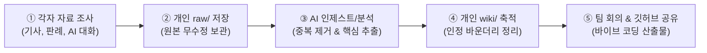
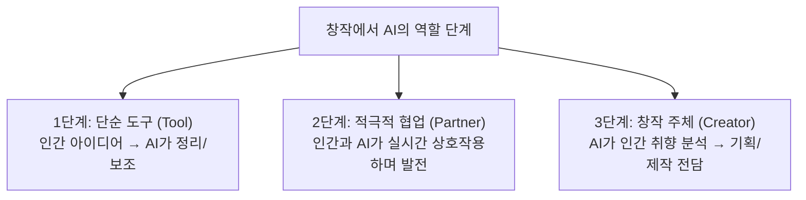

# 📋 [26.09.16] AI 창작과 인간의 역할 종합 회의록

> **팀명**: 아만보팀 [아는만큼보인다]  
> **회의 일시**: 2026년 09월 16일  
> **팀원**: 함석신, 김민주, 김준호  
> **팀 주제**: **게임 제작을 위한 AI 활용은 어디까지 인정될 수 있을까 (토론)**  
> *"AI가 발전함에 따라 게임 개발에서도 AI에 의존하는 경우가 많아졌다. 프로그래밍을 시작으로 아트, 기획의 영역까지 확장되는 상황에서 우리는 개발 환경 속에서 AI를 어디까지 인정할 것인가"*  
> **원천 자료 (RAW)**: [[회의/raw/[26.09.16]-회의록녹음요약|26.09.16 회의록녹음요약.md]]  
> **데이터 상태**: 📥 RAW 회의 녹음 요약 분석 및 정제 완료 (Ingested)

---

## 🧭 1. 회의 개요 및 팀 운영 룰 확정

오늘 회의에서는 본격적인 토론 결론을 내리기 전, **각자의 입장을 확인하고 깃허브 협업을 위한 체계적인 개인별 자료 관리 파이프라인**을 구축하기로 합의했습니다.

### 🔄 RAW-WIKI 자료 관리 파이프라인


* **개인별 폴더링 구조**:
  * `김민주/`, `김준호/`, `함석신/`: 각 팀원의 개인 연구 및 지식 베이스
  * `회의/`: 팀 전체의 종합 회의록 및 프로젝트 기획서
* **개인 폴더 내부 구조**:
  * `raw/`: 개인이 조사한 원본 자료, AI와의 대화 원문 등을 수정 없이 보관
  * `wiki/`: AI가 RAW 데이터를 분석·정제한 위키 지식 문서 축적
  * `schema/`: LLM 프롬프트 파이프라인 및 문서 규격 명세서
* **작성자 표기 규칙**:
  * 모든 개별 파일은 **`[작성자-자료제목].md`** 형식으로 작성하여 기여도를 명확히 함
* **타임스탬프 규칙**:
  * 활동 로그는 **`YYMMDD HH:mm`** 형식으로 기록하여 히스토리 추적

---

## 💡 2. 핵심 논의 ① AI와 노동 시장 (고용주 vs 노동자의 시각차)

AI 도입을 단순히 '위협'으로만 규정할 수 없으며, **이해관계자에 따라 전혀 다른 시각**이 존재함이 논의되었습니다.

| 구분 | 🏢 고용주 / 시니어 입장 | 🧑‍💻 취업 준비생 / 주니어 입장 |
| :--- | :--- | :--- |
| **핵심 인식** | **업무 효율성 극대화 및 비용 절감** | **진입 사다리 붕괴 및 고용 불안** |
| **주요 요인** | • 시니어가 의도를 정확히 지시하면 즉각적 결과물 산출<br>• 주니어 직원을 교육하고 성장시키는 시간·비용 대폭 절감<br>• 소수의 시니어와 AI 조합으로 대규모 프로젝트 수행 가능 | • 신입/초급 창작자가 실무를 배우며 성장할 기회 박탈<br>• 단순 작업 일자리가 사라져 창작 생태계 인재 유입 차단<br>• 10년 뒤 업계를 이끌 시니어 인재풀의 고사 위기 |

* **실제 사례 공유**: 음악 제작 시 초기에는 품질이 낮았으나 AI를 활용해 프롬프트와 수정을 반복하며 완성도를 극대화한 사례 언급 → **"AI를 어떻게 쓰는가에 따라 긍정/부정이 갈린다"**는 점에 공감.

---

## 🤖 3. 핵심 논의 ② 창작의 주체성: 도구인가, 새로운 주체인가?

단순히 "AI 도구를 쓸 것인가"를 넘어 **"창작의 주체가 누구인가"**에 대한 심도 있는 철학적 문제의식이 제기되었습니다.



### 미래 시나리오와 게임의 본질
* **현재**: 인간이 원하는 기획과 의도를 AI에 입력하고, AI는 이를 출력하는 형태.
* **미래**: AI가 빅데이터로 인간의 취향을 분석해 **스스로 게임 세계관, 캐릭터, 퀘스트를 기획·제작**하고 인간은 오직 '소비자'로만 머무는 구조 가능성.
* **본질적 의문**: *"사람이 만든 게임을 사람이 플레이하는 것과, 기계가 인간 취향을 분석해 만든 게임을 인간이 소비하는 것은 무엇이 다른가?"*
* **대화형 콘텐츠**: AI 캐릭터와 실시간으로 대화하고 교감하는 차세대 인터랙티브 게임 사례 주목.

---

## ⚖️ 4. 핵심 논의 ③ 저작권과 '스타일 학습' 논쟁

* **스타일 도용 문제**: 기존 창작자가 수십 년간 구축한 고유한 정체성과 화풍을 AI가 무단 학습해 복제하는 문제 논의.
  * **대표적 사례**: **'지브리풍' 이미지 무단 생성 논란**
* **대중의 수용도 양극화**:
  1. **완성도 우선주의**: 최종 결과물에서 AI 특유의 이질감이 느껴지지 않고 재미있다면 수용 가능.
  2. **정서적 거부감**: 완성도와 무관하게 **'AI를 썼다는 사실 자체'**와 노력 폄하에 강한 불쾌감을 표출.

---

## 🗂️ 5. 팀원별 연구 논점 매핑 (Ingest)

회의 녹음에서 도출된 다양한 의견을 팀원별 연구 영역으로 분류 및 정제했습니다.

```
┌────────────────────────────────────────────────────────────────────────┐
│  👤 김민주 연구 WIKI (생산성 및 개발 효율화 관점)                       │
│  • 시니어 1인이 대규모 인력 몫을 해내는 압도적 생산성 혁신              │
│  • 음악/코드 등 반복 수정을 통한 퀄리티 부스팅 도구로서의 가치          │
│  • 플레이어 맞춤형 실시간 대화형 AI 캐릭터 등 신규 장르 창출 가능성     │
├────────────────────────────────────────────────────────────────────────┤
│  👤 김준호 연구 WIKI (리스크 및 생태계 보호 관점)                       │
│  • 주니어 채용 축소로 인한 창작 생태계 진입 사다리 단절                │
│  • 지브리풍 도용 등 원작자 동의 없는 스타일 무단 착취 저작권 리스크      │
│  • AI 생성물에 대한 대중의 윤리적 거부감 및 창작 주체 상실(인간 소외)    │
├────────────────────────────────────────────────────────────────────────┤
│  👤 함석신 연구 WIKI (거버넌스 및 인정 바운더리 관점)                   │
│  • 고용주(효율)와 노동자(생존) 간의 이해관계 절충 가이드라인 필요       │
│  • 단순 도구(1단계)는 전면 허용하되, 주체 대체(3단계)는 엄격한 기준 마련 │
│  • 기존 창작물과의 유사도를 사전 검증하는 제도적·기술적 안전장치 도입    │
└────────────────────────────────────────────────────────────────────────┘
```

---

## 💡 6. 프로젝트 결과물 & 발표 연출 기획 아이디어

단순한 PPT 발표를 넘어, 회의에서 제안된 참신한 인터랙티브 기획안입니다:

### ① 바이브 코딩 연계 아이디어: 「AI 기반 창작물 유사성 탐색기」
* **기능**: 사용자가 특정 장면이나 이미지를 입력하면, AI가 기존 영화·게임·애니메이션과의 **유사도를 분석하고 레퍼런스를 역추적**해주는 웹 서비스.
* **목적**: 창작자가 무의식중에 기존 저작권을 침해하지 않도록 돕고, 독창성을 검증하는 도구로 활용.

### ② 발표 연출 아이디어: 「AI 블라인드 퀴즈 쇼 & 극적 대비」
* **인간 vs AI 블라인드 퀴즈**: 발표 화면에 사람 작품과 AI 작품을 나란히 띄우고 관객에게 "어느 쪽이 사람 작품인가?" 맞히게 하여 현장의 몰입도 극대화.
* **AI 긍정편 vs AI 절망편**: 두 개의 상반된 비주얼 콘셉트를 HTML 인터랙티브 웹 화면으로 구현하여 시각적 충격 전달.
* 게임 디렉터 관련 AI 밈과 유머 영상을 적절히 배치하여 흥미 유도.

---

## 🎯 7. 앞으로 조사할 12대 핵심 쟁점 및 Action Items

회의에서 합의된 12가지 집중 조사 과제를 팀원별로 분담하여 다음 미팅까지 각자 폴더의 `raw/`에 업로드하기로 결정했습니다.

### 📋 12대 조사 쟁점 리스트
1. AI가 창작산업과 일자리에 미치는 영향
2. AI 활용으로 인한 업무 효율성 증가 사례
3. AI로 인해 일자리가 감소하거나 업무가 대체된 사례
4. AI 창작물에 대한 사람들의 인식 (긍정 vs 거부감)
5. AI를 창작 도구로 사용하는 것과 창작을 AI에게 맡기는 것의 차이
6. AI가 인간의 취향을 분석해 스스로 콘텐츠를 만드는 사례
7. AI 캐릭터·대화형 게임 사례
8. AI 창작과 저작권 문제
9. 기존 창작자의 스타일(화풍)을 AI가 학습하는 문제
10. AI 시대에 인간에게 남게 되는 창작자의 역할
11. AI 활용에 대한 찬성·반대·중립 입장의 구체적 근거
12. 실제 사례 조사 후 팀원 각자의 입장 변화 추적

### 🏁 팀원별 다음 실행 과제 (Action Items)

| 담당 팀원 | 연구 영역 | 세부 실행 과제 (차주 회의 전까지) | 업로드 대상 폴더 |
| :---: | :---: | :--- | :---: |
| **김민주** | **개발 효율화** | • AI 도입을 통한 음악/게임 개발 효율화 성공 사례 조사<br>• 시니어 1인 개발 및 대화형 AI 캐릭터 혁신 사례 수집 | `김민주/raw/` |
| **김준호** | **리스크 분석** | • 지브리풍 화풍 도용 논란 등 스타일 저작권 침해 사례 조사<br>• 주니어 채용 감소 및 노동 현장 일자리 대체 피해 데이터 수집 | `김준호/raw/` |
| **함석신** | **바운더리/거버넌스** | • 창작 도구 vs 창작 주체의 경계선 설정 기준안 작성<br>• AI 창작물 유사성 탐색기 서비스 기획 초안 구체화 | `함석신/raw/` |
| **전원** | **공통 발표 기획** | • 각자 수집한 RAW 데이터를 바탕으로 블라인드 퀴즈용 이미지/사례 2건씩 준비 | `회의/raw/` |
