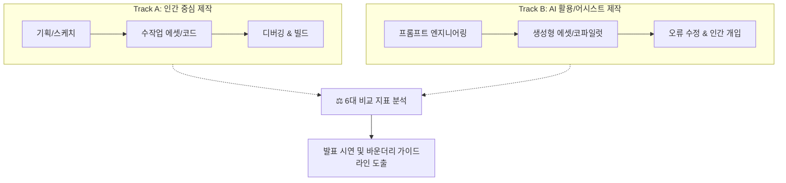

# 📋 [26.09.17] 게임 제작을 통한 AI 활용 과정 비교 및 발표 방향 종합 회의록

> **팀명**: 아만보팀 [아는만큼보인다]  
> **회의 일시**: 2026년 09월 17일 10:32  
> **참석자**: 함석신, 김민주, 김준호 (전원 참석)  
> **팀 주제**: **게임 제작을 위한 AI 활용은 어디까지 인정될 수 있을까 (토론)**  
> *"AI가 발전함에 따라 게임 개발에서도 AI에 의존하는 경우가 많아졌다. 프로그래밍을 시작으로 아트, 기획의 영역까지 확장되는 상황에서 우리는 개발 환경 속에서 AI를 어디까지 인정할 것인가"*  
> **원천 자료 (RAW)**: [[회의/raw/[26.09.17]-회의록녹음요약|[26.09.17] 회의록녹음요약.md]]  
> **데이터 상태**: 📥 RAW 회의 녹음 요약 정제 및 인제스트 완료 (Ingested)

---

## 🧭 1. 회의 배경: 토론 주제의 명확화와 실증적 접근 전환

기존의 AI 창작 토론이 콘텐츠, 저작권, 일자리, 윤리 등 범위가 지나치게 방대하여 찬반 대립각이 모호해지는 문제가 있었습니다. 이에 팀은 **"추상적 찬반 논쟁을 넘어, 실제 게임 제작 파이프라인 전반에서 인간과 AI의 개입 수준을 직접 검증하고 비교하는 실증적 프로젝트"**로 방향을 전격 구체화했습니다.

### 🎯 우리가 다루고자 하는 핵심 질문
1. **문제 정의**: AI가 게임 개발의 전 분야(기획~코딩)로 침투할 때, 인간의 손길 없이 작동 가능한가?
2. **토론의 목표**: 무조건적인 찬반이 아닌, 직군별·단계별 **'인간의 개입이 불가결한 바운더리'**를 객관적 데이터로 증명.
3. **최종 결과물**: 실제로 구현한 간단한 게임 프로토타입과 제작 과정의 상세한 시행착오 기록(로그).

---

## 🎮 2. 게임 제작 중심 주제 구체화: 7대 파이프라인 검토

게임 개발은 종합 예술이자 기술의 집약체로, 직군별 AI 수용도와 인간 개입의 차이를 비교하기에 최적의 테스트베드입니다. 회의에서는 다음 7개 분야를 집중 분석 대상으로 선정했습니다.

| 번호 | 제작 단계 | AI가 수행할 수 있는 역할 | 인간의 필수 개입 영역 |
| :---: | :--- | :--- | :--- |
| **1** | **기획 및 시나리오** | 세계관 브레인스토밍, NPC 대사 초안, 퀘스트 생성 | 게임의 전체 톤앤매너 조율, 개연성 검증, 감정선 연출 |
| **2** | **게임 시스템 및 규칙** | 밸런스 테이블 산출, 수학적 확률 공식 제안 | 플레이어 재미 요소(UX) 검증, 난이도 곡선 튜닝 |
| **3** | **그래픽 및 배경 제작** | 컨셉 아트 생성, 타일맵 텍스처 대량 생성 | 화풍의 일관성 유지, 엔진 최적화용 리터칭, 메쉬 정리 |
| **4** | **캐릭터 제작** | 2D 스프라이트 시안, 3D 모델링 생성 도구 연계 | 리깅(뼈대), 애니메이션 클린업, 표정 디테일 연출 |
| **5** | **음악 및 사운드** | BGM 루프 생성, 효과음(SFX) 합성 | 장면에 맞는 타이밍 믹싱, 사운드 연출 의도 반영 |
| **6** | **게임 구현 및 코딩** | 코어 메카닉 코드 스니펫 생성, 로직 자동 완성 | 시스템 아키텍처 결합, 예외 처리, 엔진 간 연동 디버깅 |
| **7** | **테스트 및 오류 수정** | 단위 테스트 코드 작성, 버그 패턴 탐색 | 실제 플레이 감각(조작감) 검증, 엣지 케이스 크래시 해결 |

---

## ⚔️ 3. 인간 제작 vs AI 활용 제작: 대결 구도 및 6대 비교 지표

단순히 완성된 게임만을 보여주는 것이 아니라, **"제작 과정에서 발생한 격차와 인간의 개입도"**를 실증하기 위해 대결 구도의 비교 실험을 진행하기로 합의했습니다.

### 📊 6대 비교 측정 지표
1. **작업 순서**: 기획에서 빌드까지 단계별 프로세스 차이
2. **소요 시간**: 동일 시간 내 산출물의 분량 및 완성도
3. **수정 횟수 (Iteration)**: 원하는 결과를 얻기 위한 프롬프트/코드 수정 반복 수
4. **오류 및 문제점**: AI가 뱉어낸 '환각(Hallucination)' 코드나 깨진 에셋의 유형
5. **인간의 개입 정도**: AI 산출물을 실제로 작동시키기 위해 투입된 인간의 리워크 비율(%)
6. **최종 결과물 품질**: 조작감, 비주얼 일관성, 게임 플레이 안정성

---

## 🛠️ 4. 프로토타입 게임 선정 및 개발 환경 검토

* **게임 선정 아이디어**:
  * 복잡한 기능(아이템, 네트워크 등)은 배제하고 조작과 맵 이동에 집중할 수 있는 **캐주얼 게임(카트라이더 류 주행 게임, 테트리스 류 퍼즐 게임)**이 유력 후보로 거론됨.
  * 게임의 볼륨 자체가 목표가 아니라, **"AI를 활용하는 과정에서 어떤 차이와 결함이 드러나는가"**를 빠르게 검증하는 것이 목적.
* **개발 엔진 및 환경 비교**:
  * **언리얼 엔진(Unreal Engine)**: 팀원들의 이전 버추얼 콘텐츠 제작 경험이 있으나, 영상 렌더링과 실시간 인터랙티브 게임 구현 간의 러닝커브 및 빌드 리소스 부담 존재.
  * **웹 기반(HTML5 Canvas / Three.js / Phaser)**: 설치 없이 브라우저에서 즉각 시연 가능하며, AI 도구(vibe coding)와의 연계가 빠르고 관객에게 실시간으로 보여주기에 매우 유리.
  * **결론**: 3D 대작보다는 **웹 기반 2D 또는 가벼운 3D 프로토타입**을 우선 검토하되, AI 툴과의 연계성을 감안해 최종 스택 결정.

---

## 💭 5. 창작자의 감정적·직업적 가치 변화 및 인식 조사

회의 중 팀원들이 공유한 깊이 있는 정성적 통찰과 조사 계획입니다.

* **감정적 박탈감과 허무함**:
  * 과거 수작업으로 며칠씩 걸리던 모델링, 배경, 리깅 작업이 AI 프롬프트 몇 줄로 수 초 만에 출력되는 모습을 볼 때 오는 창작자의 상실감.
  * 오랜 시간 기술 숙련도를 쌓아온 현업 종사자들의 입장에서 AI를 어떻게 바라보고 수용해야 하는가의 문제.
* **인식 설문조사 기획**:
  * AI 창작물에 대한 대중과 창작자의 거부감 수준을 파악하기 위한 설문조사 병행.
  * 한국 vs 미국, 또는 동양(공유/편집적 사유) vs 서양(배타적 소유권)의 문화적 수용도 차이 비교.
  * AI 사용량에 따른 창작 인정 범위(0%~100%) 설문 데이터 확보.

---

## 🎬 6. 발표 연출 및 결과물 구성 전략

1. **실제 게임 화면 라이브 시연**: 발표 현장에서 프로토타입을 직접 플레이하며 AI 에셋과 인간 에셋의 차이를 조작감으로 체감.
2. **시행착오 아카이브 영상(Making Film)**: AI가 코드를 잘못 짜서 벽을 뚫거나 캐릭터 메쉬가 뒤틀리는 등 **'AI의 한계와 인간의 개입 순간'**을 짧은 쇼츠/클립 영상으로 편집하여 발표에 삽입.
3. **AI 창작물 유사성 탐색기 아이디어**: 창작자가 만든 결과물이 기존 레퍼런스와 얼마나 유사한지 AI로 역추적해주는 보조 기능을 제안/시연하여 저작권 리스크 해법 제시.

---

## 🏁 7. 종합 결론 및 향후 Action Items

이번 회의를 통해 아만보팀은 **"게임 제작 전 과정을 현미경처럼 들여다보며 인간과 AI의 역할을 실증 비교하는 프로토타입 중심 프로젝트"**로 연구 방향의 퀀텀 점프를 이루었습니다.

### 📋 팀원별 다음 실행 과제 (Action Items)

| 담당자 | 중점 역할 | 세부 실행 과제 (차기 미팅 전까지) | 마감일 |
| :---: | :---: | :--- | :---: |
| **함석신** | **프레임워크 & 바운더리** | • 인간 vs AI 6대 비교 지표(시간, 수정횟수, 개입도 등) 측정 로그 템플릿 설계 • 게임 제작 분야별 AI 도구 vs 창작 주체 가이드라인 초안 수립 | `260918` |
| **김민주** | **개발 스택 & 프로토타입** | • 웹 기반(2D/경량 3D) 캐주얼 게임(카트/테트리스) 개발 타당성 검토 • 코파일럿/생성 AI 툴을 활용한 게임 코드 생성 및 에셋 파이프라인 테스트 | `260918` |
| **김준호** | **인식 조사 & 심층 인터뷰** | • 창작자 감정/직업적 가치 변화 인터뷰 질문지 구성 • AI 창작물 거부감 및 인정 바운더리 설문조사 문항 작성 및 배포 준비 | `260918` |
| **전원** | **툴 리스트업** | • 7대 게임 제작 파이프라인별로 실제 테스트해 볼 최신 AI 도구 리서치 후 개인 `raw/`에 업로드 | `260919` |

---

## 🔗 관련 문서 링크
* 📥 [26.09.17 회의록 녹음 요약 (RAW)](../raw/[26.09.17]-회의록녹음요약.md)
* 🏛️ [26.09.16 1차 종합 회의록](./[26.09.16]-AI_창작과_인간의_역할_종합_회의록.md)
* 📖 [프로젝트 메인 대시보드](../../README.md)
