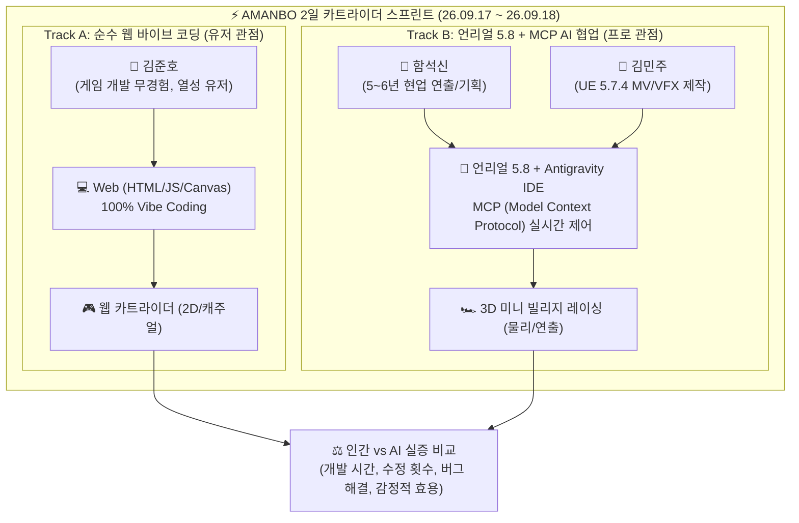
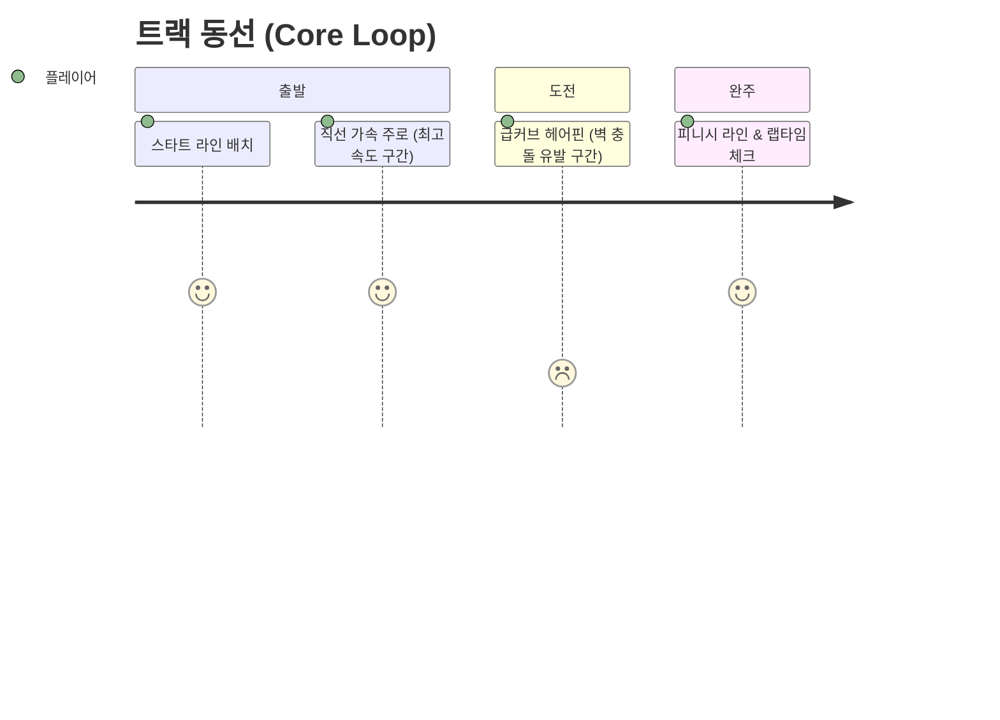

# 🏁 [26.09.17] 카트라이더 인간 vs AI 2일 스프린트 & 언리얼 미니 레이싱 기획 종합

> **팀명**: 아만보팀 [아는만큼보인다]  
> **회의 일시**: 2026년 09월 17일 11:22  
> **참석자**: 함석신, 김민주, 김준호 (전원 참석)  
> **팀 주제**: **게임 제작을 위한 AI 활용은 어디까지 인정될 수 있을까 (토론 & 실증)**  
> **원천 자료 (RAW)**: [[회의/raw/[26.09.17]-카트라이더_인간vsAI_기획_및_언리얼파트_아트가이드|[26.09.17] 카트라이더 인간vsAI 기획 및 언리얼파트 아트가이드.md]]  

---

## 🎯 1. 프로젝트 킥오프: 2일 스프린트 '인간 vs AI' 대결

아만보팀은 이론 중심의 토론을 벗어나 **"실제 게임 제작 과정에서 AI의 생산성과 한계는 어디까지인가?"**를 입증하기 위해, **3인 2팀 체제로 2일 만에 완성하는 카트라이더 레이싱 게임 제작 챌린지**에 돌입합니다.

### 👥 팀원 프로필 및 역할 분담

1. **함석신 (연출/기획, Track B)**
   * **배경**: 게임회사 2020년부터 (약 5~6년) 현업 제작/연출/기획. 인간의 손맛과 AI의 효율성을 모두 체감한 시니어.
   * **역할**: 게임 디자인(Core Loop), 트랙 레이아웃 및 장애물 배치 규칙, 충돌 감각 및 시퀀스 연출 가이드 수립.
2. **김민주 (제작/VFX, Track B)**
   * **배경**: 2026년 상반기 언리얼 5.7.4 및 블렌더로 버추얼 아이돌 MV 시퀀스/VFX를 6인 팀프로젝트로 제작하며 실시간 AI 개입 파이프라인 경험.
   * **역할**: Antigravity IDE와 언리얼 5.8을 MCP(Model Context Protocol)로 연동하여 AI에게 레벨 생성, 에셋 배치, 물리 머티리얼 세팅 지시 및 실시간 기술 로그 작성.
3. **김준호 (바이브 코딩, Track A)**
   * **배경**: 게임 개발 지식은 없으나 방대한 게임 플레이 경험을 가진 순수 유저.
   * **역할**: LLM 프롬프트만을 이용한 웹 바이브 코딩으로 2일 만에 플레이 가능한 카트라이더 게임 단독 제작.

---

## 🏎️ 2. 언리얼 파트 기획 및 아트 가이드: '빌리지 미니 레이싱'

함석신 연출가가 수립한 언리얼 엔진 파트의 공식 게임 디자인 및 비주얼 가이드라인입니다.

### 🎮 게임 룰: One Lap Challenge
* **개념**: 단 **'딱 한 바퀴'**만을 주행하는 초미니 아케이드 레이싱.
* **목표**: 복잡한 시스템을 배제하고 **물리 엔진 체감(벽 충돌 반발력, 가속도, 드리프트/코너링, 완주 시간)**에 집중.

### 🎨 아트 컨셉: '아기자기한 미니 빌리지 (Mini Village)'
* **시각적 특징**:
  * **트랙 바닥**: 밝은 돌담길(Stone Cobblestone) 또는 황토색 흙길(Dirt Road) 머티리얼 적용.
  * **주변 환경**: 코너 주변에 초록색 잔디 블록(Grass Block) 배치.
  * **프랍(Props)**: 아기자기한 저폴리곤(Low-Poly) 나무, 나무 상자(Crates), 가로등 등을 배치해 따뜻하고 친숙한 마을 분위기 연출.

---

## ⏱️ 3. 제작 로그 전수 기록 체계 가동 (Action Rules)

> [!IMPORTANT]
> **전수 기록 원칙**:
> AI와 협업하는 언리얼 파트(Track B)는 **MCP를 연결한 순간부터 모든 디버깅, 프롬프트 지시, 엔진 설정, 수정 내역을 분 단위(`YYMMDD HH:mm`)로 누락 없이 기록**합니다.
> 이 기록은 프로젝트 종료 후 **"AI가 게임 개발에서 실제로 기여한 영역과 인간의 개입이 필수적인 바운더리"**를 증명하는 핵심 발표 자료로 사용됩니다.

* **팀 공통 총괄 문서**: `회의/` 폴더 내 종합 회의록 및 기획서 아카이빙
* **언리얼 MCP 실시간 제작 일지**: `김민주/` 폴더 내 실시간 제작 WIKI 및 RAW 로그 저장

---

## 🔗 연결된 문서
* 📥 [원문 기획 RAW](../raw/[26.09.17]-카트라이더_인간vsAI_기획_및_언리얼파트_아트가이드.md)
* 🏛️ [회의록 아카이브 홈](../README.md)
* 👤 [김민주 연구 WIKI (MCP 실시간 제작 로그)](../../김민주/README.md)
