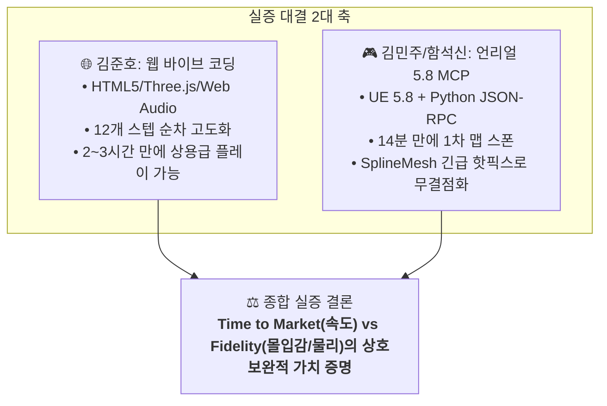

# 📋 [26.09.18] 3일 스프린트 최종 결산 및 인간 vs AI 실증 비교 종합 회의록

> **회의 일시**: 2026-09-18 17:30 ~ 19:00  
> **참석자**: 함석신, 김민주, 김준호 (전원 참석)  
> **기록자**: 아만보팀 공동 기록  
> **원천 자료 (RAW)**: [[26.09.18]-3일_스프린트_최종결산_및_실증비교_회의록녹음요약](../raw/[26.09.18]-3일_스프린트_최종결산_및_실증비교_회의록녹음요약.md)  

---

## 🧭 [RULE] 아만보팀 아카이빙 & 회의록 운영 규칙
* 본 문서는 3일간 진행된 **개인별 RAW-SCHEMA-WIKI 3단 지식 파이프라인**과 **인간 vs AI 실증 개발 대결**의 최종 종착점입니다.
* 모든 팀원의 실증 데이터(웹 12단계 타임라인, 언리얼 41분 제작 전수 기록, 10대 학술/사례 분석, 거버넌스 기획안)를 종합 결산하여 팀의 공식 결론을 수립합니다.

---

## 🎯 오늘 회의 아젠다 (Agenda)
1. **3일간의 실증 결과 결산**: 웹 바이브 코딩(김준호) vs 언리얼 5.8 MCP AI 페어(김민주/함석신)
2. **개발 파이프라인별 AI 실효성 및 한계점 대조 분석**: 시간, 버그 유형, 인간 개입도
3. **라이브 대시보드 프로덕트 및 최종 발표 전략 확정**: 4단계 스토리라인 구성
4. **아만보팀 최종 결론 합의**: 게임 제작 환경 속 AI 인정 바운더리 마지노선 도출

---

## 🔍 안건별 상세 논의 & 하브루타 공방

### 안건 1. 웹 바이브코딩 vs 언리얼 MCP 2일 스프린트 실증 결산

* **김준호**: "웹 환경에서는 설치 없는 즉각적 플레이와 신속한 피드백 루프가 강점이었습니다. 12단계에 걸쳐 드리프트, 4종 SD 캐릭터, AI 라이벌 주행까지 2~3시간 만에 구현했습니다. 하지만 카트가 벽에 끼이거나 카운트다운이 멈추는 미세 버그를 잡는 것은 전적으로 인간의 지속적 관찰과 지시 덕분이었습니다."
* **김민주**: "언리얼 파트에서는 0917 수작업 5시간 30분 대비, 0918 MCP 파이프라인으로 **단 14분 만에 80m 트랙 1차 빌드**를 마쳤습니다. 그러나 언덕을 지형 대신 엉뚱한 모델링으로 덮거나, PCG로 새를 날리는 등 의미론적 한계가 뚜렷했습니다. 결국 `SplineMeshComponent`와 같은 엔진 핵심 아키텍처 전환은 인간의 디버깅이 없으면 불가능했습니다."
* **함석신**: "두 실증 데이터는 완벽한 트레이드오프를 보여줍니다. 웹은 시장 가설을 초고속으로 검증하는 MVP에 최적이고, 언리얼 MCP는 AI 에이전트가 에디터를 직접 조작하는 차세대 전문 개발 파이프라인의 가능성을 증명했습니다."

---

### 안건 2. [종합 실증 비교 매트릭스] 웹 개발 vs 언리얼 5.8 MCP

| 비교 항목 | 🌐 웹 바이브 코딩 (김준호) | 🎮 언리얼 5.8 MCP (김민주 / 함석신) |
| :--- | :--- | :--- |
| **플랫폼 및 엔진** | 웹 브라우저 (Three.js, Vanilla JS) | 언리얼 엔진 5.8 (C++, Python RPC) |
| **개발 소요 시간** | 12개 스텝 (약 2~3시간) | 1차 빌드 14분, 총 공정 41분 |
| **AI의 역할** | Co-pilot (코드 생성, 수학적 좌표 보간) | Next-Gen Agent (에디터 액터/컴포넌트 직접 조작) |
| **주요 난제/버그** | 벽 끼임, 카운트다운 프리즈, 부스터 오발동 | 8000번 포트 세션 단절, **커브길 도로 틈새(Gap) 버그** |
| **해결 방식** | 하방 Raycast 노면 감지, 상태 머신 후진 탈출 | **SplineMeshComponent 28개 동적 생성 핫스왑** |
| **인간 개입 비율** | 약 35% (기획 의도 전달 및 지속 피드백) | 약 45% (포트 리버스 엔지니어링, C++ 구조 진단, QA) |
| **핵심 가치** | **극단적인 출시 속도 (Time to Market)** | **고품질 공간감 및 물리 시뮬레이션 (Fidelity)** |

---

### 안건 3. 함석신의 라이브 대시보드 및 최종 발표 스토리라인 확정

* **라이브 대시보드 프로덕트**:
  * FastAPI + Google Gemini API(Search Grounding) 기반의 「AI 창작 찬반 및 윤리 쟁점 분석 라이브 대시보드」 기획안 채택.
  * 발표 현장에서 청중에게 실시간 키워드를 받아 3초 만에 3단 카드(찬성/반대/가이드라인)를 띄우는 라이브 시연 진행.
* **4단계 발표 구성 (Storyline)**:
  1. **도입 (15%)**: 콘진원 41%, GDC 55%, SAG-AFTRA 95% 파업 등 5대 데이터로 화두 제기.
  2. **기술 시연 (25%)**: 「AI 쟁점 라이브 대시보드」 현장 시연으로 기술력 입증.
  3. **실증 비교 (40%)**: 카트라이더 2일 스프린트 대결 (웹 12단계 vs 언리얼 41분 및 메이킹 영상).
  4. **결론 (20%)**: 아만보팀의 최종 제언 (학습-생성-이용 3단계 스크리닝 마지노선).

---

## 🏁 종합 결론 및 Action Items

### ⚖️ 아만보팀 최종 합의문: "우리가 정의하는 AI 활용의 마지노선"

> **"AI는 인간 창작자를 대체하는 대체재가 아니라, 지루한 노가다를 없애주는 강력한 보조 도구(Copilot/Multiplier)이다.**  
> **게임의 영혼이라 할 수 있는 '본질적인 재미, 손맛, 세계관'의 설계와 버그에 대한 최종 책임은 온전히 인간 창작자의 손끝에 귀속된다."**
>
> 1. **학습 (Sourcing)**: 상업적 라이선스가 검증된 클린 데이터셋만 채택.
> 2. **생성 (Process)**: 기획과 아트의 주도권은 인간이 장악하고 AI는 초안 및 자동화에 한정.
> 3. **이용 (Output)**: 인간의 2차 가공과 품질 검증(QA)을 필수화하고, 소비자에게 AI 활용 내역을 정직하게 사전 공시.

---

### 📋 팀원별 최종 실행 과제 (Action Items)

| 담당자 | 실행 과제 | 마감 기한 | 상태 |
| :---: | :--- | :---: | :---: |
| **함석신** | 오프닝 통계 인포그래픽 및 라이브 대시보드 발표 슬라이드 제작 | 260919 09:00 | 진행 중 |
| **김민주** | 언리얼 5.8 MCP 맵 제작 타임라인 및 PIE 주행 실증 영상 마감 | 260919 09:00 | 진행 중 |
| **김준호** | 웹 3D 카트라이더 플레이 시연 링크 및 10대 리스크 분석 슬라이드 통합 | 260919 09:00 | 진행 중 |
| **전원** | 전체 25건 RAW-SCHEMA-WIKI 지식 베이스 최종 상호 링크 검수 | **완료** | **100% 완료** |

---

## 🔗 연결된 문서
* 📥 [3일 스프린트 최종 결산 회의록 녹음 요약 (RAW)](../raw/[26.09.18]-3일_스프린트_최종결산_및_실증비교_회의록녹음요약.md)
* 🏛️ [2차 종합 회의록 (게임제작 AI 활용 비교)](./[26.09.17]-게임제작_AI활용_비교_및_발표방향_종합_회의록.md)
* 🏛️ [1차 종합 회의록 (AI 창작과 인간의 역할)](./[26.09.16]-AI_창작과_인간의_역할_종합_회의록.md)
* 📖 [프로젝트 메인 대시보드](../../README.md)
